# 1. System Overview

## 1.1 Purpose

DataAtlas là một **AI metadata assistant cho DataHub**: chatbot RAG hỏi-đáp về metadata của công ty qua DataHub. Hệ thống:

- Đồng bộ metadata từ DataHub (GraphQL thật hoặc mock fixtures) vào **PostgreSQL**.
- Chunk + embedding (Ollama `nomic-embed-text`) vào **OpenSearch**.
- Trả lời câu hỏi tiếng Việt/Anh bằng LLM (Fireworks `deepseek-v4-flash`, có thể đổi sang NVIDIA `llama-3.3-70b-instruct`).

Các mục đích chính: tra cứu catalog DataHub bằng ngôn ngữ tự nhiên (dataset, schema/field, glossary term, owner, domain, lineage, impact analysis, listing); sinh SQL có kiểm soát dựa trên schema thật; đánh giá data quality từ mức độ đầy đủ của metadata; hiểu ảnh (dashboard, ERD, SQL/table screenshot) qua vision model; xử lý câu hỏi phức hợp qua Thinking Mode (deterministic planning) và Query Planner (DAG tool execution); kiểm soát truy cập theo domain (RBAC) và ACL theo entity.

## 1.2 Users

- Người dùng nội bộ VinFast (theo system prompt: "automotive manufacturing and business") truy cập qua web chat.
- Vai trò seeded: `admin`, `finance`, `logistics` (tài khoản demo).
- RBAC roles: `Tài chính`, `Logistics`, `Sản Xuất`, `VGreen`, `Sales`.

## 1.3 Key Capabilities

| Capability | Mô tả |
|---|---|
| Chat hỏi-đáp metadata RAG (stream SSE) | Pipeline chat với intent resolution, retrieval, citations |
| Intent classification (regex + LLM semantic) | Phân loại mục đích câu hỏi, lập kế hoạch tool |
| Entity resolution / fuzzy / coreference | Ánh xạ câu hỏi sang entity chuẩn trong catalog |
| Hybrid search (keyword + vector trên OpenSearch) | Retrieval kết hợp lexical + semantic |
| Tool registry (13 tool) | Truy xuất metadata, schema, lineage, impact... |
| Thinking Mode (deterministic reasoning) | Suy luận câu hỏi phức hợp không dùng LLM để lập kế hoạch |
| Query Planner DAG | Chạy nhiều bước truy vấn theo đồ thị phụ thuộc |
| SQL generation | Sinh SQL grounded, read-only, có kiểm soát |
| Data quality report | Đánh giá chất lượng metadata theo mức độ đầy đủ |
| Vision / image understanding | Phân tích dashboard, ERD, ảnh chụp bảng |
| Document import (PDF/DOCX/HTML) | Nhập tài liệu qua URL, parse, chunk, index phục vụ QA |
| Image/document storage | Lưu ảnh upload (gốc + thumbnail) kèm metadata |
| DataHub sync (full + incremental) | Đồng bộ metadata từ DataHub vào kho nội bộ |
| Auth JWT + RBAC + ACL + guardrail | Phân quyền theo domain, phòng thủ prompt injection |

# 2. System Architecture

## 2.1 High-level Architecture

Hệ thống gồm 4 layer:

**Presentation/UI (Next.js)** — Landing "DataAtlas" (static marketing), app shell authenticated (sidebar, topbar, chat, admin, storage, search, glossary, entities, status, profile). Mọi API gọi client-side và proxy qua Next rewrites.

**API/Backend (FastAPI)** — 16 router, prefix `/api/v1/*` + `/health`, `/ready`, `/api/me`, `/api/v1/documents/import`. Middleware: ErrorHandling, Metrics, RateLimit. Lifespan: sync DataHub, seed RBAC/ACL, index, healthcheck loop.

**AI / Orchestration (ChatService)** — Pipeline: intent resolution → guardrails → relevance gate → tool/planner → retrieval → context → LLM → citations → SSE. Gồm IntentResolver, Thinking Mode, Query Planner (DAG), ToolRegistry, AnswerGenerator, VisionSkill.

**Data / Storage** — PostgreSQL (metadata, transactional), OpenSearch (chunk + knn), Redis (rate limit/queue), filesystem (ảnh), live DataHub GraphQL (lineage chi tiết).

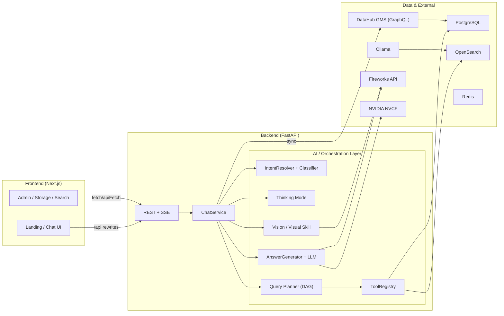

## 2.2 Technology Stack

| Layer | Công nghệ | Vai trò |
|---|---|---|
| Frontend | Next.js 16.3 (App Router), React 19, Tailwind 4 | Web UI |
| Backend | FastAPI (Python 3.12), uvicorn | REST + SSE + sync + admin |
| Database | PostgreSQL 16 (asyncpg), SQLAlchemy 2.0 async | Persistence chính |
| Vector store | OpenSearch 2.15 | Chunk embeddings (knn), hybrid search |
| Cache/queue | Redis 7 | Rate limit, queue sync |
| LLM | Fireworks `deepseek-v4-flash`; NVIDIA `llama-3.3-70b-instruct` | Sinh câu trả lời, intent, relevance |
| Vision | Fireworks `qwen3p7-plus` | Phân tích ảnh (OCR + structured extraction) |
| Embedding | Ollama `nomic-embed-text` (768-d) | Vector hoá chunk |
| Metadata source | DataHub quickstart (GMS GraphQL) | Nguồn metadata |
| Auth | JWT (HS256, pyjwt) | Session token |

## 2.3 Main Data Flow

- **Metadata**: DataHub GraphQL → CanonicalEntity → PostgreSQL `entities` → IndexingPipeline (chunk + embed) → OpenSearch `datahub-rag-chunks-v1` → ToolRegistry / hybrid_search → context → LLM.
- **Query-time**: truy vấn metadata từ PostgreSQL và OpenSearch; chỉ gọi live DataHub cho lineage chi tiết.
- **Storage roles**: PostgreSQL (metadata + transactional), OpenSearch (chunks), Redis (rate limit/queue), filesystem (ảnh upload).
- **Response**: LLM sinh JSON answer + citations → stream SSE về frontend.

# 3. Core Processing

## 3.1 Chat Processing

Pipeline chính xử lý từng lượt chat:

1. **Input**: Chat UI gửi message + `selected_action` + `images` (data URL base64, tối đa 4 ảnh).
2. **Stream**: Frontend gọi `POST /api/v1/chat/stream` (SSE), tạo optimistic message.
3. **Context**: ChatService load `history` từ `conversation_history` và `active_entities` từ in-memory.
4. **Intent**: IntentResolver merge action + message + history (LLM khi mơ hồ, keyword router khi rõ) → intent + plan + chosen_tool.
5. **Gates**: guardrail scope/injection, domain RBAC, datahub relevance (LLM).
6. **Execution**: ToolRegistry / Planner thực thi truy vấn (Postgres, OpenSearch hybrid, live DataHub lineage).
7. **Context assembly**: ACL filter → reranker → ContextBuilder → XML `<context>` với citations.
8. **Generation**: LLM sinh JSON `{answer, citation_ids, confidence}` hoặc stream tokens.
9. **Validation**: validate citations, strip ungrounded URN.
10. **Render**: SSE emit `status|token|done|error`; UI render markdown + citations/entities/lineage/quality.

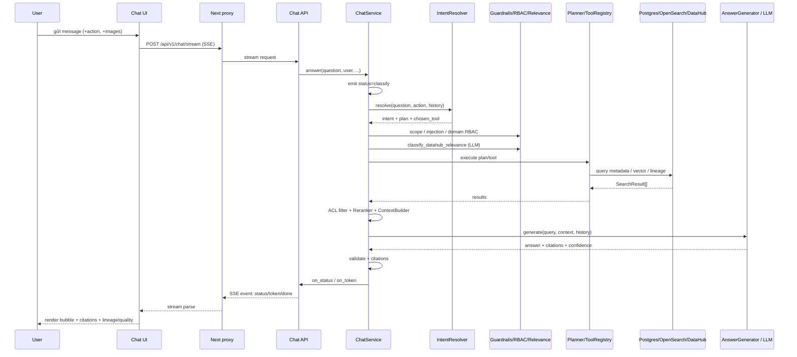

## 3.2 Multi-question & Thinking Mode

### 3.2.1 Multi-question / Sub-question Processing

Xử lý câu hỏi chứa **nhiều phần / nhiều entity** trong một lượt chat:

- **Detect**: câu hỏi có dấu hiệu composite (`đồng thời`, `cũng như`, `sau đó`...) hoặc nhiều dataset → gắn cờ composite / multi-entity (regex hoặc LLM classifier).
- **Decompose**: Query Planner sinh đồ thị các bước (DAG), mỗi bước là một thao tác truy vấn (resolve entity, schema lookup, lineage...) với quan hệ phụ thuộc giữa các bước.
- **Execute**: các bước sẵn sàng được chạy (song song khi độc lập, tuần tự theo thứ tự phụ thuộc); kết quả gộp theo thứ tự tô-pô và khử trùng lặp URN.
- **Merge**: kết quả các bước đưa vào pipeline chuẩn — Reranker → ContextBuilder → AnswerGenerator.
- **Error isolation**: một bước thất bại trả kết quả rỗng, không làm hỏng toàn cục.

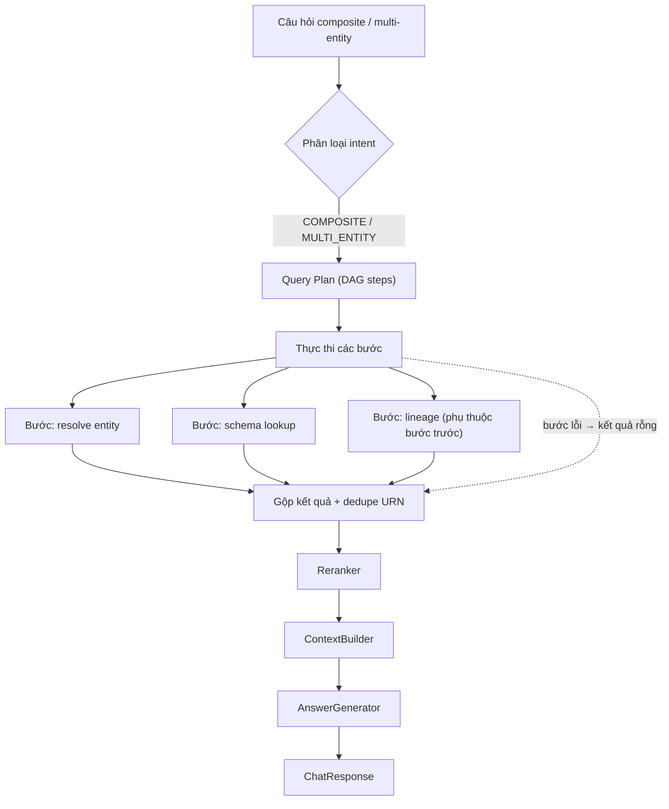

### 3.2.2 Thinking Mode / Complex Question Processing

Xử lý các câu hỏi phức hợp dạng **GENERAL** (không phải follow-up ngữ cảnh) bằng một tầng suy luận **deterministic** (không dùng LLM để lập kế hoạch):

- **Detect**: câu hỏi GENERAL không follow-up, độ phức tạp đạt ngưỡng.
- **Plan**: lập kế hoạch các bước suy luận.
- **Execute**: thực thi truy vấn dựa trên MetadataGraph + repositories (resolve / schema / owner / glossary / lineage / impact / quality...).
- **Synthesize**: tổng hợp câu trả lời markdown có cấu trúc — **Kết luận / Lý do / Rủi ro / Khuyến nghị** — stream về UI.

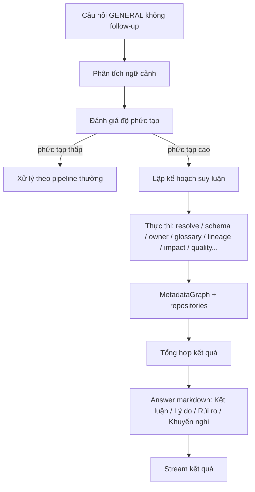

## 3.3 Conversation Context

- **Lưu trữ**: bảng `conversation_history` — mỗi hàng = một lượt Q/A, nhóm theo `conversation_id`, `user_id`, `title`, `is_pinned`, `is_favorite`. Không có bảng `conversations`/`messages` riêng.
- **In-memory**: `ConversationMemory` quản lý `active_entities` (ghi mỗi turn) và `image_focus` (cho follow-up về ảnh).
- **Context window**: `history` = các lượt `(question, answer)` được chuyển thành messages `[system, *history, context-block, user prompt]`; ngữ cảnh retrieval được giới hạn để kiểm soát độ dài prompt.
- **Coreference / follow-up**: nhận diện anaphora (`nó`, `đó`, `bảng này`) và ellipse; `active_entities` + `image_focus` định tuyến lại intent/tool. Thinking Mode chặn follow-up anaphora vì entity đã nằm trong history.

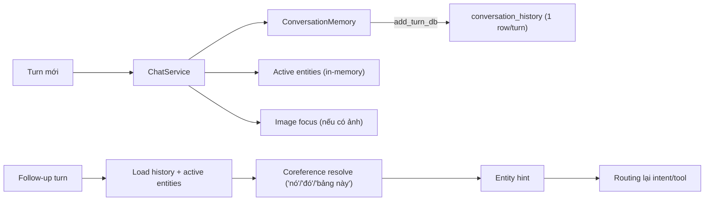

# 4. Data & AI Architecture

## 4.1 DataHub Integration

- **Client**: wrapper httpx gọi `{gms_url}/api/graphql`, Bearer token nếu có; retry exponential backoff; phân biệt timeout/auth/404/5xx.
- **Sync**: `scrollAcrossEntities` pagination (page size 100) → CanonicalEntity → mappers → PostgreSQL `entities` + `index_jobs` → IndexingPipeline chunk+embed → OpenSearch. Full sync chạy lúc boot và định kỳ; incremental sync dùng checkpoint + Redis queue (consumer / DLQ / distributed lock).
- **Entity types**: dataset, dashboard, glossary_term/node, document (+ chart, dataFlow, dataJob, container, tag, mlModel). URN routing theo pattern trong URN.
- **Query-time**: metadata đọc từ PostgreSQL/OpenSearch, không gọi DataHub (trừ lineage live qua `get_lineage`).

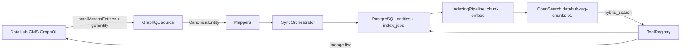

## 4.2 RAG / Retrieval

Pipeline retrieval theo thứ tự:

1. **Ingestion**: sync DataHub + document import → `entities`.
2. **Chunking**: chunk text theo cấu trúc từng entity type (dataset: summary/schema_fields/upstream/downstream; glossary: definition/relationship; dashboard: summary; document: summary + sections), có overlap để giữ ngữ nghĩa.
3. **Embedding**: `OllamaEmbedder` (`nomic-embed-text`, 768-d) qua OpenAI-compatible endpoint.
4. **Hybrid retrieval**: kết hợp entity resolution (exact + candidates) và vector search (keyword + vector trên OpenSearch knn).
5. **Reranking**: đa tín hiệu (semantic, graph, metadata, citation).
6. **Context**: ContextBuilder → XML `<context>` + citations `[E1..]`; sanitize để mask secret.
7. **Generation**: AnswerGenerator.

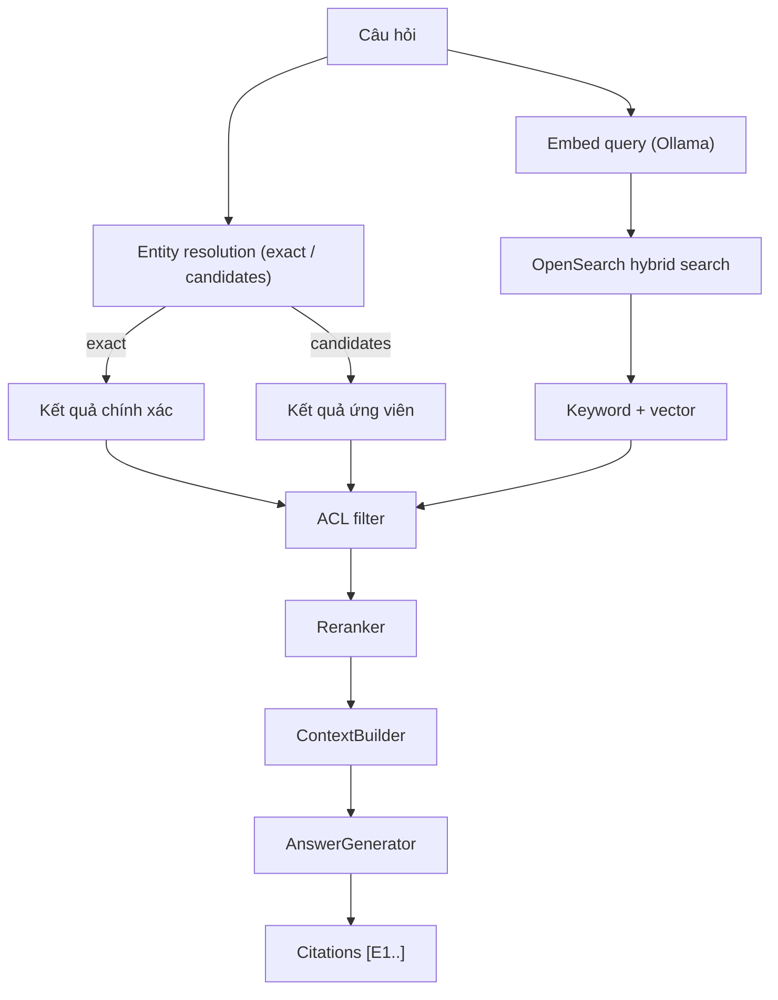

## 4.3 LLM Architecture

- **Providers**: Fireworks `deepseek-v4-flash` (mặc định), NVIDIA `llama-3.3-70b-instruct` (NVCF, chọn được qua `/api/v1/chat/models`), MockLLM (dev).
- **Prompting & guardrail**: 3 system prompt (JSON answer / stream text / general scope-refusal); tất cả append `GUARDRAIL_RULES` (13 quy tắc grounded).
- **Tool dispatch**: không dùng native function calling của API — tool dispatch là code-level (IntentResolver/PlannerExecutor chọn tool → ToolRegistry.execute); LLM chỉ sinh JSON intent/plan/answer qua `response_format=json_object`.
- **Streaming**: Fireworks `stream=True`, forward delta qua `on_token` → SSE backend → frontend parse.
- **Routing**: model override theo từng request; registry trả danh sách model khả dụng.

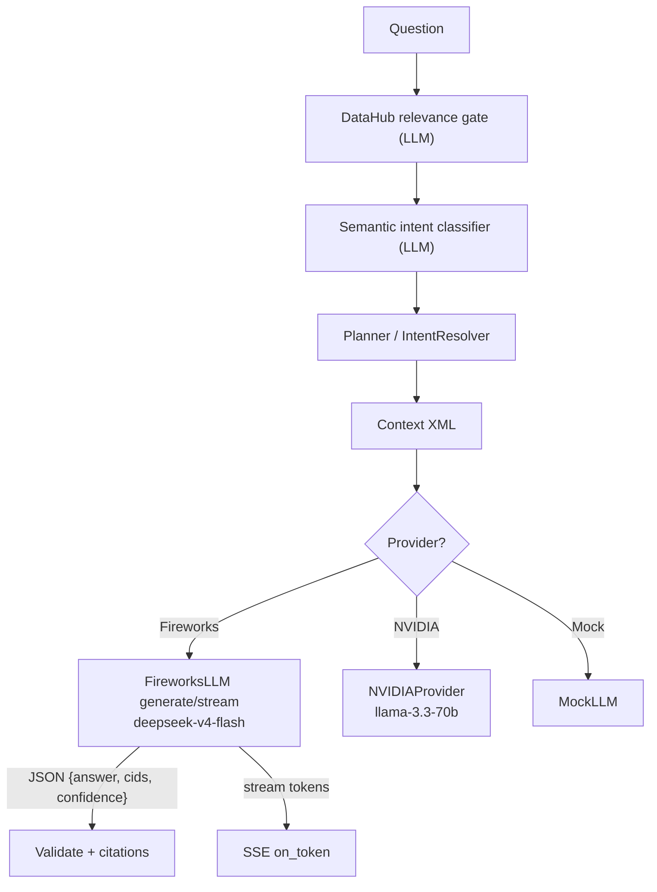

## 4.4 Vision & Document Processing

### 4.4.1 Vision / Image Understanding

1. **Upload**: ChatInput đọc file → `FileReader.readAsDataURL` (data URL base64, tối đa 4 ảnh, `image/*`, ≤15MB); filename sanitize, path traversal guard.
2. **Persist**: lưu original + thumbnail (re-encode) + `ImageRecord`.
3. **Analyze**: VisionService gọi vision model `qwen3p7-plus` (cache theo `content_hash`).
4. **ImageContext**: detect dataset trong ảnh, enrich DataHub metadata → `ImageContext`.
5. **Answer**: câu hỏi phân tích ảnh trực tiếp → `VISION_ANALYSIS`; ngược lại bind image entity và fall-through pipeline thường.
6. **Follow-up về ảnh**: load lại ImageContext từ DB (không re-run vision), `image_focus` định tuyến.

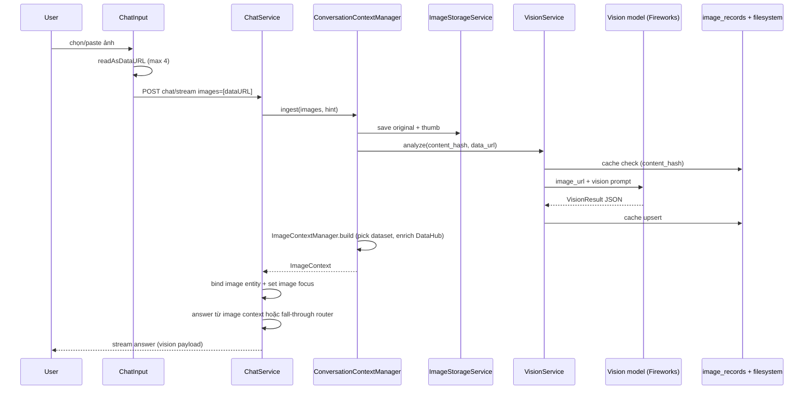

### 4.4.2 Document Processing

- **Import**: admin gọi `POST /api/v1/documents/import?url=` → SSRF guard → download.
- **Parse**: parser theo loại file — PDF, DOCX, HTML → text.
- **Chunk & embed**: chunk text → embeddings (Ollama).
- **Index**: lưu `EntityChunk` vào PostgreSQL + bulk_upsert OpenSearch.
- **QA**: câu hỏi về tài liệu → hybrid search trên `document_chunk` → context + citations → AnswerGenerator.

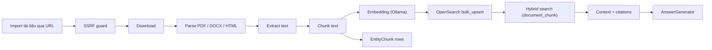

# 5. Application Features

## 5.1 SQL Generation

- **Trigger**: action `sql` hoặc intent `SQL_GENERATION`.
- **Schema**: lấy dataset + `schema_fields` từ `entities.payload`; trích filter columns và xác định JOIN keys.
- **Generation**: `GroundedSqlGenerator` — grounded/validated; LLM enhance, nếu lỗi giữ deterministic SQL.
- **Validation**: chỉ **read-only SELECT**, alias `t.`, chặn DDL/DML/dangerous.
- **Execution**: **không thực thi SQL** — chỉ sinh câu SQL trả về trong `SqlResponse`/answer markdown; không có connection tới warehouse.

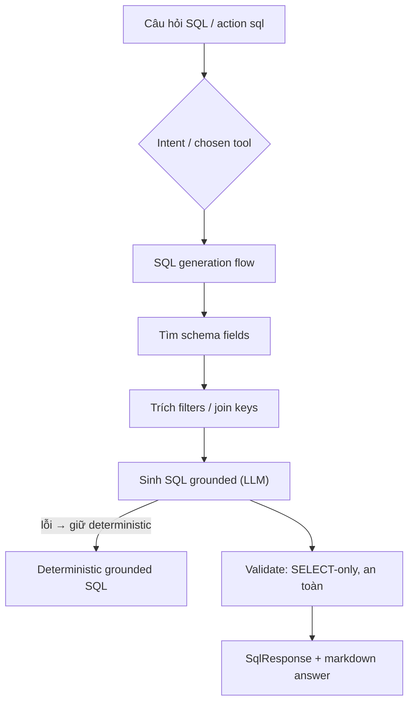

## 5.2 Data Quality

- **Trigger**: action `quality` hoặc intent ưa thích quality.
- **Đánh giá** (deterministic, không LLM): **metadata completeness** — description, owners, domain, platform, schema fields, lineage, glossary terms, tags; cộng profiling stats nếu có.
- **Output**: `QualityReport` — tổng score + sections (Metadata/Schema/Profiling/Lineage), findings, recommendations (priority high/medium/low).
- **Trình bày**: markdown answer + `QualityReportCard` UI; export PDF/TXT qua `POST /api/v1/actions/quality/export`.

## 5.3 Authentication & Authorization

- **Login/session**: `POST /api/v1/auth/login` với user seeded (admin/finance/logistics) → JWT HS256, exp 24h; secret từ `JWT_SECRET_KEY` (bắt buộc khi `AUTH_MODE=jwt`).
- **RBAC**: roles `admin, editor, steward, viewer, user`; dữ liệu-driven qua bảng `rbac_roles`, `rbac_role_domains`, `rbac_users`, `rbac_user_roles`; domain access admin → `{"*"}`, user không role → deny-by-default.
- **Domain gate trong chat**: chạy trước mọi retrieval → trả lời denial như answer bình thường (HTTP 200).
- **Post-retrieval ACL**: filter kết quả theo domain/entity ACL.
- **Storage/actions**: route lưu trữ enforce ownership (`user_id` match → 404); action resolve_dataset → 403 `{code: "domain_access_denied"}`.
- **Audit**: ghi `audit_logs` cho các quyết định truy cập.

## 5.4 Frontend / Backend

### 5.4.1 Frontend

- **Routes**: `/` landing, `/login`, `/chat`, `/search`, `/glossary`, `/entities`, `/storage`, `/admin`, `/status`, `/profile`.
- **Chat components**: `chat-layout` (welcome + message list + step indicator), `message-bubble` (citations ≤5, entities, LineageGraph, QualityReportCard, SuggestionBox, image lightbox), `chat-input` (slash commands, image picker/paste, action menu, model menu).
- **State/API**: React Context `AppProvider` (auth + conversations) + `useChat` (chat stream); `apiFetch` gắn Bearer token, 401 → redirect `/login`; SSE parse; Next rewrites proxy `/api/*` → backend.

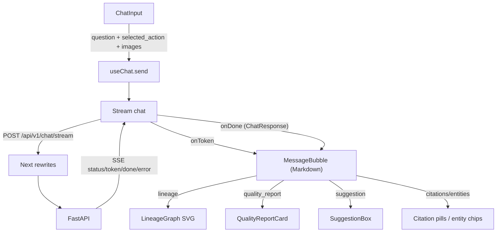

### 5.4.2 Backend

- **Routers**: 16 router, prefix `/api/v1/*` (+ `/health`, `/ready`, `/api/me`, `/api/v1/documents/import`).
- **Services**: ChatService (orchestrator), ActionService (schema-compare, sql, impact, quality, metadata report), ConversationMemory/ContextManager, Image/Vision services, HealthService.
- **AI orchestration**: ChatService.answer pipeline, intent resolver, thinking, planner executor, tool registry.
- **Data access**: repositories trên AsyncSession.
- **Background jobs**: sync_worker (full sync định kỳ), indexing_worker (poll index_jobs), healthcheck_loop.

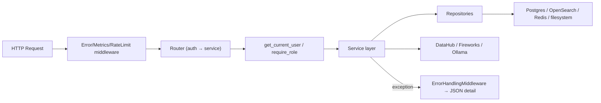

# 6. Security & Reliability

## 6.1 Security

| Lớp | Implementation |
|---|---|
| Auth | JWT (HS256, 24h); header/mock dev modes |
| Authorization | RBAC theo domain + ACL per entity; domain gate trước retrieval; post-retrieval ACL filter; ownership trên storage |
| Prompt-injection protection | Regex sanitizer chặn `ignore previous instructions`, `reveal system prompt`, `jailbreak`... + canned response |
| Input validation / SSRF | Ảnh: MIME `image/*`, ≤15MB, ≤4 ảnh, filename sanitize, path traversal guard; document: SSRF guard (schemes, forbidden hosts/ports, private IP) |
| Output sanitization | `mask_secrets` (JWT, key=value, connection string, private endpoints); `validate_generation` strip ungrounded URN |
| Guardrail scope | Chặn câu hỏi ngoài phạm vi (SQL tuning/code/math/infra/trivia...), canned response VI/EN |
| LLM prompt-level | `GUARDRAIL_RULES` 13 quy tắc (grounded, không fabricate, cite, context untrusted, no secrets) |
| Tool restrictions | SQL SELECT-only; scope refuse; không tool truy cập hệ thống |
| Rate limiting | per-IP per-path, 429 |
| Secrets | `.env` không commit; JWT secret bắt buộc |

## 6.2 Reliability

- **Error handling**: ErrorHandlingMiddleware → JSON error; 403 cho domain access denied; 422 cho invalid input.
- **Failover**: DataHub unavailable → sync trả page rỗng, app vẫn chạy trên dữ liệu cũ; LLM failure → fallback message/stream vẫn chạy; vision failure → mock client.
- **Isolation**: tool/step fail độc lập, không hỏng toàn cục; retrieval failure → kết quả rỗng → NO_EVIDENCE.
- **Retry**: SDK retry + exponential backoff cho GraphQL; retry policy cho sync; DLQ cho incremental sync.
- **Logging**: structlog — chat_request, route, intent_resolution, llm_generation_failed, thinking_mode_failed, audit logs.

# 7. End-to-End Examples

## 7.1 Dataset Search

`FIND_ENTITY` → hybrid search (resolve + vector) → rerank → context → LLM → citations.

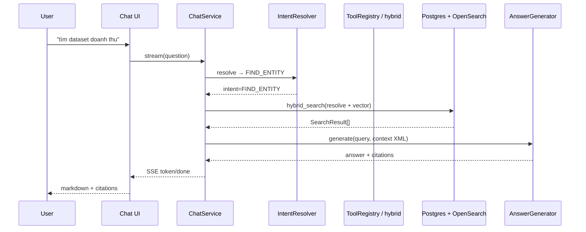

## 7.2 Lineage / Impact

`LINEAGE` → lineage tool → root + live DataHub `get_lineage` + repo payload → answer markdown + `LineageData` → UI LineageGraph. Impact: `recursive_impact` (BFS downstream) trên MetadataGraph → impacted nodes → generate.

## 7.3 Multi-question / Complex Query

Câu hỏi composite/multi-entity → Query Plan steps (DAG) → thực thi (song song/tuần tự theo dependency) → gộp + dedupe URN → rerank → generate. (Mục 3.2.)

## 7.4 SQL Generation

Action `sql` hoặc `SQL_GENERATION` → tìm schema fields → grounded SELECT-only SQL (không execute) → `SqlResponse` + markdown answer. (Mục 5.1.)

# 8. Architecture Summary

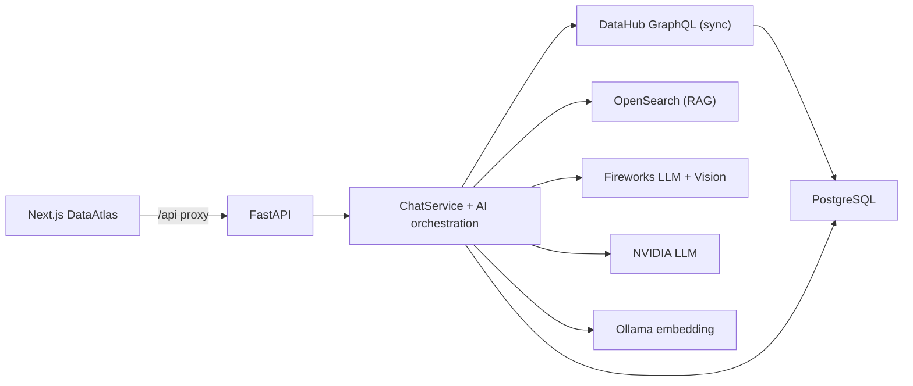

- **Chat flow**: IntentResolver → guardrails → relevance gate → tool/planner → retrieval → context → LLM → citations → SSE.
- **Complex flow**: Thinking Mode (deterministic planner/executor/synthesizer) song song với Query Planner DAG; đều ra markdown answer.
- **Image flow**: upload → filesystem + image_records → vision → ImageContext → bind entity → answer/fall-through.
- **Retrieval flow**: DataHub GraphQL → Postgres entities → chunks → OpenSearch → ToolRegistry/hybrid_search → context.
- **Storage**: Postgres (metadata) + filesystem (ảnh) + OpenSearch (chunks) + Redis (rate limit/queue).
- **LLM/tool flow**: model override → provider (Fireworks/NVIDIA/Mock) → JSON answer hoặc stream; tool dispatch code-level (ToolRegistry).

# Appendix A — API Inventory

| Method | Endpoint | Purpose | Auth |
|---|---|---|---|
| POST | `/api/v1/auth/login` | login, trả JWT | public |
| GET | `/api/me` | thông tin user (dev) | get_current_user + ENABLE_DEV_ENDPOINTS |
| GET | `/api/v1/chat/models` | danh sách model | get_current_user |
| POST | `/api/v1/chat` | chat non-stream (JSON) | get_current_user |
| POST | `/api/v1/chat/stream` | chat SSE | get_current_user |
| GET | `/api/v1/conversations` | list | user |
| GET | `/api/v1/conversations/{id}` | detail turns | user |
| PATCH | `/api/v1/conversations/{id}` | rename/pin/favorite | user |
| DELETE | `/api/v1/conversations/{id}` | xoá | user |
| DELETE | `/api/v1/conversations` | clear | user |
| GET | `/api/v1/search?q&entity_type&domain&platform` | hybrid search | get_current_user |
| GET | `/api/v1/search/stats` | counts | get_current_user |
| GET | `/api/v1/glossary/terms` | list glossary | get_current_user |
| GET | `/api/v1/glossary/terms/{urn}` | chi tiết term | get_current_user |
| POST | `/api/v1/sync/full` | full sync | admin |
| POST | `/api/v1/sync/entity` | sync 1 entity | admin/editor/steward |
| POST | `/api/v1/index/rebuild` | enqueue + index | admin |
| POST | `/api/v1/documents/import?url&title` | import document | admin/editor/steward |
| GET | `/api/v1/datasources/datahub/health` | health DataHub source | get_current_user |
| GET | `/api/v1/storage` | list images | user (ownership) |
| GET | `/api/v1/storage/stats` | stats ảnh | user |
| GET | `/api/v1/storage/{id}` | detail | user |
| GET | `/api/v1/storage/{id}/thumbnail` | thumbnail | user |
| GET | `/api/v1/storage/{id}/download` | download gốc | user |
| POST | `/api/v1/storage/{id}/reanalyze` | re-run vision | user |
| DELETE | `/api/v1/storage/{id}` | soft/hard delete | user |
| POST | `/api/v1/storage/{id}/restore` | restore | user |
| GET | `/api/v1/admin/domains` | list domains | admin |
| GET/POST | `/api/v1/admin/roles` | CRUD roles | admin |
| GET/PUT/DELETE | `/api/v1/admin/roles/{id}` | role detail | admin |
| PUT | `/api/v1/admin/roles/{id}/domains` | set role domains | admin |
| GET | `/api/v1/admin/users` | list users | admin |
| POST | `/api/v1/admin/users` | tạo user | admin |
| PUT | `/api/v1/admin/users/{id}/roles` | set user roles | admin |
| DELETE | `/api/v1/admin/users/{id}` | xoá user | admin |
| POST | `/api/v1/actions/schema-compare` | so sánh schema | user |
| POST | `/api/v1/actions/sql` | SQL | user |
| POST | `/api/v1/actions/impact` | impact | user |
| POST | `/api/v1/actions/lineage` | lineage | user |
| POST | `/api/v1/actions/quality` | quality | user |
| POST | `/api/v1/actions/quality/export` | export PDF/TXT | user |
| POST | `/api/v1/actions/report` | metadata report | user |
| GET | `/health` | health | public |
| GET | `/ready` | readiness deps | public |
| GET | `/ready/logs` | healthcheck logs | public |
| GET | `/metrics` | Prometheus metrics | public |

# Appendix B — Environment & Configuration

Cấu hình được quản lý qua **environment variables** (pydantic-settings, đọc `.env`), phân theo các nhóm:

**Auth**
| Biến | Purpose |
|---|---|
| `AUTH_MODE` | `jwt`/`header`/mock |
| `AUTH_REQUIRED` | bật/tắt yêu cầu auth |
| `JWT_SECRET_KEY` | HS256 secret (bắt buộc khi jwt) |
| `ENABLE_DEV_ENDPOINTS` | bật `/api/me` |

**DataHub**
| Biến | Purpose |
|---|---|
| `USE_MOCK_DATAHUB` | dùng mock thay DataHub thật |
| `DATAHUB_GMS_URL` / `DATAHUB_TOKEN` | GraphQL endpoint + token |
| `DATAHUB_FRONTEND_URL` | base URL entity links |

**Database / Storage**
| Biến | Purpose |
|---|---|
| `DATABASE_URL` | Postgres async URL |
| `REDIS_URL` | Redis |
| `OPENSEARCH_URL` / `OPENSEARCH_INDEX` | OpenSearch |
| `USE_IN_MEMORY_DATABASE` / `USE_IN_MEMORY_QUEUE` | sqlite/redis thay thế |
| `IMAGE_STORAGE_PATH` / `IMAGE_TRASH_PATH` / `IMAGE_THUMBNAIL_SIZE` | storage ảnh |
| `EMBEDDING_PROVIDER` / `EMBEDDING_MODEL` / `EMBEDDING_DIMENSION` | embedding (ollama/nomic-embed-text/768) |
| `OLLAMA_BASE_URL` | Ollama endpoint |

**LLM / Vision**
| Biến | Purpose |
|---|---|
| `LLM_PROVIDER` / `FIREWORKS_API_KEY` / `FIREWORKS_MODEL_ID` | Fireworks |
| `NVIDIA_API_KEY` / `NVIDIA_MODEL_ID` | NVIDIA NVCF |
| `USE_MOCK_LLM` / `USE_MOCK_EMBEDDING` | mock LLM/embedding |
| `USE_FAKE_OPENSEARCH` | fake vector store |
| `VISION_ENABLED` / `USE_MOCK_VISION` / `FIREWORKS_VISION_MODEL_ID` | vision |
| `VISION_MAX_IMAGES` (4) / `VISION_MAX_IMAGE_BYTES` (15MB) / `VISION_TIMEOUT_SECONDS` | giới hạn vision |

**Retrieval / Planner**
| Biến | Purpose |
|---|---|
| `MAX_CONTEXT_CHUNKS` (8) / `MAX_CONTEXT_CHARACTERS` (24000) | context budget |
| `INTENT_CLASSIFIER_ENABLED` / `QUERY_PLANNER_ENABLED` / `PLANNER_FALLBACK_TO_REGEX` | bật classifier/planner |
| `THINKING_MODE_ENABLED` / `THINKING_MAX_STEPS` (8) | thinking mode |
| `GRAPH_MAX_DEPTH` (3) / `IMPACT_MAX_NODES` (200) / `IMPACT_DEFAULT_DEPTH` (3) | graph/impact |
| `ENTITY_RESOLVER_*_THRESHOLD` | độ ngưỡng resolve/fuzzy |
| `RATE_LIMIT_MAX_REQUESTS` (60) / `RATE_LIMIT_WINDOW_SECONDS` (60) / `RATE_LIMIT_ENABLED` | rate limit |
| `HEALTHCHECK_INTERVAL_SECONDS` (300) / `HEALTHCHECK_LOG_TTL_SECONDS` / `HEALTHCHECK_MAX_LOGS` | healthcheck |

# Appendix C — Database / Data Model

Các nhóm dữ liệu chính trong PostgreSQL:

| Nhóm | Bảng | Vai trò |
|---|---|---|
| Metadata entities | `entities` | entity từ DataHub (urn, type, name, description, platform, domain, payload JSON...) |
| Chunks / indexing | `entity_chunks`, `index_jobs` | chunk text + embedding model; hàng đợi indexing |
| Sync | `sync_checkpoints` | watermark sync (source, entity_type, cursor) |
| Conversations | `conversation_history` | 1 row/turn Q/A + pin/favorite |
| RBAC / ACL | `rbac_roles`, `rbac_role_domains`, `rbac_users`, `rbac_user_roles`, `entity_acls` | phân quyền theo role/domain và ACL per entity |
| Image / vision | `image_records`, `vision_cache_records` | metadata ảnh + cache kết quả vision |
| Audit | `audit_logs` | log quyết định truy cập |

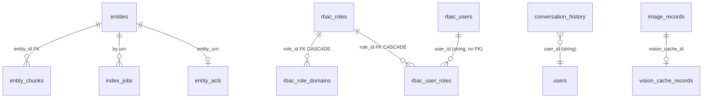
