# BÁO CÁO KIẾN TRÚC KỸ THUẬT — DATAATLAS / DATAHUB AI CHATBOT

> **Phạm vi:** repository `/home/annh45/Desktop/datahub_ai_chatbot`.
> **Về tên gọi:** Sản phẩm được marketing trên landing page frontend là **"DataAtlas — AI Metadata Assistant for DataHub"** (`frontend/app/page.tsx:5-9`, `frontend/components/landing/*`). Ứng dụng backend FastAPI có `APP_NAME="DataHub AI Chatbot"` (`config/settings.py:8`, `app/main.py:72`). Trong báo cáo này "DataAtlas" dùng để chỉ toàn bộ hệ thống chatbot; phần lõi implementation nằm ở thư mục `datahub-ai-chatbot/`.
>
> **Ghi chú:** Mọi assertion đều trace về file + dòng trong code. Trạng thái "chưa hoàn chỉnh / dead code / not found" được ghi rõ ràng. Không có phần "future improvements".

---

## 1. Tổng quan hệ thống

### 1.1 DataAtlas là gì (dựa trên implementation thực tế)

DataAtlas là một **AI metadata assistant cho DataHub**: một chatbot RAG hỏi-đáp về metadata của công ty qua DataHub. Hệ thống sync metadata từ DataHub (thật qua GraphQL hoặc mock fixtures) vào **PostgreSQL**, chunk + embedding (Ollama `nomic-embed-text`) vào **OpenSearch**, và trả lời câu hỏi tiếng Việt/Anh bằng LLM (Fireworks `deepseek-v4-flash`, có thể đổi sang NVIDIA `meta/llama-3.3-70b-instruct`).

### 1.2 Mục đích hệ thống

- Tra cứu dữ liệu trong catalog DataHub bằng ngôn ngữ tự nhiên: dataset, schema/field, glossary term, owner, domain, lineage, impact analysis, listing.
- Sinh SQL có kiểm soát dựa trên schema thật.
- Đánh giá **data quality** từ mức độ đầy đủ của metadata.
- **Hiểu ảnh** (dashboard, ERD, SQL screenshot, table screenshot...) qua vision model.
- Xử lý câu hỏi phức hợp/nhiều bước qua **Thinking Mode** (deterministic planning) và **Query Planner** (DAG tool execution).
- Kiểm soát truy cập theo **domain** (RBAC) và **ACL** theo entity.

### 1.3 Đối tượng sử dụng

- Người dùng nội bộ VinFast (theo system prompt: "automotive manufacturing and business") truy cập qua web chat.
- Vai trò seeded: `admin`, `finance`, `logistics` (hardcoded login trong `app/api/auth.py:10-38`); RBAC roles: `Tài chính`, `Logistics`, `Sản Xuất`, `VGreen`, `Sales` (seeded từ `app/api/dependencies/acl_seed.py:37-66`).

### 1.4 Capability chính (có thật trong code)

| Capability | Bằng chứng chính |
|---|---|
| Chat hỏi-đáp metadata RAG (stream SSE) | `app/api/chat.py:44-102`, `app/services/chat_service.py:401` |
| Intent classification (regex + LLM semantic) | `retrieval/intent.py`, `retrieval/classifier.py` |
| Entity extraction / resolution / fuzzy / coreference | `retrieval/entity_extraction.py`, `entity_resolver.py`, `fuzzy.py`, `coreference.py` |
| Hybrid search (keyword + vector trên OpenSearch) | `retrieval/hybrid_search.py`, `indexing/vector_store.py` |
| Tool registry (13 tool) | `retrieval/tools.py` |
| Thinking Mode (deterministic reasoning) | `retrieval/thinking/*` |
| Query Planner DAG | `retrieval/planner_executor.py` |
| SQL generation | `app/services/sql_llm.py`, `app/services/chat_service.py:1407` |
| Data quality report | `app/services/quality_report.py`, `chat_service.py:1553` |
| Vision / image understanding | `retrieval/visual/*`, `app/services/image_*`, `vision_service.py` |
| Document import (PDF/DOCX/HTML) | `ingestion/document_ingestion.py`, `app/api/documents.py` |
| Image/document storage | `infrastructure/storage.py`, `app/api/storage.py` |
| DataHub sync (full + incremental scaffold) | `ingestion/sync.py`, `sync/incremental_sync.py` |
| Auth JWT + RBAC + ACL + guardrail | `app/auth/*`, `guardrails/*` |

### 1.5 Frontend / backend / database / external services

| Thành phần | Công nghệ | Vai trò |
|---|---|---|
| Frontend | Next.js 16.3 (App Router), React 19, Tailwind 4 | Landing page "DataAtlas", chat UI, admin, storage, search, glossary |
| Backend | FastAPI (Python 3.12), uvicorn | REST + SSE chat + sync + admin |
| Database | PostgreSQL 16 (asyncpg), fallback SQLite in-memory | 13 bảng (entities, chunks, conversation, images, rbac, acl...) |
| Vector store | OpenSearch 2.15 | chunk embeddings (knn), hybrid search |
| Cache/queue | Redis 7 | rate limit, (scaffold) incremental-sync consumer/DLQ |
| LLM | Fireworks `deepseek-v4-flash`; NVIDIA `llama-3.3-70b-instruct` | sinh câu trả lời, intent, relevance gate |
| Vision | Fireworks `qwen3p7-plus` | phân tích ảnh (OCR + structured extraction) |
| Embedding | Ollama `nomic-embed-text` (768-d) | vector hoá chunk |
| DataHub | DataHub quickstart (GMS GraphQL, frontend) | nguồn metadata thật |

### 1.6 Sơ đồ kiến trúc tổng quan

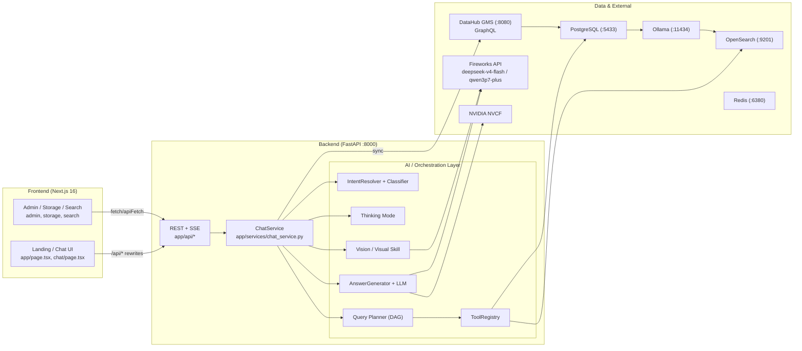

---

## 2. Technology Stack

| Layer | Technology | Vai trò | Evidence trong code |
|---|---|---|---|
| Ngôn ngữ backend | Python ≥ 3.12 | | `pyproject.toml: requires-python` |
| Web framework | FastAPI ≥ 0.115 + uvicorn | REST + SSE | `pyproject.toml`, `app/main.py:71` |
| ORM | SQLAlchemy 2.0 async (`asyncpg`, `aiosqlite`) | persistence | `pyproject.toml`, `database/session.py:18-19` |
| Migrations | Alembic | schema | `pyproject.toml`, `database/migrations/versions/*` |
| Structured logs | structlog | logging | `pyproject.toml`, `config/logging.py` |
| Config | pydantic-settings (.env) | env/config | `config/settings.py:5-6` |
| LLM SDK | `openai` (OpenAI-compatible) | Fireworks/NVIDIA/Ollama/vision | `pyproject.toml`, `llm/fireworks.py:82`, `llm/nvidia.py:40`, `indexing/embedder.py:65` |
| HTTP client | httpx | DataHub GraphQL, document download | `pyproject.toml`, `ingestion/graphql/client.py:33` |
| Vector search | OpenSearch `opensearch-py` | knn + keyword | `pyproject.toml`, `indexing/vector_store.py` |
| Redis | `redis` (asyncio) | rate limit, queue scaffold | `pyproject.toml`, `app/middleware/rate_limit.py:37`, `sync/consumer.py:56` |
| Prometheus | prometheus-client | metrics | `pyproject.toml`, `app/metrics.py` |
| DataHub SDK | `acryl-datahub` | ingest mock data vào DataHub thật | `pyproject.toml`, `scripts/ingest_real_datahub.py:24` |
| JWT | pyjwt | auth | `pyproject.toml`, `app/auth/jwt_provider.py:32` |
| PDF | PyMuPDF | parse PDF | `pyproject.toml`, `ingestion/document_parsers/pdf_parser.py` |
| Embedding | Ollama `nomic-embed-text` | vector 768-d | `indexing/embedder.py:60-87` |
| Frontend | Next.js 16.3, React 19.2, TypeScript, Tailwind 4 | | `frontend/package.json` |
| UI components | Radix UI, lucide-react, framer-motion, react-markdown, highlight.js | | `frontend/package.json` |

> Lưu ý: `tenacity` có trong pyproject nhưng retry thực tế do SDK OpenAI (`max_retries`) và code tự viết (`sync/retry.py`); không tìm thấy usage trực tiếp của tenacity. `numpy` dùng trong `MockEmbedder` (`indexing/embedder.py:49-57`).

---

## 3. Repository / Source Code Structure

### 3.1 Cây thư mục (phần triển khai chatbot)

```
datahub_ai_chatbot/
├── CACH_KHOI_CHAY.md              # lệnh chạy nhanh
├── prompt                          # file prompt gốc (ngoài code)
├── mock-data/                      # YAML dữ liệu demo (dùng bởi scripts/ingest_real_datahub.py)
├── platform/                       # (ngoài phạm vi chatbot)
├── datahub/                        # fork DataHub (mã nguồn tham chiếu, không phân tích)
└── datahub-ai-chatbot/
    ├── app/
    │   ├── main.py                 # FastAPI entry, lifespan (sync + seed + index + healthcheck)
    │   ├── api/                    # 16 router: chat, actions, auth, conversations, documents,
    │   │                           #   glossary, health, index, me, metrics, roles, search,
    │   │                           #   storage, sync, datasource
    │   │   └── dependencies/       # auth.py (get_current_user, require_role), acl_seed.py
    │   ├── auth/                   # identity, jwt_provider, authorization (ACL), rbac, models
    │   ├── middleware/             # error_handler, metrics, rate_limit
    │   ├── schemas/                # chat, actions, quality, storage, sync, entity
    │   └── services/               # chat_service (core), action_service, conversation,
    │                               #   conversation_context, image_*, vision_service, sql_llm,
    │                               #   quality_report, health_service
    ├── config/                     # settings, prompts, constants, logging
    ├── database/
    │   ├── models.py               # 13 bảng
    │   ├── session.py              # async engine/session
    │   ├── migrations/versions/    # 6 migration
    │   └── repositories/           # entity, chunk, index_job, sync, image, rbac, vision_cache
    ├── ingestion/
    │   ├── graphql_source.py       # DataHub GraphQL source
    │   ├── graphql/                # client.py, queries.py
    │   ├── mappers/                # dataset, dashboard, glossary, document
    │   ├── mock_source.py          # mock fixtures
    │   ├── sync.py                 # SyncOrchestrator
    │   ├── document_ingestion.py   # import tài liệu
    │   ├── document_parsers/       # pdf, docx, html, mock, ssrf_guard
    │   └── models.py               # CanonicalEntity...
    ├── indexing/                   # chunker, embedder, entity_document, vector_store, pipeline
    ├── retrieval/
    │   ├── intent.py, classifier.py, intent_resolver.py, datahub_intent.py
    │   ├── tools.py                # ToolRegistry
    │   ├── entity_* , fuzzy.py, coreference.py, semantic_expansion.py
    │   ├── hybrid_search.py, reranker.py, citation.py, context_builder.py
    │   ├── graph.py, graph_expander.py, planner_executor.py, query_models.py
    │   ├── thinking/               # orchestrator, complexity, planner, executor, synthesizer, context
    │   └── visual/                 # client, prompts, parser, models, skill
    ├── llm/                        # fireworks, nvidia, openai, bedrock, cohere, mock, client, generator, registry
    ├── sync/                       # incremental_sync, consumer, event_handler, models, retry, dlq, locks
    ├── workers/                    # sync_worker, indexing_worker, scheduler(stub), document_worker, embedding_worker
    ├── guardrails/                 # sanitizer, scope, service, validation
    ├── infrastructure/             # storage, redis, cache
    ├── evaluation/                 # golden dataset, evaluator, metrics
    ├── scripts/                    # full_sync, rebuild_index, bootstrap, seed, ingest_real_datahub...
    ├── tests/                      # unit/integration/e2e
    └── frontend/                   # Next.js (xem mục 22)
```

### 3.2 Module quan trọng & dependency

| Module | Path | Responsibility | Phụ thuộc |
|---|---|---|---|
| **ChatService** | `app/services/chat_service.py` (3649 dòng) | Orchestrator toàn bộ pipeline chat | mọi retrieval/llm/auth service |
| **IntentResolver** | `retrieval/intent_resolver.py` | Quyết định intent/tool từ message + action + history | `retrieval/intent.py`, `classifier.py`, `coreference.py` |
| **ToolRegistry** | `retrieval/tools.py` | Thực thi tool trên repo + graph + live DataHub | `database/repositories`, `retrieval/graph.py`, `ingestion/factory` |
| **ThinkingModeOrchestrator** | `retrieval/thinking/orchestrator.py` | Reasoning phức hợp (LLM-free) | complexity, planner, executor, synthesizer, context |
| **PlannerExecutor** | `retrieval/planner_executor.py` | Chạy DAG step bằng tool | `retrieval/tools.py` |
| **AnswerGenerator** | `llm/generator.py` | Gọi LLM, context assembly, confidence, citations | `llm/*`, `retrieval/context_builder.py`, `guardrails/validation.py` |
| **SyncOrchestrator** | `ingestion/sync.py` | Sync DataHub → Postgres | `ingestion/graphql_source.py`, repositories |
| **IndexingPipeline** | `indexing/pipeline.py` | Chunk + embed → OpenSearch + Postgres | `indexing/chunker/embedder/vector_store`, repos |
| **VisionSkill** | `retrieval/visual/skill.py` | Phân tích ảnh → vision JSON | `retrieval/visual/client.py`, `parser.py` |
| **AuthorizationService** | `app/auth/authorization.py` | ACL/RBAC domain enforcement | `app/auth/rbac.py`, repositories |

---

## 4. Kiến trúc hệ thống

### 4.1 Các layer

**Presentation/UI (Next.js)**
- Landing "DataAtlas" (`frontend/components/landing/*`) là static marketing, không gọi API.
- App shell authenticated (`frontend/app/(app)/layout.tsx`) gồm sidebar, topbar, chat, admin, storage, search, glossary, entities, status, profile.
- Mọi API gọi client-side qua `lib/api.ts` / `lib/stream.ts`; proxy qua Next rewrites (`next.config.ts`).

**API/Backend (FastAPI)**
- 16 router, prefix `/api/v1/*` + `/health`, `/ready`, `/api/me`, `/api/v1/documents/import`.
- Middleware: `ErrorHandlingMiddleware`, `MetricsMiddleware`, `RateLimitMiddleware`.

**Application/Orchestration**
- `ChatService.answer()` là pipeline tuyến tính có các "cổng" (gate) theo thứ tự: intent → clarify → greeting/chitchat → scope → injection → domain RBAC → AI relevance → vision → thinking → sql → sync → quality → conversational → listing → plan/classifier → planner DAG → retrieval → ACL → rerank → context → generate.

**AI/LLM**
- `AnswerGenerator` gọi `FireworksLLM` (mặc định) hoặc `NVIDIAProvider` (model override).
- `SEMANTIC_INTENT_PROMPT` cho classifier; `ACTION_RESOLUTION_PROMPT` cho intent resolver; `classify_datahub_relevance` (LLM relevance gate).
- `GENERAL_SYSTEM_PROMPT` cho chat ngoài metadata ("strict scope-refusal", `llm/fireworks.py:53-72`).

**Data retrieval**
- Postgres (SQLAlchemy repo) cho metadata/entities, OpenSearch cho chunk vector + keyword, live DataHub GraphQL cho lineage chi tiết.

**Persistence/Storage**
- PostgreSQL 16 (13 bảng); OpenSearch index `datahub-rag-chunks-v1`; file system `./data/images` cho ảnh, `./data/documents` (LocalStorage) — không thực sự lưu binary tài liệu; Redis cho rate-limit/queue scaffold.

**External services**
- DataHub GMS (GraphQL), Ollama, Fireworks, NVIDIA NVCF.

### 4.2 Sơ đồ kiến trúc theo layer

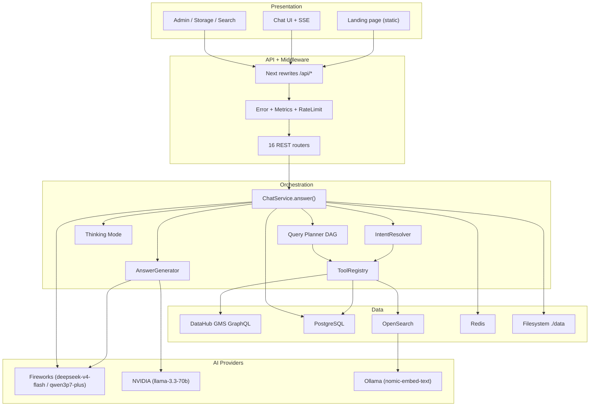

---

## 5. Luồng xử lý Chatbot tổng thể

### 5.1 Các bước thực tế (trace từ code)

1. **User input**: `ChatInput` (`frontend/components/chat/chat-input.tsx:51-76`) gửi raw message + `selected_action` + `images` (data URL base64, tối đa 4).
2. **Frontend xử lý**: `useChat.send()` (`lib/use-chat.ts:106-194`) tạo optimistic user + empty assistant message; gọi `streamChat` (`lib/stream.ts:40`).
3. **Request gửi backend**: `POST /api/v1/chat/stream` (SSE). Backend nhận tại `app/api/chat.py:44-102` (`chat_stream`). Frontend không dùng `POST /api/v1/chat` (non-stream).
4. **Backend nhận request**: `chat_stream` tạo `ChatService` + `AuthorizationService`, chạy `service.answer(...)` trong task `produce()` với callback `on_status`/`on_token`.
5. **Conversation/context**: `answer()` load `history` từ `conversation_history` DB (`chat_service.py:436`) và `active_entities` từ in-memory `ConversationMemory` (`chat_service.py:438`).
6. **Intent phân tích**: `IntentResolver.resolve()` (`chat_service.py:445-447`) merge selected_action + message + history; dùng `ACTION_RESOLUTION_PROMPT` (LLM) khi mơ hồ; keyword router khi không. Reroute khái niệm→dataset (`_CONCEPT_TO_DATASETS_RE`) trước clarify.
7. **LLM gọi ở nhiều bước**: relevance gate (`chat_service.py:573`), semantic intent classifier (`chat_service.py:906-910`), intent resolver LLM, và cuối cùng `AnswerGenerator.generate`/`generate_stream` (`llm/generator.py:70-156`).
8. **Tool lựa chọn**: `resolution.chosen_tool` (từ `_INTENT_TOOL` map `intent_resolver.py:176-199`) hoặc `_default_op` của planner (`planner_executor.py:69-80`); composite → `planner_dag`. Tool thực thi qua `ToolRegistry.execute` (`tools.py:352-362`).
9. **Truy xuất DataHub/RAG/DB**: ToolRegistry đọc từ Postgres repo, OpenSearch (hybrid search), và live DataHub lineage (`tools.py` `_live_lineage_urns` 159-174). Sync nền từ DataHub vào Postgres khi boot (`app/main.py:38-55`).
10. **Context assemble**: `ContextBuilder.build_context` (`retrieval/context_builder.py:44-73`) chọn ≤ 8 chunks / ≤ 24000 ký tự → XML `<context>` với citation `[E1..]`; `_sanitize_context` mask secret.
11. **LLM generate response**: `_rag_answer` → `FireworksLLM.generate_structured` (JSON `{answer, citation_ids, confidence, insufficient_context}`); streaming path `generate_stream` → `llm.stream`.
12. **Citation/reference**: `build_citations` + `validate_citations` (`retrieval/citation.py:30-58`) map `citation_ids` → docs (dedupe theo entity_urn); `validate_generation` (`guardrails/validation.py:72-103`) strip URN không có trong context.
13. **Response stream về frontend**: `event_gen()` emit `event: status|token|done|error` (`app/api/chat.py:56-92`); SSE header `Cache-Control: no-cache`, `X-Accel-Buffering: no`.
14. **UI render**: `parseBlock`/`streamChat` dispatch (`lib/stream.ts:99-108`) → token nối vào bubble (Markdown), `done` merge ChatResponse (citations, entities, lineage graph, quality_report, suggestion, confidence); `onError` → "⚠️ ...".

### 5.2 Sequence diagram

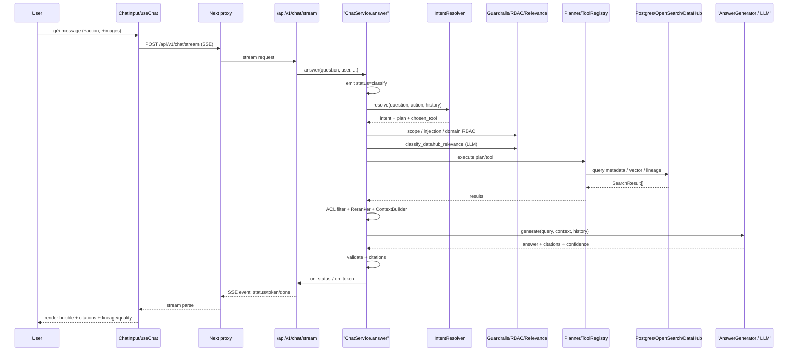

---

## 6. Kiến trúc xử lý câu hỏi DataHub

### 6.1 Pipeline dùng chung

Hầu hết câu hỏi đi qua cùng pipeline: **IntentResolver → (gate) → ToolRegistry / structured retrieval → AnswerGenerator**. Điểm phân nhánh chính nằm ở `resolution.chosen_tool` + `intent` trong `answer()` (`chat_service.py:785-1091`).

### 6.2 Từng capability

| Capability | Input example | Detection/Routing | Tool/Flow | Data source | Context | LLM processing |
|---|---|---|---|---|---|---|
| Dataset search | "tìm dataset doanh thu" | `FIND_ENTITY`/`DATASET_LOOKUP` (regex `_RULE_STRINGS`) | `hybrid_search` (mặc định) | Postgres resolver + OpenSearch hybrid | `<context>` XML từ chunks | `generate` JSON answer |
| Schema/fields | "fact_sales_order có những trường nào?" | `SCHEMA_LOOKUP` regex (`intent.py:140`) | `schema_lookup` (`tools.py:188`) | resolver (dataset) | schema chunk | generate |
| Glossary | "Term Revenue nghĩa là gì?" | `TERM_DEFINITION` (`intent.py:145`) | `glossary_lookup` (`tools.py:204`) | resolver (glossary_term) | term_definition chunk | generate; dưới `ENTITY_RESOLVER_TRUST_THRESHOLD` → suggestion "Ý bạn là X?" |
| Owner | "ai sở hữu dim_product_model?" | `OWNER_LOOKUP` (`intent.py:136`) | `owner_lookup` (`tools.py:196`) | resolver | owner chunk | generate |
| Domain | "dataset này thuộc domain nào?" | `ENTITY_DOMAIN` (`intent.py:132`) | `resolve_entity` | resolver | domain | generate |
| Lineage | "fact_sales_order lấy dữ liệu từ đâu?" | `LINEAGE` (`intent.py:147`) | `lineage` (`tools.py:220`) | resolver + live DataHub `get_lineage` + repo payload | upstream/downstream chunks | generate + `_build_lineage_data` trả `LineageData` cho UI graph |
| Impact analysis | "xóa dim_warehouse thì ai bị ảnh hưởng?" | `IMPACT_ANALYSIS`/`RECURSIVE_IMPACT` (`intent.py:106-130`) | `recursive_impact` (`tools.py:246`, BFS downstream depth≤3 max 200 nodes) | `MetadataGraph.impact`/`impact_summary` | impact summary | `_recursive_impact_retrieval` (`chat_service.py:2351`) + generate |
| Documentation/document | "tài liệu về chính sách?" | `DOCUMENT_QA` (`intent.py:189`) | `document_qa` tool → **luôn trả []**; đi qua RAG vector (`tools.py:347-350`) | OpenSearch document_chunk | document chunks | generate |
| SQL generation | "viết sql lấy doanh thu" | `SQL_GENERATION` regex (`intent.py:198-209`) hoặc action `sql` | `_sql_generation_flow` (`chat_service.py:1407`) | schema thật + grounded rules | xem mục 17 | `sql_llm.py` |
| Data quality | "chất lượng dữ liệu của X?" | action `quality`/`GENERAL` (`_QUALITY_FAVORED_INTENTS`) | `_quality_check_flow` (`chat_service.py:1553`) | metadata completeness + profiling | xem mục 18 | deterministic (không LLM sinh score) |
| Listing | "có những dataset nào?" | `_detect_listing` (`chat_service.py:2432`) | `_deterministic_listing` / listing path | Postgres `count_by_type`/`list_by_type` | — | deterministic, không gọi LLM |
| Count | "có bao nhiêu dataset?" | `COUNT_ENTITIES` | `count_entities` (`tools.py:336`) | repo | count trong payload | generate |
| Term→datasets | "dataset nào liên quan đến doanh thu?" | `TERM_TO_DATASETS` (`intent.py:185`) + `_CONCEPT_TO_DATASETS_RE` reroute | `term_to_datasets` (`tools.py:293`) + semantic expansion | repo dataset + glossary overlap | term concept | `_term_datasets_flow` |
| Domain/Platform/Tag/Owner/Certified query | "dataset trên SAP?" | `DOMAIN_QUERY`/`PLATFORM_QUERY`/`TAG_QUERY`/`ENTITIES_BY_OWNER`/`CERTIFIED_LIST` | `list_by_dimension` (`tools.py:309`) | repo `list_by_*` | — | generate |
| Existence | "có dataset X không?" | `ENTITY_EXISTS` (`intent.py:194`) | `existence` (`tools.py:215`) | resolver | — | generate |
| DataHub URL | "link datahub của X?" | `DATAHUB_URL` | `resolve_entity` | resolver | `datahub_url` | generate |
| Greeting/chitchat | "xin chào" | exact-set (`_GREETINGS`/`_CHITCHAT`) | canned response | — | — | không gọi LLM |

### 6.3 Ghi chú trạng thái

- `document_qa` tool không trực tiếp trả document chunks; retrieval qua RAG vector (`hybrid_search`) với `chunk_type=document_chunk` thay vì tool.
- Các endpoint standalone `/api/v1/actions/*` (`app/api/actions.py:32-144`: schema-compare, sql, impact, lineage, quality, report, quality/export) có đầy đủ backend nhưng **UI chat không gọi** — UI gửi `selected_action` vào SSE và để `ChatService` xử lý. Ngoại lệ: `POST /api/v1/actions/quality/export` được `quality-report-card.tsx:44` gọi để export PDF/TXT.

---

## 7. Multi-question / Sub-question Processing

### 7.1 Trạng thái thực tế

- **Detect nhiều câu hỏi**: Có. Regex `_RULE_STRINGS` ưu tiên `COMPOSITE_QUERY` khi có `đồng thời|cũng như|sau đó|and then|and what|and who`; `nhiều/một số + dataset/table` → `MULTI_ENTITY_QUERY` (`retrieval/intent.py:92-95`). Semantic classifier cũng gắn cờ `is_composite=true` (`SEMANTIC_INTENT_PROMPT`, `classifier.py`).
- **Decomposition**: Có hai tầng:
  1. **Query Planner** (`retrieval/planner_executor.py`): `QueryPlan.steps` là DAG `PlanStep{op, params, depends_on}`; composite/multi-entity → một step `resolve_entity` cho từng `entity_ref`; `_default_steps` (`planner_executor.py:82-98`). Gate: `QUERY_PLANNER_ENABLED and (plan.steps or plan.intent in (COMPOSITE_QUERY, MULTI_ENTITY_QUERY))` (`chat_service.py:920-925`).
  2. **Thinking Mode** cho câu phức hợp GENERAL (mục 8).
- **Tuần tự/song song**: `_execute_dag` (`planner_executor.py:152-203`) — các step ready chạy `asyncio.gather` nếu có `session_factory` (mỗi op dùng session riêng để tránh SQLAlchemy ISCE), ngược lại tuần tự; kết quả gộp theo topological order, dedupe theo URN.
- **Combine result**: `planner_results` trở thành `results` chính (`chat_service.py:927-929`), sau đó vào `Reranker` + `ContextBuilder` + `AnswerGenerator` như pipeline thường.
- **Context giữa sub-question**: DAG `depends_on` cho phép step sau dùng output step trước (parameter forwarding qua `params`); không có cơ chế lưu intermediate answer vào conversation.
- **LLM tham gia**: `classifier.classify` (LLM semantic) sinh `QueryPlan` với steps; `QUERY_PLAN_PROMPT` trong `config/prompts.py:116-148` là prompt định nghĩa cho planner nhưng **dead code** — không được import (planner deterministic, không gọi LLM planner thật).
- **Giới hạn**: `THINKING_MAX_STEPS=8` (settings), `IMPACT_MAX_NODES=200`, `GRAPH_MAX_DEPTH=3`. Planner DAG không có hard cap step count trong `planner_executor.py` (chỉ phụ thuộc vào số `entity_refs`).
- **Error handling một sub-question**: `_run_op` retry 2 lần rồi trả `[]` (`planner_executor.py:123-146`); nếu `planner_results` rỗng → rơi về single-intent path (`chat_service.py:931+`). Step bị lỗi không làm hỏng toàn cục.

### 7.2 Diagram

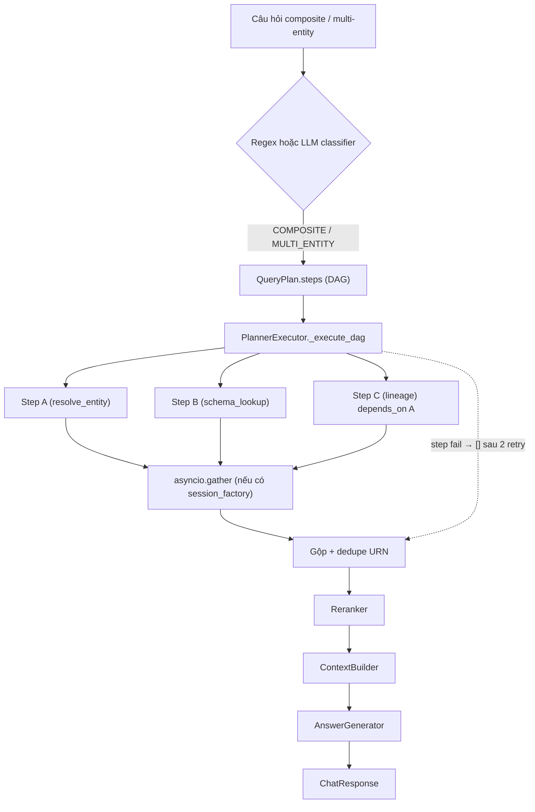

---

## 8. Thinking / Complex Question Processing

### 8.1 Tổng quan (trạng thái thực tế)

Thinking Mode là một **reasoning layer độc lập, deterministic (không dùng LLM)** nằm ở `retrieval/thinking/`. Pipeline: `maybe_answer()` (`orchestrator.py:43-76`):
1. `ContextResolver.resolve()` luôn chạy trước.
2. `ComplexityClassifier.evaluate()` — nếu **không complex → trả `None`** (fall-through pipeline thường).
3. Nếu complex: `ThinkingPlanner.plan()` → `ExecutionPlan`, `ThinkingExecutor.execute()`, `ThinkingSynthesizer.synthesize()` → trả **markdown answer**.

### 8.2 Điều kiện kích hoạt

- `settings.THINKING_MODE_ENABLED = True` (`config/settings.py:109`).
- Chỉ khi `intent == QueryIntent.GENERAL` VÀ không phải contextual follow-up (`_ctx_followup`, anaphora/ellipsis) (`chat_service.py:748-752`).
- Complexity score ≥ 3 từ weighted regex features (`complexity.py`): so sánh (+2), overview (+2), delete×impact (+3), cross-domain (+2), planning (+1), join key (+2), ownerless×quality (+2), cross-reference (+2), số entity mentions (+min(2)), số knowledge sources (+min(3)).
- Kết quả trả về được đánh `intent="THINKING_OVERVIEW"` **hardcode** (`chat_service.py:775`) dù hint thực tế có thể là THINKING_COMPARISON/OVERVIEW/IMPACT/... (bất nhất có thật trong code).

### 8.3 Cấu trúc answer

`EffortResult.to_answer_md()` (`thinking/models.py:124-152`) render markdown tiếng Việt:
- `### Kết luận`, `### Lý do chính`, `### Các thực thể liên quan`, `### Rủi ro / điểm chưa chắc chắn`, `### Thiếu dữ liệu`, `### Khuyến nghị tiếp theo`.

### 8.4 Executor & DataHub context

`ThinkingExecutor.execute()` (`executor.py:86-106`) budget `_MAX_STEPS = THINKING_MAX_STEPS (8)`; `_run_step` dispatch các bước: `_resolve`, `_schema`, `_owners`, `_glossary`, `_lineage`, `_downup`, `_quality`, `_compare`, `_impact` (dùng `MetadataGraph.impact_summary` depth=3, max 200 nodes), `_ownerless_quality`, `_overview`, `_join_key`, `_cross_ref`. Evidence confidence gán theo loại (0.95 resolve, 0.85 schema, 0.8 lineage, 0.9 compare/impact immediate, 0.7 indirect...).

### 8.5 Exposure

- Thinking answer được stream `on_token` cho user như một câu trả lời markdown bình thường, **không có UI đặc biệt** phân biệt với answer khác (landing page `complex-questions.tsx` quảng cáo "high-level reasoning steps, NOT chain-of-thought" nhưng backend không expose thinking steps riêng).

### 8.6 Diagram

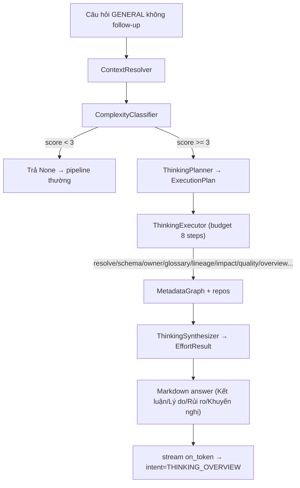

---

## 9. Conversation Context Management

### 9.1 Lưu trữ

- Bảng duy nhất `conversation_history` (`database/models.py:118-131`): **mỗi hàng = một lượt Q/A** (question + answer), nhóm theo `conversation_id` (64 ký tự), `user_id`, `title`, `is_pinned`, `is_favorite`, `created_at`. **Không có bảng `conversations` hoặc `messages` riêng.**
- `ConversationMemory` (`app/services/conversation.py`): wrapper in-memory + DB (add_turn_db, load_history_from_db, get/set_active_entities, set/get/clear_image_focus).
- API conversation: list/get/patch/delete/clear (`app/api/conversations.py`).

### 9.2 Message schema

- Backend: `question` (Text), `answer` (Text), `conversation_id`, `user_id`, `title`, `is_pinned`, `is_favorite` (DB).
- Frontend `ChatMessage` (`lib/use-chat.ts:19-36`): `id, role(user/assistant/error), content, displayContent, images, citations, entities, lineage, quality_report, suggestion, confidence, ambiguous, intent, conversation_id, streaming`.

### 9.3 Context window & cách đưa vào LLM

- `history` = list `(question, answer)` load từ DB (`chat_service.py:436`), chuyển thành messages `[system, *history, context-block, user prompt]` trong `FireworksLLM.generate`/`stream` (`llm/fireworks.py:105-129`).
- **Không có summarization**; không có giới hạn số turn rõ ràng trong code (toàn bộ history được đưa vào mỗi request).
- Ngữ cảnh retrieval (context) được giới hạn: ≤ 8 chunks / ≤ 24000 chars (`context_builder.py:44-73`).

### 9.4 Phân biệt các loại context

| Loại | Nơi lưu | Vai trò trong prompt |
|---|---|---|
| User text | `question` (DB) | message user |
| Image context | `ImageContext` JSON trong `image_records` + `ConversationContextManager` in-memory | entity hint / trả lời trực tiếp nội dung ảnh; **không đưa raw vision JSON vào LLM prompt chính** |
| DataHub context | `retrieval/context_builder.py` | `<context>` XML, untrusted data |
| Tool result | `SearchResult` payload | thành ContextDocument |
| Previous assistant response | `history` (DB) | messages `(user, assistant)` |

### 9.5 Resolve reference follow-up ("nó", "dataset đó", "bảng này")

- `retrieval/coreference.py`: `has_anaphora` (từ `nó|đó|ấy|này|đây|kia` + English), `resolve_entity_reference` (quét lùi, ưu tiên subject entity gần nhất).
- `chat_service.py:941-955`: `has_anaphora`, `is_ellipsis` ("con ...", "the ..."), `_is_contextual_followup`; sau đó `_resolve_followup_entity` (`chat_service.py:3273`) + `active_entities` (được `_record_active_entities` ghi mỗi turn).
- Image focus: `_IMAGE_REF_RE` + `ConversationMemory.set_image_focus` cho follow-up về ảnh.
- Thinking Mode **chặn** follow-up anaphora (`_ctx_followup` → không vào thinking) vì entity nằm trong history.

### 9.6 Diagram lifecycle

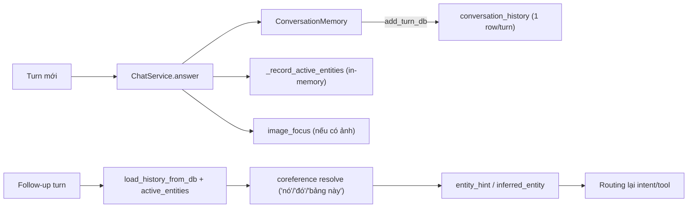

---

## 10. Image / Vision Processing

### 10.1 Flow đầy đủ

1. **User upload image**: `ChatInput` đọc file → `FileReader.readAsDataURL` (base64 data URL, `chat-input.tsx:149-158`), tối đa `MAX_IMAGES=4` (`chat-input.tsx:13`).
2. **Frontend**: gửi trong `ChatRequest.images` (`lib/use-chat.ts:124,147`; `lib/types.ts`; schema `app/schemas/chat.py:6-18`).
3. **Upload/API**: `POST /api/v1/chat/stream` → `ChatService` → `ConversationContextManager.ingest` (`conversation_context.py:82-117`) → `ImageUploadService` (`image_upload.py:52-85`).
4. **Image storage**: `ImageStorageService.save` ghi file `./data/images/<user_id>/<image_id>/original.<ext>` + `thumb.jpg` (320px, JPEG q80) (`image_storage.py:113-157`); DB `image_records` chỉ lưu metadata; `content_hash` = SHA-256 bytes.
5. **Vision model**: `VisionService.analyze` (`vision_service.py:33-67`, cache-first qua `VisionCacheRepository`) → `VisualUnderstandingSkill.analyze` (`retrieval/visual/skill.py:93-148`) → `FireworksVisionClient` (`visual/client.py:42-65`), model `accounts/fireworks/models/qwen3p7-plus`, gửi base64 `data:` URL + prompt, `response_format=json_object`, temperature 0.1, max_tokens 2048, timeout 60s.
6. **Extracted visual context**: `VisionResult` (JSON schema trong `retrieval/visual/models.py:92-171`): `image_type` (dashboard/erd/sql/sql_error/error/metadata/requirement/table/lineage/workflow/access_permission/irrelevant/unknown), `ocr_text`, `detected_entities/tables/columns/metrics/relationships/errors/questions`, `confidence`, `recommended_skills`, `candidates`, `quality`, `irrelevant`, `refusal_reason`. Parser `retrieval/visual/parser.py:203-240` 4-layer robust, không bao giờ raise.
7. **Conversation context**: `ImageContextManager.build` (`image_context.py:87-149`) chọn dataset candidate tốt nhất, enrich với DataHub (dataset_name/urn/domain/owner/description/platform/glossary_terms); lưu `image_context` JSON vào DB; `ConversationMemory.set_image_focus` bind làm active entity.
8. **Question answering**: `chat_service.py:628-735` (vision gate):
   - "IMAGE IS CONTEXT, NOT INTENT": dataset từ ảnh được bind vào `entity_hint`/`active_entities` để các function flow (SQL, quality, impact, lineage, schema, owner...) chạy trên nó.
   - Chỉ trả lời **trực tiếp từ ảnh** khi câu hỏi thuần về nội dung ảnh (`_answer_from_image_context`, `chat_service.py:1657`); intent trả về `VISION_ANALYSIS` (hoặc `VISION_REFUSED` nếu ảnh irrelevant).
   - Nhiều ảnh mơ hồ → `VISION_CLARIFY` liệt kê ≤ 3 filename (`chat_service.py:717-735`).
9. **Response**: vision payload trả trong `ChatResponse.vision` (`schemas/chat.py:71`).

### 10.2 Các trạng thái chi tiết

- **Ảnh lưu ở đâu**: filesystem `./data/images/<user_id>/<image_id>/`; metadata trong `image_records`.
- **Image ID/URL**: `image_id = uuid4().hex[:16]`; thumbnail URL `/api/v1/storage/{id}/thumbnail`; download `/api/v1/storage/{id}/download`.
- **Vision model**: `qwen3p7-plus` (Fireworks). Docstring client ghi "Qwen2.5-VL-72B-Instruct" nhưng model thật lấy từ settings — stale.
- **Vision prompt**: `VISION_SYSTEM_PROMPT` (`retrieval/visual/prompts.py:23-92`): "extract and normalize, do NOT answer business questions", schema JSON bắt buộc, ngôn ngữ theo câu hỏi.
- **Vision output vào conversation context?**: Có — `image_context` JSON lưu DB và được `ConversationContextManager.load`/`resolve_active` khôi phục cho follow-up; không re-run vision (cache theo content_hash).
- **Follow-up tham chiếu ảnh**: `_IMAGE_REF_RE` (ảnh/hình/nó/đó/đây/này/trên...) + `resolve_active` + image focus.
- **Phân biệt "phân tích ảnh" vs "trả lời dựa trên ảnh"**: `_answer_from_image_context` xử lý câu hỏi nội dung ảnh (what/fields) → `VISION_ANALYSIS`; câu hỏi chức năng DataHub → fall-through router với image entity bound. `VISION_REFUSED` khi ảnh không liên quan data.
- **Câu hỏi cụ thể về ảnh**: hệ thống ưu tiên user question; `_answer_from_image_context` dùng `image_context` để trả lời có trọng tâm, không trả toàn bộ metadata.
- **Ảnh + Data Lineage/Quality/Impact**: image entity bind làm active entity → các flow đó resolve trên dataset của ảnh.
- **Ảnh + câu hỏi không liên quan**: question tự chứa identifier → giữ entity riêng của câu hỏi (image context ở dưới explicit intent); nếu là listing (`_detect_listing`) → không bind ảnh.

### 10.3 Sequence diagram

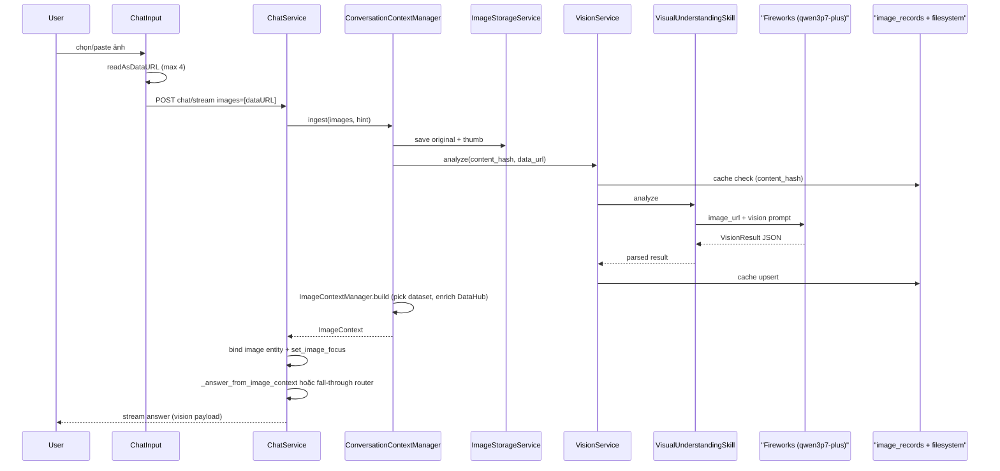

---

## 11. Document Processing

### 11.1 Trạng thái thực tế

- **Upload**: Chỉ qua **URL**, endpoint `POST /api/v1/documents/import?url=&title=` (`app/api/documents.py:13-29`), yêu cầu role `admin|editor|steward`. Không có multipart upload endpoint (backend có `ingest_from_file` nhưng không expose).
- **Parsing**: `DocumentIngestionService.ingest_from_url` → SSRF guard → download (httpx 30s) → `get_parser(filename)` chọn parser theo extension (`.pdf`, `.docx`, `.html`, `.htm`); dev dùng `mock_parser` (`APP_ENV == development`). Parser: PyMuPDF (fallback latin-1), python-docx (optional), BeautifulSoup (optional + regex fallback).
- **Extraction/Indexing**: parse → text → `chunk_text` → embed (`OllamaEmbedder`) → lưu `EntityChunk` (Postgres) + OpenSearch docs; upsert `Entity(entity_type="document")` với URN `urn:li:document:{sha256(content)[:16]}`; `vector_store.ensure_index()` + `bulk_upsert`.
- **Document trong catalog**: mappers sync document từ DataHub (`ingestion/mappers/document.py`, `info.contents.text`), hoặc import qua API. Chunk types: `document_summary` (idx 0) + `document_chunk` per section (`entity_document.py:79-101`).
- **Retrieval**: `document_chunk` chunks truy xuất qua `hybrid_search` (OpenSearch), `source_type=document_chunk` trong citations (`context_builder.py`, `constants.py:21`).
- **Document listing/metadata**: listing document = `_detect_listing` + `list_by_type("document")`; không có trang UI riêng (đi qua Entities page).
- **Permissions**: `POST /api/v1/documents/import` yêu cầu role; document entities có ACL domain như mọi entity khác.
- **Document storage**: **không lưu binary file tài liệu** trên disk (LocalStorage `./data/documents` được khởi tạo nhưng không dùng để persist); chỉ lưu text chunk trong Postgres + OpenSearch.

### 11.2 Diagram

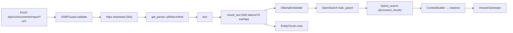

---

## 12. Storage Architecture

### 12.1 Các tầng storage

| Storage | Nội dung | Vị trí code |
|---|---|---|
| PostgreSQL (13 bảng) | entities, entity_chunks, sync_checkpoints, entity_acls, conversation_history, rbac_roles/role_domains, rbac_users, rbac_user_roles, audit_logs, index_jobs, image_records, vision_cache_records | `database/models.py` |
| OpenSearch `datahub-rag-chunks-v1` | chunk + knn embedding | `indexing/vector_store.py:20-57` |
| Filesystem `./data/images` | ảnh gốc + thumbnail (per user/image_id), `.trash` | `app/services/image_storage.py:113-157,184-198` |
| Filesystem `./data/documents` | `LocalStorage` — khởi tạo nhưng **không persist tài liệu** | `infrastructure/storage.py` |
| Redis | rate limit, queue scaffold | `app/middleware/rate_limit.py`, `sync/*` |

### 12.2 Image lifecycle

- Upload: data URL → hash → save file → `ImageRecord(status=uploaded)` → vision → `analyzed` + `image_type` + `vision_result` + `image_context` (`image_upload.py`).
- Retrieve: `list`/`get`/`thumbnail`/`download` (`app/api/storage.py`) — tất cả enforce ownership (`user_id` match, else 404).
- Re-analyze: `POST /{id}/reanalyze` (bypass cache, cooldown `IMAGE_RERUN_COOLDOWN_SECONDS=5`).
- Delete: soft → `is_deleted=True` + move original vào `.trash`; hard → purge directory. `restore` chỉ DB (khôi phục soft-delete; `restore_from_trash` là no-op `False`).
- Error: `ImageTooLargeError` (> 15MB), MIME không phải `image/*` bị từ chối.

### 12.3 Diagram

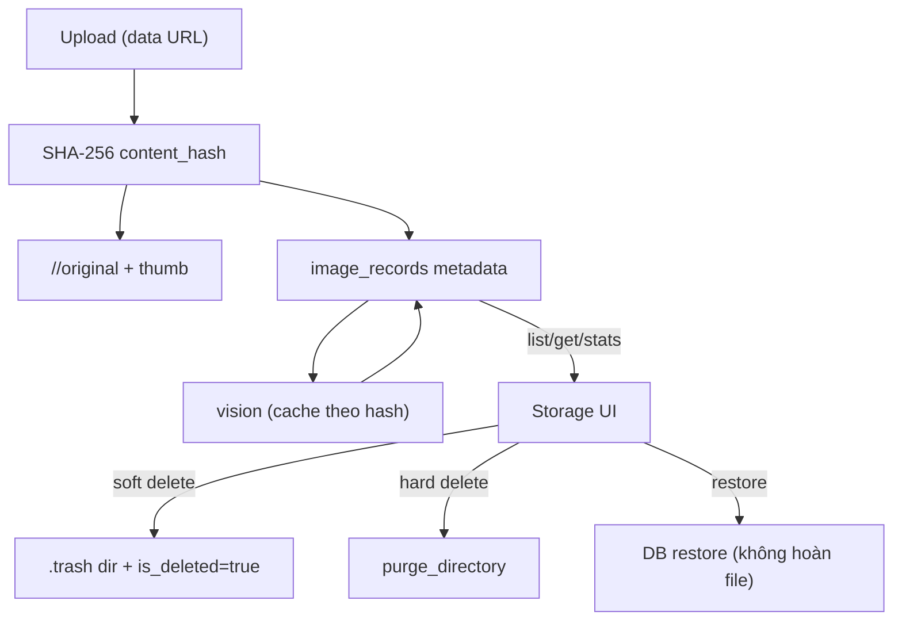

---

## 13. DataHub Integration

### 13.1 Client & API

- `GraphQLClient` (`ingestion/graphql/client.py:33`): wrapper `httpx.AsyncClient`, POST `{gms_url}/api/graphql`, Bearer token nếu có; retry exponential backoff; phân biệt `DataHubTimeoutError`, `DataHubAuthError` (401), 404 → `{}`, 5xx retry.
- `GraphQLDataHubSource` (`ingestion/graphql_source.py:29`): pagination bằng `scrollAcrossEntities` (scrollId), `count=page_size (100)`.

### 13.2 Query patterns (`ingestion/graphql/queries.py`)

| Query | GQL operation | Mục đích |
|---|---|---|
| `SEARCH_ENTITIES_QUERY` | searchEntities | **Dead code** (không ai dùng) |
| `SCROLL_ACROSS_ENTITIES_QUERY` | scrollAcrossEntities | listing + search (inline fragments giàu) |
| `GET_DATASET_QUERY` | getDataset | chi tiết dataset + schema + ownership + lineage + domain + terms + tags |
| `GET_DATASET_LINEAGE_QUERY` | getDatasetLineage | lineage theo direction |
| `GET_DASHBOARD_QUERY` | getDashboard | chi tiết dashboard |
| `GET_GLOSSARY_TERM_QUERY` | getGlossaryTerm | chi tiết glossary term + relatedEntities |
| `LIST_GLOSSARY_TERMS_QUERY` | scrollGlossaryTerms | **imported nhưng không dùng** |
| `GET_DOCUMENT_QUERY` | getDocument | chi tiết document |

### 13.3 Entity types & URN

- MVP sync: `dataset, dashboard, glossary_term, glossary_node, document` (`config/constants.py:1-7`). GraphQL source type_map còn nhận `chart, dataFlow, dataJob, container, tag, mlModel, mlFeatureTable` nhưng không nằm trong sync loop.
- URN routing `_urn_to_type` (`graphql_source.py:141-146`): dataset, glossaryTerm, dashboard, chart, dataFlow, dataJob, container, tag, mlModel; **default "dataset"**; **thiếu pattern `:glossaryNode:` và `:document:`** → document/glossaryNode URN bị route nhầm về dataset (trừ khi rơi đúng branch `_get_document` — thực tế `get_entity` với document urn bị `_urn_to_type` trả "dataset").
- Mappers (`ingestion/mappers/*`): chỉ dùng trong path `get_entity`; path `list_entities`/`search_entities` dùng `_search_hit_to_canonical` (map trực tiếp từ search hit). `DatasetMapper._map_schema_fields` không set `field_path`/`native_data_type` (khác path search-hit).

### 13.4 Cache/indexing/RAG

- Sync DataHub → Postgres `entities` (payload JSON đầy đủ) + tạo `IndexJob` pending → `IndexingPipeline` chunk+embed → OpenSearch. Như vậy **query-time không gọi DataHub**; ngoại lệ: lineage tool gọi live `get_lineage` (`tools.py:159-174`) và action endpoints `action_service.py` (resolve_dataset dùng DB, `_lineage_urns`).
- Startup mỗi lần boot chạy `SyncOrchestrator.run_full_sync()` (`app/main.py:38-43`).
- Incremental sync scaffold: `IncrementalSyncService` (test-only), `RedisStreamEventConsumer`/`RedisDeadLetterQueue`/`DistributedLock` — **không wire vào production** (không có producer events). `sync_worker.py` thực chất là full re-sync mỗi giờ.

### 13.5 Diagram

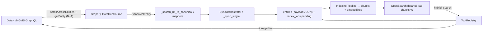

---

## 14. RAG / Retrieval Architecture

### 14.1 Các bước

- **Data ingestion**: sync từ DataHub (mục 13) → `entities`; import document → entity document.
- **Chunking**: `chunker.py` `chunk_text` (target 600 tokens, overlap 75; paragraph/sentence split). Chunk templates per entity type trong `entity_document.py` (dataset: summary/schema_fields/upstream/downstream; glossary: definition/relationship; dashboard: summary; document: summary + sections).
- **Embedding**: `OllamaEmbedder` (`nomic-embed-text`, 768-d) qua OpenAI-compatible endpoint; `MockEmbedder` (hash vector) khi mock.
- **Vector DB**: OpenSearch index `datahub-rag-chunks-v1` (knn_vector dim 768; keyword fields entity_urn/type/domain/platform/environment/owner_names/term_urns). `bulk_upsert`/`upsert`/`delete_by_entity_urn`.
- **Retrieval**: `HybridSearch.search` (`hybrid_search.py:61-89`): (1) resolver exact → score 1.0; (2) resolver candidates → top-5 URN 0.9; (3) vector: embed query → `OpenSearchVectorStore.hybrid_search` (keyword×0.5 + vector×0.5, cộng trên doc id trùng, top `size`); (4) mock fallback khi fake/mock.
- **Ranking**: `Reranker` 4-signal (`reranker.py:30-36`): base 0.5, semantic 0.2, graph 0.15, metadata 0.1, citation 0.05.
- **Context assembly**: `ContextBuilder.build_context` (≤8 chunks, ≤24000 chars) → XML `<context>` + cid `[E1..]`; `_sanitize_context` mask secret.
- **LLM generation**: `AnswerGenerator.generate`/`generate_stream` (mục 15).

> **Lưu ý trạng thái**: `keyword_index.py` là stub (raise NotImplementedError). Chunk retrieval dùng OpenSearch là chính; Postgres `entity_chunks` là nguồn backup/audit.

### 14.2 Diagram

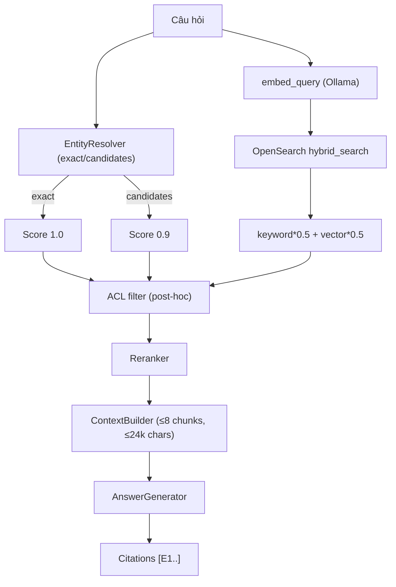

---

## 15. LLM Architecture

### 15.1 Provider & model

- `LLM_PROVIDER=fireworks` (default), model `accounts/fireworks/models/deepseek-v4-flash` (`settings.py:50-58`).
- NVIDIA provider: `meta/llama-3.3-70b-instruct` qua NVCF (`settings.py:60-62`), chọn được khi user đổi model qua `/api/v1/chat/models` (`llm/registry.py:15-29`).
- OpenAI/Bedrock/Cohere: **stub** raise `NotImplementedError` (`llm/openai.py`, `bedrock.py`, `cohere.py`).
- Mock: `MockLLM` (`mock-llm-v1`) khi `USE_MOCK_LLM`.

### 15.2 System/developer/user prompt

- `llm/fireworks.py` có 3 system prompt: `SYSTEM_PROMPT` (JSON answer), `STREAM_SYSTEM_PROMPT` (chỉ text, không JSON), `GENERAL_SYSTEM_PROMPT` (scope-refusal "DataAtlas strict assistant"). Tất cả append `GUARDRAIL_RULES` (`config/prompts.py:34-48`).
- NVIDIA dùng `NVIDIA_SYSTEM_PROMPT` + `GUARDRAIL_RULES`; streaming dùng `STREAM_SYSTEM_PROMPT` từ fireworks.
- User prompt: question + `<context>` block; history chèn trước user prompt.

### 15.3 Context / tool definition / function calling

- **Không dùng native tool/function calling của API**. Tool dispatch là code-level: `IntentResolver`/`PlannerExecutor` chọn tool → `ToolRegistry.execute`. LLM chỉ sinh JSON intent/plan/answer qua `response_format=json_object` (Fireworks) hoặc parsing tự do (NVIDIA).
- `SEMANTIC_INTENT_PROMPT`, `ACTION_RESOLUTION_PROMPT`, `QUERY_PLAN_PROMPT` (dead), `classify_datahub_relevance` system prompt — xem mục 6/7.

### 15.4 Streaming

- `FireworksLLM.stream` (`fireworks.py:131-168`): `stream=True`, không `response_format`, forward delta qua `on_token`.
- Backend: `chat_stream` SSE (`app/api/chat.py`). Frontend: `streamChat` parse.
- `BaseLLM.stream` mặc định = generate + 1 token (chỉ stub provider).

### 15.5 Retry / fallback

- `LLM_TIMEOUT_SECONDS=60`: fireworks timeout = `min(60,15)=15s` (hardcode cap 15), nvidia 60s; vision 60s.
- `LLM_MAX_RETRIES=2` **không được wire** (settings-only). Retry thật: `AsyncOpenAI(max_retries=1)` fireworks/nvidia; vision `max_retries=0`.
- Chuỗi fallback (trace): mock → không API key (deterministic `format_fallback_answer`/NO_EVIDENCE) → SDK retry → exception fallback ("Xin lỗi, đã xảy ra lỗi...") → classifier fallback regex → `datahub_intent` UNCERTAIN → keyword rescue → planner retry 2 → tool `[]`.

### 15.6 Token/context & model routing

- `MAX_CONTEXT_CHUNKS=8`, `MAX_CONTEXT_CHARACTERS=24000`; `max_tokens=2048`, `temperature=0.1` (generate/stream/vision).
- Model routing: `AnswerGenerator(provider=model)` khi `request.model` được set (`chat_service.py:415-424`); registry trả 2 model.

### 15.7 Diagram orchestration LLM

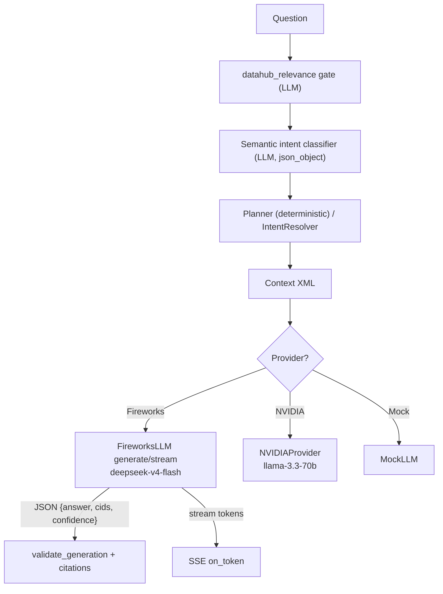

---

## 16. Tool / Function Calling Architecture

### 16.1 Danh sách tool (ToolRegistry — `retrieval/tools.py`)

| Tool | Purpose | Input | Output | Data source | Caller | Failure handling |
|---|---|---|---|---|---|---|
| `resolve_entity` | entity chuẩn theo tên/URN | name, entity_type | 0-1 SearchResult (score 1.0) | EntityRepository qua resolver | planner/structured | `[]` |
| `schema_lookup` | schema dataset | name | 0-1 result | resolver (dataset) | planner | `[]` |
| `owner_lookup` | owner | name | 0-1 result | resolver | planner | `[]` |
| `glossary_lookup` | glossary definition | name | 0-1 result | resolver | planner | `[]` |
| `existence` | entity tồn tại? | name | 0-1 result | resolver | planner | `[]` |
| `lineage` | upstream/downstream | name, direction | root (1.0) + rels (0.8/0.75) | resolver + live DataHub + repo payload | planner/structured | `[]` nếu root unresolved |
| `recursive_impact` | blast radius | name, depth(3), max_nodes(200) | root + impacted (score giảm theo depth) | MetadataGraph.impact | chat `_recursive_impact_retrieval` | `[]` |
| `sources` | upstream producers | name, depth, max_nodes | root + ancestors | MetadataGraph.sources | (không thấy caller trực tiếp) | `[]` |
| `term_to_datasets` | dataset gắn glossary term | term | matching datasets (0.9) | resolver + repo filter | planner | `[]` |
| `list_by_dimension` | filter domain/platform/tag/owner/certified | dimension, value, entity_type, limit | results (0.9) | repo `list_by_*` | planner | `[]` dimension lạ |
| `list_by_type` | list theo type | entity_type, limit | results | repo | planner | `[]` |
| `count_entities` | đếm | entity_type | 20 results + payload.count | repo | planner | `[]` nếu total 0 |
| `document_qa` | QA tài liệu | query | **luôn `[]`** (delegate RAG) | — | planner | — |
| `execute` | dispatcher | op, params | results / `[]` | `getattr(self, op)` | planner | `[]` + warning |

### 16.2 Router chọn tool

1. `IntentResolver._tool_for` (`intent_resolver.py:366-369`): composite/multi-entity/plan có steps → `planner_dag`; else `_INTENT_TOOL.get(intent, "hybrid_search")`.
2. `PlannerExecutor._SINGLE_OPS` (`planner_executor.py:29-38`) + `_default_op` (69-80).
3. Tools `sql_generator`, `quality_check`, `metadata_report` không phải method ToolRegistry — chúng là flow riêng trong `chat_service` (`_sql_generation_flow`, `_quality_check_flow`) được trigger qua `resolution.chosen_tool`.

---

## 17. SQL Generation

### 17.1 Trạng thái thực tế

- **Trigger**: `resolution.chosen_tool == "sql_generator"` hoặc `intent == SQL_GENERATION` (`chat_service.py:785`). Regex `SQL_GENERATION` trong `intent.py:198-209` (`\bsql\b`, `viết sql`, `truy vấn`, `select `, `bản ghi/records`, `lấy ... cột có value = X`). Action menu "Generate SQL" → `selected_action=sql`.
- **Schema retrieval**: `_sql_generation_flow` (`chat_service.py:1407-1420`) → `ActionService.discover_sql_candidates` + `generate_sql` (`action_service.py:395,456`): lấy dataset + `schema_fields` từ `entities.payload`, trích filter columns (`extract_filter_values`, `extract_filter_fields`), xác định JOIN keys (`_looks_like_join`, `_schema_join_lookup`).
- **Prompt/context**: `sql_llm.py` `GroundedSqlGenerator` — grounded/validated; `enhance()` gọi LLM (nếu lỗi → `None`, giữ deterministic SQL).
- **Model**: LLM hiện tại (Fireworks deepseek).
- **SQL validation (có thật)**: chỉ cho phép **read-only SELECT**; alias chỉ `t.`; regex `_DANGEROUS` chặn; không DDL/DML (theo agent report; verified trong `action_service.generate_sql`).
- **SQL execution**: **KHÔNG thực thi SQL** — chỉ sinh câu SQL, trả về trong `SqlResponse`/answer markdown. Không có connection tới warehouse.
- **Result handling**: ChatResponse chứa SQL trong answer; `SqlResponse` schema (`app/schemas/actions.py`) có sẵn nhưng UI chat không render structured (chỉ markdown).
- **Error handling**: candidate không tìm thấy → trả None → fallback pipeline.

### 17.2 Flow

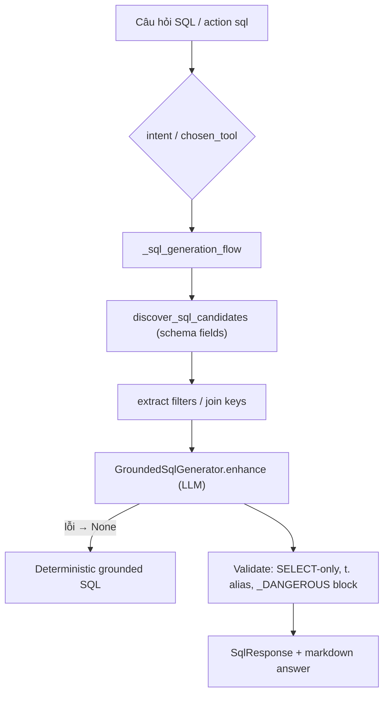

---

## 18. Data Quality

### 18.1 Trạng thái thực tế

- **Trigger**: action `quality` (`selected_action="quality"`) hoặc `resolution.chosen_tool == "quality_check"` hoặc intent trong `_QUALITY_FAVORED_INTENTS` (`chat_service.py:812-814`).
- **Flow**: `_quality_check_flow` (`chat_service.py:1553-1633`) → `ActionService.quality_check` (`action_service.py:670-1070`).
- **Đánh giá** (deterministic, không LLM): dựa trên **metadata completeness** — description, owners, domain, platform, schema fields, lineage, glossary terms, tags; cộng **profiling stats** nếu có trong payload (`_profiling_stats`, `_rating(score)` → trạng thái/điểm).
- **Scoring**: `QualityReport` Pydantic (`app/schemas/quality.py`): tổng score + sections (Metadata/Schema/Profiling/Lineage), findings, recommendations (priority high/medium/low), not-evaluated checks.
- **Report generation**: render markdown answer + `ChatResponse.quality_report` → `QualityReportCard` UI.
- **Recommendations**: sinh deterministic từ findings (không LLM).
- **Export**: `POST /api/v1/actions/quality/export` với body `{report, format: pdf|txt}` (`app/api/actions.py:111-142`, `quality_report.py` render PDF/TXT).
- **UI**: `QualityReportCard` (`frontend/components/chat/quality-report-card.tsx`) hiện score, top issues, top recommendations, expandable full report.
- **Không có bảng DB cho quality report** — sinh on-demand.

> Lưu ý: quality không phải dữ liệu DataHub profiling thật (datahub không có assertions được đọc); nó đánh giá mức độ đầy đủ metadata.

---

## 19. Authentication & Authorization

### 19.1 Login / Session

- `POST /api/v1/auth/login` (`app/api/auth.py:55-85`): so sánh **plaintext hardcoded users** (`admin/admin123`, `finance/finance123`, `logistics/logistics123`), sai → 401. Không lockout, không bcrypt, không rate-limit riêng.
- Session = **JWT HS256**, exp = now + **24h** (`jwt_provider.py:64`), secret từ `JWT_SECRET_KEY` (validator bắt buộc khi `AUTH_MODE=jwt`). Không iss/aud/nonce. Decode lỗi → anonymous.
- Frontend lưu token trong `localStorage` (`dhab_token`) — XSS-accessible; không refresh token, không cookie httpOnly.
- Identity provider theo `AUTH_MODE`: `jwt` → JWT, `header` → trust-proxy headers (không chữ ký), khác → `MockIdentityProvider` (auto admin).

### 19.2 User/role/permissions

- `UserRole` enum: `admin, editor, steward, viewer, user` (`app/auth/models.py:14-19`).
- `get_admin_user` (403 nếu không admin), `require_role(*roles)` (403).
- RBAC data-driven: bảng `rbac_roles`, `rbac_role_domains`, `rbac_users`, `rbac_user_roles`; roles seeded `Tài chính/Logistics/Sản Xuất/VGreen/Sales`. Snapshot cache TTL 5s. Domain access: admin → `{"*"}`; user không role → deny-by-default; so khớp chuẩn hoá + substring.
- `require_role` kiểm tra `current_user.roles` (string) — **không** consult DB RBAC cho endpoint-level.

### 19.3 Domain access / DataHub / storage

- **Domain gate trong chat**: `_gate_domain_access` (`chat_service.py:2649-2680`) chạy TRƯỚC mọi retrieval → trả lời denial như answer bình thường (HTTP 200).
- **Post-retrieval ACL**: `filter_results_by_domain` + `filter_accessible_urns` (`chat_service.py:1195-1226`) drop kết quả không được phép.
- **`build_database_acl_filter` / `build_opensearch_acl_filter`** (`app/auth/authorization.py:229-266`): ĐÃ implement SQL/ES filter thật, nhưng **không có caller nào** — dead code; enforcement thực tế là post-hoc filter.
- **Fail-open**: entity không có ACL row → ai cũng truy cập được (`can_view_entity` L127-128, `filter_accessible_urns` L210-211).
- **Search API**: domain không được phép → 200 rỗng. **Glossary API**: → 200 null.
- **Action endpoints**: `resolve_dataset` raise `PermissionDeniedError` → handler global trả **403** `{detail, code:"domain_access_denied"}` (`app/main.py:82-87`).
- **Storage access**: mọi storage route enforce ownership (`user_id` match → 404).
- **ACL seed**: `seed_acls` (`acl_seed.py:78-108`) tạo ACL theo domain rules (Finance/Logistics/Manufacturing/VGreen → groups; Sales/After Sales/Data Governance → public).

---

## 20. Guardrail & Security

| Lớp | Implementation | Bằng chứng |
|---|---|---|
| Input scope | Regex `_OUT_OF_SCOPE_PATTERNS` chặn SQL tunning/code/math/infra/consulting/trivia...; canned VI/EN | `guardrails/scope.py:15-193` |
| Prompt injection | 10 pattern regex (`ignore previous instructions`, `reveal system prompt`, `jailbreak`...) + canned response | `guardrails/sanitizer.py:52-90`, `service.py:35-56` |
| Output sanitize | `mask_secrets` (JWT, key=value, connection string, private endpoints); `validate_generation` strip ungrounded URN + downgrade confidence | `guardrails/sanitizer.py:20-48`, `validation.py:72-103` |
| LLM prompt-level | `GUARDRAIL_RULES` 13 quy tắc (grounded, không fabricate, cite, context untrusted, no secrets) append vào system prompt | `config/prompts.py:34-48`, `llm/fireworks.py`, `nvidia.py` |
| Tool restrictions | `GroundedSqlGenerator` SELECT-only; scope refuse; không tool truy cập hệ thống | `sql_llm.py`, `guardrails/scope.py` |
| Data access | Domain RBAC + ACL (post-hoc) | `app/auth/*` |
| File upload (image) | MIME `image/*`, ≤15MB, ≤4 ảnh, filename sanitize, thumbnail re-encode, path traversal guard | `image_upload.py`, `image_storage.py:103-163` |
| File upload (document) | SSRF guard (schemes, forbidden hosts/ports, private IP); **không giới hạn size** (`MAX_DOCUMENT_SIZE_MB` không có trong settings/code); **không malware scan** | `document_parsers/ssrf_guard.py`, `.env` |
| Auth | JWT (HS256, 24h); header/mock dev modes | `app/auth/*` |
| Rate limit | per-IP per-path, 60 req/60s, 429 | `app/middleware/rate_limit.py` |
| Secrets | `.env` không commit; JWT secret bắt buộc; nhưng `app/api/auth.py` chứa plaintext passwords hardcoded | `config/settings.py:137-138`, `app/api/auth.py:10-38` |

> Ghi chú: mô tả trên phản ánh behavior quan sát được từ code; không đánh giá "an toàn". Một số lỗ hổng thiết kế có thật: fail-open ACL, header-trust auth, mock auto-admin, JWT localStorage, không login lockout, SSRF guard thiếu DNS-rebinding protection, document không chặn kích thước.

---

## 21. Error Handling & Reliability

| Lỗi | Nơi xử lý | Hành vi |
|---|---|---|
| API failure (external) | `ErrorHandlingMiddleware` (`app/middleware/error_handler.py`), handlers `@app.exception_handler(PermissionDeniedError)` | 500 chung / 403 domain |
| DataHub unavailable | `GraphQLDataHubSource.list_entities` → empty page; sync worker sleep 60s | sync thất bại nhưng app vẫn chạy trên dữ liệu cũ |
| LLM failure | `generator._rag_answer` try/except → "Xin lỗi, đã xảy ra lỗi..."; `generate_conversational` → fallback; classifier → regex fallback | fallback message stream vẫn chạy |
| Vision failure | `VisualUnderstandingSkill.analyze` fallback `MockVisionClient` (`skill.py:117-143`) | kết quả generic |
| Storage failure | `ImageTooLargeError`, MIME reject; path traversal guard | 4xx/422 |
| Retrieval failure | `HybridSearch._search` catch → `[]`; vector_search fallback keyword | empty results → NO_EVIDENCE |
| Tool failure | `ToolRegistry.execute` try/except → `[]`; `PlannerExecutor._run_op` 2 attempts | step fail độc lập |
| Timeout | fireworks 15s, nvidia 60s, vision 60s, download 30s | retry/fallback |
| Invalid input | 422 (pydantic), role 403, ownership 404 | chuẩn FastAPI |
| Session teardown | `get_session` xử lý `IllegalStateChangeError`/`PendingRollbackError` khi streaming (`database/session.py:22-52`) | không mất commit |
| Retry | SDK `max_retries=1`, `sync/retry.py` exponential backoff, `RetryPolicy.is_retryable` | — |
| DLQ | `RedisDeadLetterQueue`/`InMemoryDeadLetterQueue` (scaffold, chưa wire) | — |
| Logging | structlog: `chat_request`, `route_*`, `intent_resolution`, `llm_generation_failed`, `thinking_mode_failed`, audit logs | — |

---

## 22. Frontend Architecture

### 22.1 Pages/routes

| Route | File | Nội dung |
|---|---|---|
| `/` | `app/page.tsx` + `components/landing/*` | Landing "DataAtlas" (static marketing) |
| `/login` | `app/login/page.tsx` | login + demo accounts |
| `/chat` | `app/(app)/chat/page.tsx` | chat chính |
| `/search` | `app/(app)/search/page.tsx` | tìm kiếm catalog |
| `/glossary` | `app/(app)/glossary/page.tsx` | glossary terms |
| `/entities` | `app/(app)/entities/page.tsx` | danh sách entity |
| `/storage` | `app/(app)/storage/page.tsx` | quản lý ảnh đã upload |
| `/admin` | `app/(app)/admin/page.tsx` | sync/index/documents/datahub/roles |
| `/status` | `app/(app)/status/page.tsx` | health + stats |
| `/profile` | `app/(app)/profile/page.tsx` | hồ sơ user |
| `/(app)/layout.tsx` | — | shell authenticated + admin gate (`ADMIN_ROUTES`) |

### 22.2 Components chính (chat)

- `chat-layout.tsx`: WelcomeScreen (4 sample suggestions), message list, step indicator, input.
- `message-bubble.tsx`: user/assistant bubble, citations (≤5 + expand), entities, LineageGraph, QualityReportCard, SuggestionBox ("Ý bạn là X?"), confidence/ambiguous footer, image lightbox.
- `chat-input.tsx`: slash commands, image picker/paste (data URL), action menu, model menu.
- `action-menu.tsx`: 6 actions (search/sql/impact/lineage/quality/report) → `selected_action` (không gọi `/api/v1/actions/*`).
- `model-menu.tsx`: `GET /api/v1/chat/models`.
- `lineage-graph.tsx`: SVG render LineageData.
- `quality-report-card.tsx`: render + export PDF/TXT.
- `conversation-*`: history, cards (pin/favorite/rename/delete), search dialog.

### 22.3 State management & API

- React Context `AppProvider` (`lib/app-store.tsx`) cho auth + conversations; `useChat` (`lib/use-chat.ts`) cho chat state/stream; không Redux/Zustand/React-Query.
- API: `apiFetch` (`lib/api.ts`) gắn Bearer token, 401 → clear + redirect `/login`; raw fetch trong `use-chat` (401 ignore).
- Streaming: `lib/stream.ts` SSE parse.
- Auth: `lib/auth.ts` localStorage.
- Proxy: `next.config.ts` rewrites `/api/*`, `/ready/*` → `BACKEND_URL` (default `http://localhost:8000`).

### 22.4 Component/data-flow diagram

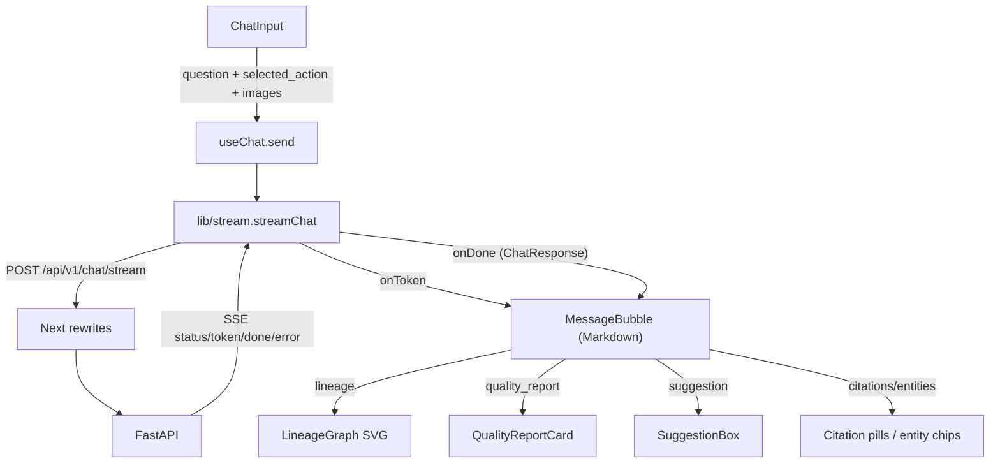

---

## 23. Backend Architecture

### 23.1 Routes / Controllers

16 router được đăng ký trong `app/main.py:90-104` (prefix `/api/v1/*` trừ health/ready/me/documents). Chi tiết mục 25.

### 23.2 Services

- `ChatService` (orchestrator chat).
- `ActionService` (schema-compare, sql, impact, quality, metadata report; `PermissionDeniedError`).
- `ConversationMemory` + `ConversationContextManager` (context).
- `ImageUpload/ImageStorage/ImageContext/VisionService/VisionCache`.
- `HealthService` (healthcheck loop 300s, log trong Redis TTL 86400, max 200).
- `SqlLlm`/`QualityReport`.

### 23.3 Business logic / AI orchestration

- `chat_service.answer()` pipeline (mục 5); `intent_resolver`; `thinking`; `planner_executor`; `tool_registry`.

### 23.4 Data access

- Repositories (`database/repositories/*`) trên AsyncSession.
- Sync: `SyncOrchestrator` (boot), `IncrementalSyncService` (test), workers.

### 23.5 Background jobs

- `sync_worker` (full sync mỗi 3600s), `indexing_worker` (poll index_jobs), `healthcheck_loop` (lifespan task), `scheduler` (stub), `document_worker`/`embedding_worker` (empty loops).

### 23.6 Backend request-flow diagram

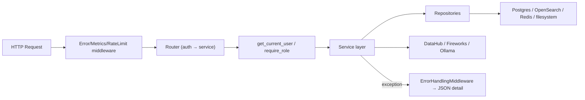

---

## 24. Database / Data Model

### 24.1 Danh sách bảng (13 bảng — `database/models.py`)

| Bảng | Purpose | Fields chính | Used by |
|---|---|---|---|
| `entities` | metadata entity từ DataHub | urn(unique), entity_type, name, display_name, description, platform, environment, domain, datahub_url, payload(JSON), content_hash | mọi retrieval |
| `entity_chunks` | chunk text | entity_id FK, entity_urn, chunk_type, chunk_index, content, chunk_metadata, content_hash, embedding_model | RAG backup |
| `sync_checkpoints` | watermark sync | source, entity_type, cursor, status, checkpoint_metadata | incremental sync |
| `entity_acls` | ACL theo entity | entity_urn(unique), is_public, allowed/denied user_ids/groups (ARRAY), classification, tenant_id | authorization |
| `conversation_history` | chat history (1 row/turn) | user_id, conversation_id, question, answer, title, is_pinned, is_favorite | chat + conversations API |
| `rbac_roles` | roles | name(unique), is_admin, group_names(ARRAY) | admin API |
| `rbac_role_domains` | role→domain | role_id FK CASCADE, domain | domain access |
| `rbac_users` | user accounts | user_id(unique), username(unique), email, is_admin, password_hash (nullable, **không được login dùng**) | admin API |
| `rbac_user_roles` | user↔role | user_id, role_id FK CASCADE | admin API |
| `audit_logs` | audit | request_id, user_id, action, resource_urn, decision, reason, metadata_json | authorization audit |
| `index_jobs` | queue indexing | entity_urn, status(pending/processing/completed/failed), attempts, error | IndexingPipeline |
| `image_records` | metadata ảnh | image_id(unique), user_id, conversation_id, filenames, mime_type, size, storage_path, thumbnail_path, status, vision_cache_id, content_hash, is_deleted, image_type, dataset_detected, vision_result, image_context | storage/vision |
| `vision_cache_records` | cache vision | cache_id(unique), content_hash(unique), model_id, vision_result, image_context | VisionService |

### 24.2 Relationships

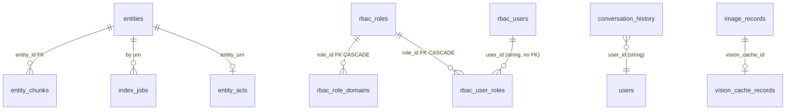

> Không có bảng riêng cho `conversations`, `messages`, `documents`, `actions`, `quality_reports`. Migration chain: `1fc2647b8b5d → 2_add_audit_logs → 3_add_entity_acls → 4_conversation_meta → 5_add_rbac → 6_add_image_storage`. Bảng `conversation_history` được tạo bởi `init_db()` (create_all) trước khi migration 4 alter — nằm ngoài lịch sử Alembic. PostgreSQL-specific types (ARRAY/JSONB) không hoạt động trên aiosqlite.

---

## 25. API Inventory

> Danh sách endpoint thực tế đăng ký trong `app/main.py:90-104` + `app/api/*`.

| Method | Endpoint | Purpose | Auth | Main caller |
|---|---|---|---|---|
| POST | `/api/v1/auth/login` | login, trả JWT | public | `lib/api.ts:51` |
| GET | `/api/me` | thông tin user (dev) | get_current_user + ENABLE_DEV_ENDPOINTS | `lib/api.ts:66` |
| GET | `/api/v1/chat/models` | danh sách model | get_current_user | `model-menu.tsx` |
| POST | `/api/v1/chat` | chat non-stream (JSON) | get_current_user | **UI không dùng** |
| POST | `/api/v1/chat/stream` | chat SSE | get_current_user | `lib/stream.ts:40` |
| GET | `/api/v1/conversations` | list | user | `app-store.tsx:121` |
| GET | `/api/v1/conversations/{id}` | detail turns | user | `use-chat.ts:74` |
| PATCH | `/api/v1/conversations/{id}` | rename/pin/favorite | user | `app-store.tsx:190` |
| DELETE | `/api/v1/conversations/{id}` | xoá | user | `app-store.tsx:149` |
| DELETE | `/api/v1/conversations` | clear | user | `app-store.tsx:169` |
| GET | `/api/v1/search?q&entity_type&domain&platform` | hybrid search | get_current_user | `search/page.tsx`, `entities/page.tsx` |
| GET | `/api/v1/search/stats` | counts | get_current_user | `status/page.tsx:28` |
| GET | `/api/v1/glossary/terms` | list glossary | get_current_user | `glossary/page.tsx:30` |
| GET | `/api/v1/glossary/terms/{urn}` | chi tiết term | get_current_user | **UI không dùng** |
| POST | `/api/v1/sync/full` | full sync | admin | `admin/page.tsx:59` |
| POST | `/api/v1/sync/entity` | sync 1 entity | admin/editor/steward | `admin/page.tsx:72` |
| POST | `/api/v1/index/rebuild` | enqueue + index | admin | `admin/page.tsx:121` |
| POST | `/api/v1/documents/import?url&title` | import document | admin/editor/steward | `admin/page.tsx:158` |
| GET | `/api/v1/datasources/datahub/health` | health DataHub source | get_current_user | `admin/page.tsx:207` |
| GET | `/api/v1/storage` | list images | user (ownership) | `lib/storage.ts:25` |
| GET | `/api/v1/storage/stats` | stats ảnh | user | `lib/storage.ts:29` |
| GET | `/api/v1/storage/{id}` | detail | user | **UI không dùng** |
| GET | `/api/v1/storage/{id}/thumbnail` | thumbnail | user | `lib/storage.ts:67` |
| GET | `/api/v1/storage/{id}/download` | download gốc | user | **UI không dùng** |
| POST | `/api/v1/storage/{id}/reanalyze` | re-run vision | user | `lib/storage.ts:49` |
| DELETE | `/api/v1/storage/{id}` | soft/hard delete | user | `lib/storage.ts:36` |
| POST | `/api/v1/storage/{id}/restore` | restore | user | `lib/storage.ts:43` |
| GET | `/api/v1/admin/domains` | list domains | admin | `roles-panel.tsx` |
| GET/POST | `/api/v1/admin/roles` | CRUD roles | admin | `roles-panel.tsx` |
| GET/PUT/DELETE | `/api/v1/admin/roles/{id}` | role detail | admin | `roles-panel.tsx` |
| PUT | `/api/v1/admin/roles/{id}/domains` | set role domains | admin | `roles-panel.tsx:245` |
| GET | `/api/v1/admin/users` | list users | admin | `roles-panel.tsx:66` |
| POST | `/api/v1/admin/users` | tạo user | admin | **UI không dùng** |
| PUT | `/api/v1/admin/users/{id}/roles` | set user roles | admin | `roles-panel.tsx:423` |
| DELETE | `/api/v1/admin/users/{id}` | xoá user | admin | **UI không dùng** |
| POST | `/api/v1/actions/schema-compare` | so sánh schema | user | **UI không dùng** |
| POST | `/api/v1/actions/sql` | SQL | user | **UI không dùng** |
| POST | `/api/v1/actions/impact` | impact | user | **UI không dùng** |
| POST | `/api/v1/actions/lineage` | lineage | user | **UI không dùng** |
| POST | `/api/v1/actions/quality` | quality | user | **UI không dùng** |
| POST | `/api/v1/actions/quality/export` | export PDF/TXT | user | `quality-report-card.tsx:44` |
| POST | `/api/v1/actions/report` | metadata report | user | **UI không dùng** |
| GET | `/health` | health | public | curl |
| GET | `/ready` | readiness deps | public | `status/page.tsx:26` |
| GET | `/ready/logs` | healthcheck logs | public | `status/page.tsx:27` |
| GET | `/metrics` | Prometheus metrics | public | monitoring |

---

## 26. Environment & Configuration

> Xem đầy đủ `config/settings.py` (pydantic-settings, đọc `.env`). Dưới đây là biến quan trọng. Không ghi giá trị secret.

| Biến | Purpose | Required | Used by |
|---|---|---|---|
| `AUTH_MODE` | `jwt`/`header`/mock | required | `app/api/dependencies/auth.py:17-25` |
| `AUTH_REQUIRED` | bật/tắt yêu cầu auth | no (default true) | `dependencies/auth.py:31-38` |
| `JWT_SECRET_KEY` | HS256 secret | **bắt buộc khi jwt** | `app/auth/jwt_provider.py` |
| `ENABLE_DEV_ENDPOINTS` | bật `/api/me` | no (default true) | `app/api/me.py` |
| `USE_MOCK_DATAHUB` | DataHub mock? | no | `ingestion/__init__.py`, `factory.py` |
| `DATAHUB_GMS_URL` / `DATAHUB_TOKEN` | GraphQL endpoint + token | **bắt buộc khi không mock** | `ingestion/graphql/*` |
| `DATAHUB_FRONTEND_URL` | base URL entity links | no | `settings.datahub_entity_url` |
| `USE_MOCK_LLM` / `USE_MOCK_EMBEDDING` | mock LLM/embedding | no | `llm/client.py`, `indexing/embedder.py` |
| `USE_FAKE_OPENSEARCH` | fake vector store | no | `indexing/vector_store.py` |
| `USE_IN_MEMORY_DATABASE` / `USE_IN_MEMORY_QUEUE` | sqlite/redis thay thế | no | `database/session.py`, `rate_limit` |
| `DATABASE_URL` | Postgres async URL | yes | `database/session.py` |
| `REDIS_URL` | Redis | yes | `infrastructure/redis.py`, rate limit |
| `OPENSEARCH_URL` / `OPENSEARCH_INDEX` | OpenSearch | yes | `indexing/vector_store.py` |
| `EMBEDDING_PROVIDER` / `EMBEDDING_MODEL` / `EMBEDDING_DIMENSION` | embedding (ollama/nomic-embed-text/768) | yes | `indexing/embedder.py` |
| `OLLAMA_BASE_URL` | Ollama endpoint | yes (nếu embedding real) | `indexing/embedder.py:64` |
| `LLM_PROVIDER` / `FIREWORKS_API_KEY` / `FIREWORKS_MODEL_ID` | Fireworks | **bắt buộc khi không mock** | `llm/fireworks.py` |
| `NVIDIA_API_KEY` / `NVIDIA_MODEL_ID` | NVIDIA NVCF | optional | `llm/nvidia.py` |
| `LLM_TIMEOUT_SECONDS` / `LLM_MAX_RETRIES` | timeout / retry (retry **không wire**) | no | `llm/fireworks.py`, `nvidia.py` |
| `VISION_ENABLED` / `USE_MOCK_VISION` / `FIREWORKS_VISION_MODEL_ID` | vision | no | `chat_service.py`, `retrieval/visual/client.py` |
| `VISION_MAX_IMAGES` (4) / `VISION_MAX_IMAGE_BYTES` (15MB) / `VISION_TIMEOUT_SECONDS` | giới hạn vision | no | `skill.py`, `image_storage.py` |
| `IMAGE_STORAGE_PATH` / `IMAGE_TRASH_PATH` / `IMAGE_THUMBNAIL_SIZE` | storage ảnh | no | `app/services/image_storage.py` |
| `LOCAL_STORAGE_PATH` | documents storage (không dùng thực) | no | `infrastructure/storage.py` |
| `MAX_CONTEXT_CHUNKS` (8) / `MAX_CONTEXT_CHARACTERS` (24000) | context budget | no | `retrieval/context_builder.py` |
| `INTENT_CLASSIFIER_ENABLED` / `QUERY_PLANNER_ENABLED` / `PLANNER_FALLBACK_TO_REGEX` | bật classifier/planner | no | `chat_service.py` |
| `THINKING_MODE_ENABLED` / `THINKING_MAX_STEPS` (8) | thinking mode | no | `chat_service.py:751`, `thinking/executor.py:32` |
| `GRAPH_MAX_DEPTH` (3) / `IMPACT_MAX_NODES` (200) / `IMPACT_DEFAULT_DEPTH` (3) | graph/impact | no | `retrieval/graph.py`, `tools.py` |
| `ENTITY_RESOLVER_*_THRESHOLD` | độ ngưỡng resolve/fuzzy | no | `retrieval/entity_resolver.py` |
| `RATE_LIMIT_MAX_REQUESTS` (60) / `RATE_LIMIT_WINDOW_SECONDS` (60) / `RATE_LIMIT_ENABLED` | rate limit | no | `app/middleware/rate_limit.py` |
| `HEALTHCHECK_INTERVAL_SECONDS` (300) / `HEALTHCHECK_LOG_TTL_SECONDS` / `HEALTHCHECK_MAX_LOGS` | healthcheck | no | `app/services/health_service.py` |
| `AUTH_MODE`+`JWT_SECRET_KEY` | validator bắt buộc | yes | `config/settings.py:135-150` |

---

## 27. End-to-End Example Flows

### 27.1 User hỏi dataset

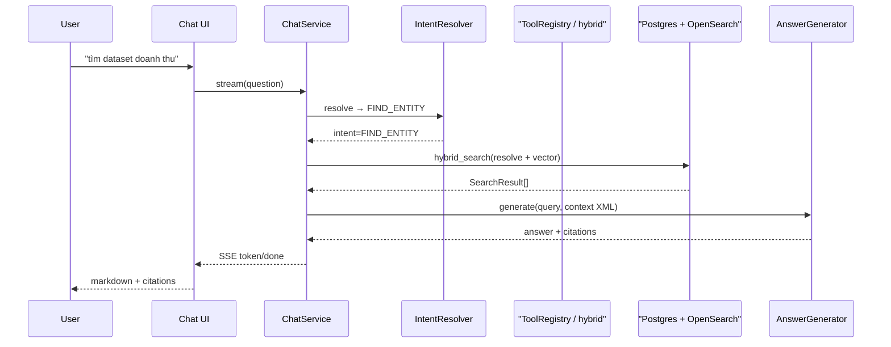

### 27.2 User hỏi schema

`SCHEMA_LOOKUP` → `schema_lookup` tool → resolver dataset → schema chunk → generate. (Tương tự 27.1, tool = schema_lookup.)

### 27.3 User hỏi lineage

`LINEAGE` → `lineage` tool → root + live DataHub `get_lineage` + repo payload → `_build_lineage_data` (`chat_service.py:2457`) → answer markdown + `LineageData` → UI `LineageGraph`.

### 27.4 User hỏi nhiều sub-question

`COMPOSITE_QUERY`/`MULTI_ENTITY_QUERY` → `QueryPlan.steps` → `PlannerExecutor._execute_dag` (parallel/sequential) → `asyncio.gather` → merge/dedupe → rerank → generate. (Mục 7.)

### 27.5 User gửi ảnh + câu hỏi

Vision gate (`chat_service.py:628-735`): ingest → persist → analyze → ImageContext → bind image entity → answer direct (`VISION_ANALYSIS`) hoặc fall-through. (Mục 10.)

### 27.6 User gửi ảnh rồi hỏi follow-up

Follow-up không gửi ảnh: `ConversationContextManager.load` khôi phục context từ DB (không re-run vision) → `resolve_active` theo anaphora/entity name → `set_image_focus` → trả lời dựa trên image entity.

### 27.7 User yêu cầu SQL

Action `sql` hoặc `SQL_GENERATION` → `_sql_generation_flow` → candidates schema → grounded SELECT-only SQL. (Mục 17.)

### 27.8 User yêu cầu Data Quality

Action `quality` → `_quality_check_flow` → `ActionService.quality_check` (metadata completeness scoring) → markdown + `QualityReport` → `QualityReportCard` + export. (Mục 18.)

### 27.9 User truy cập document/storage

- Document: `POST /api/v1/documents/import?url=` (admin) → parse/chunk/index → hỏi "theo tài liệu..." → `DOCUMENT_QA` → RAG `document_chunk`.
- Storage: user xem ảnh trong `/storage` → list/thumbnail/delete/restore/reanalyze qua `/api/v1/storage/*` (ownership enforced).

---

## 28. Architecture Summary

### 28.1 System architecture

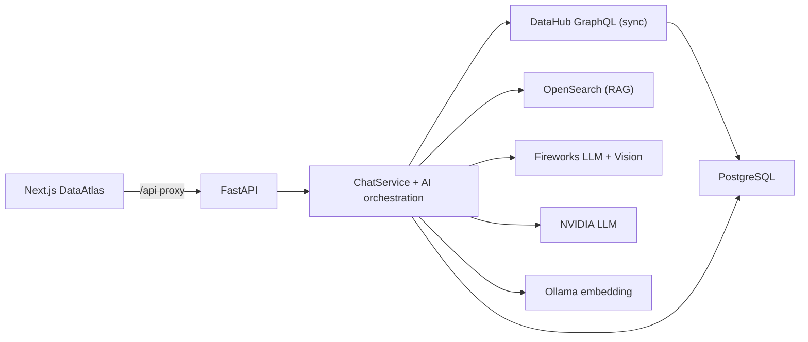

### 28.2 Chat request flow

IntentResolver → guardrails → relevance gate → vision/thinking gates → tool/planner → retrieval → context → LLM → citations → SSE.

### 28.3 Complex question flow

Thinking Mode (deterministic planner/executor/synthesizer) song song với Query Planner DAG; đều ra markdown answer.

### 28.4 Image flow

Upload data URL → filesystem + image_records → vision (qwen3p7-plus) → ImageContext → bind entity → answer/fall-through.

### 28.5 DataHub retrieval flow

DataHub GraphQL → CanonicalEntity → Postgres entities → chunks → OpenSearch → ToolRegistry/hybrid_search → context.

### 28.6 Storage flow

Postgres (metadata) + filesystem (ảnh) + OpenSearch (chunks) + Redis (rate limit/queue). Không persist tài liệu binary.

### 28.7 LLM/tool flow

Model override → provider (Fireworks/NVIDIA/Mock) → JSON answer (generate_structured) hoặc stream; tool dispatch code-level (ToolRegistry), không function-calling native.

---

## 29. Implementation Status

| Feature | Frontend | Backend | Data/Storage | AI/LLM | Status | Evidence |
|---|---|---|---|---|---|---|
| Chat RAG stream SSE | ✅ | ✅ | ✅ | ✅ | Complete | `use-chat.ts`, `chat.py`, `chat_service.py` |
| Intent classification (regex) | — | ✅ | — | — | Complete | `retrieval/intent.py` |
| Intent classification (semantic LLM) | — | ✅ | — | ✅ | Complete | `classifier.py`, `SEMANTIC_INTENT_PROMPT` |
| Entity resolution / fuzzy / coreference | — | ✅ | ✅ | — | Complete | `entity_resolver.py`, `fuzzy.py`, `coreference.py` |
| Hybrid search (keyword+vector) | — | ✅ | ✅ | ✅ | Complete | `hybrid_search.py`, `vector_store.py` |
| Tool registry (13 tools) | — | ✅ | ✅ | — | Complete | `tools.py` |
| Query Planner DAG | — | ✅ | ✅ | — | Complete | `planner_executor.py` |
| Thinking Mode | ✅ (render markdown) | ✅ | ✅ | — | Complete (deterministic, LLM-free) | `retrieval/thinking/*` |
| SQL generation (grounded, SELECT-only, không execute) | ✅ (markdown) | ✅ | ✅ | ✅ | Complete (không execute) | `sql_llm.py`, `action_service.py` |
| Data quality report | ✅ (card + export) | ✅ | ✅ | — | Complete | `quality_report.py`, `quality-report-card.tsx` |
| Vision / image understanding | ✅ | ✅ | ✅ (filesystem+DB) | ✅ | Complete | `retrieval/visual/*`, `image_*` |
| Image storage (list/thumb/delete/restore/reanalyze) | ✅ | ✅ | ✅ | — | Complete | `app/api/storage.py`, `storage/page.tsx` |
| Document import (URL) | ✅ (admin panel) | ✅ | ✅ (chunks) | ✅ (embed) | Complete (không lưu binary) | `documents.py`, `document_ingestion.py` |
| Document parsing (PDF/DOCX/HTML) | — | ✅ | — | — | Complete (parser optional fallback) | `document_parsers/*` |
| DataHub sync (full) | ✅ (admin trigger) | ✅ | ✅ | — | Complete | `SyncOrchestrator`, `sync.py` |
| DataHub incremental sync (event/Redis) | — | ✅ (scaffold) | ✅ (checkpoint) | — | Partial — **không wire production** | `sync/incremental_sync.py`, `consumer.py` |
| Crawlers (`fetch_*.py`) | — | ✅ (stub) | — | — | Not implemented (raise NotImplementedError) | `ingestion/fetch_*.py` |
| Search page / glossary / entities | ✅ | ✅ | ✅ | — | Complete | `search/page.tsx`... |
| Conversations CRUD + pin/favorite/rename | ✅ | ✅ | ✅ | — | Complete | `conversations.py`, `app-store.tsx` |
| Auth login JWT | ✅ | ✅ | — | — | Complete (hardcoded users, plaintext) | `auth.py`, `jwt_provider.py` |
| RBAC roles/domains (admin API) | ✅ | ✅ | ✅ | — | Complete | `roles.py`, `rbac_repository.py` |
| ACL filter DB/OpenSearch | — | ✅ (implemented) | ✅ | — | **Dead code — không caller** | `authorization.py:229-266` |
| Domain access enforcement | ✅ (answer/403) | ✅ | ✅ | — | Complete (post-hoc filter) | `_gate_domain_access`, `filter_results_by_domain` |
| Guardrail scope/injection/validate | — | ✅ | — | ✅ | Complete | `guardrails/*` |
| SSRF guard (document) | — | ✅ | — | — | Complete (thiếu DNS-rebinding protection) | `ssrf_guard.py` |
| Document size limit / malware scan | — | — | — | — | Not found (config chết) | `.env` `MAX_DOCUMENT_SIZE_MB`/`ENABLE_MALWARE_SCAN` |
| Standalone `/api/v1/actions/*` endpoints | — | ✅ | ✅ | ✅ | Backend only — **UI không dùng** (trừ quality/export) | `actions.py`, `types.ts` dead types |
| `POST /api/v1/chat` (non-stream) | — | ✅ | — | — | Backend only — UI luôn dùng stream | `chat.py:28-41` |
| `/api/me` contract | ⚠️ mismatch (`username`) | ✅ | — | — | Partial (mismatch type) | `me.py`, `types.ts` |
| Metrics `/metrics` | — | ✅ | — | — | Backend only | `metrics.py` |
| `keyword_index.py` | — | — | — | — | Not implemented (stub) | `keyword_index.py` |
| Scheduler worker | — | — | — | — | Not implemented (stub) | `workers/scheduler.py` |
| document/embedding workers | — | — | — | — | Partial — empty loop | `workers/document_worker.py`, `embedding_worker.py` |
| `QUERY_PLAN_PROMPT` | — | — | — | — | Dead code (không import) | `config/prompts.py:116` |
| Landing page capabilities | ✅ (marketing) | — | — | — | UI only (static) | `components/landing/*` |
| `_tmp_gms_lineage.py` | — | — | — | — | Broken scratch (import lỗi) | `_tmp_gms_lineage.py` |

**Chú thích trạng thái**: Complete = chạy được theo code; Partial = có logic nhưng chưa đầy đủ/wire; UI only = chỉ frontend (static); Backend only = backend có, UI không dùng; Not found = không tìm thấy implementation; Error/unstable = có code nhưng không hoạt động đúng (dead import, stub raise, mismatch).
