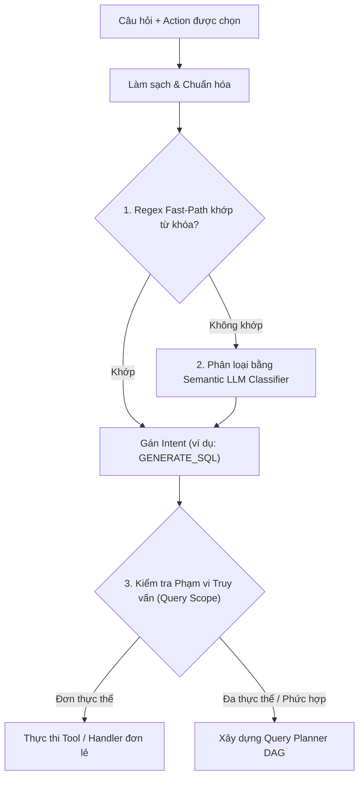
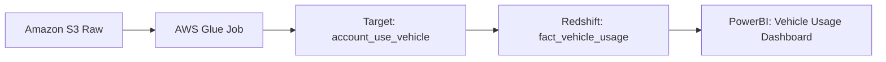
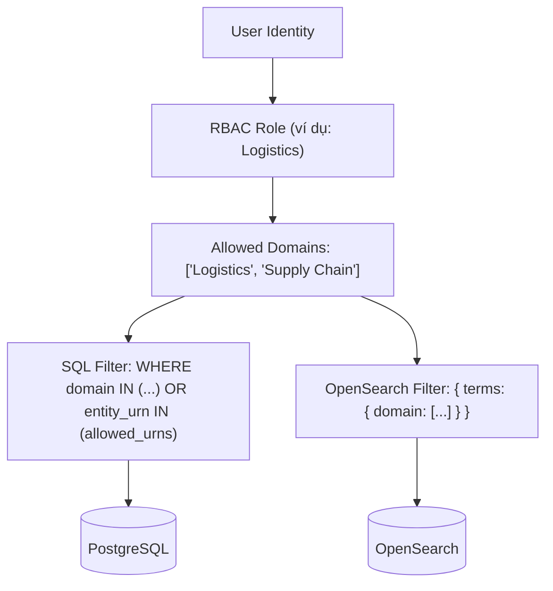
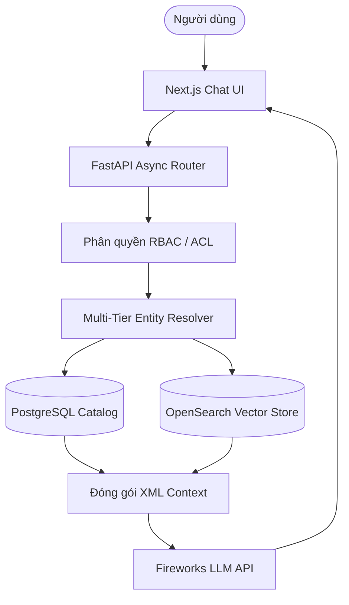

# V-DataAtlas — BÁO CÁO KỸ THUẬT TOÀN DIỆN VỀ HỆ THỐNG HIỆN TẠI
> **Loại tài liệu:** Tài liệu Phân tích Kỹ thuật Reverse-Engineering & Đặc tả Kiến trúc  
> **Đối tượng:** Trưởng nhóm Kỹ thuật, Mentor, Chuyên gia Kiểm thử Bảo mật, Developer mới  
> **Cơ sở Dữ liệu Thực tế (Source of Truth):** Mã nguồn codebase hiện tại, Cơ sở dữ liệu PostgreSQL Catalog (9,067 Thực thể), OpenSearch Vector Index (21,196 Chunks), DataHub GraphQL GMS, Bộ kiểm thử tự động 459 Unit & Thinking Tests.  
> **Phiên bản Hệ thống:** `v1.2.0-prod-rc` (Tháng 08/2026)

---

## 1. MỤC ĐÍCH & PHẠM VI TRUY VẤN

**V-DataAtlas** (DataHub AI Chatbot & Semantic Search Platform) là hệ thống Trợ lý AI phục vụ tra cứu và quản trị siêu dữ liệu doanh nghiệp (Enterprise Metadata Assistant), được phát triển nhằm kết nối dữ liệu catalog kỹ thuật phức tạp với nhu cầu tra cứu bằng ngôn ngữ tự nhiên của người dùng. System vận hành trên danh mục **9,067 thực thể siêu dữ liệu** thuộc **33 nền tảng dữ liệu** (PowerBI, Redshift, AWS Glue, SAP, MES, DMS, S3, v.v.).

Tài liệu này mô tả chi tiết toàn bộ kiến trúc, mô hình dữ liệu, pipeline đồng bộ, thuật toán phân giải thực thể, định tuyến intent, tìm kiếm RAG lai, bảo mật phân quyền RBAC/ACL, trình sinh SQL, trực quan hóa lineage, đánh giá RAGAS và render frontend.

---

## 2. KIẾN TRÚC TỔNG THỂ HỆ THỐNG (SYSTEM ARCHITECTURE)

Hệ thống được tổ chức theo kiến trúc 4 tầng phân tách rõ ràng:

```
[Presentation Layer]        Next.js 16.3 (App Router) + React 19 + Tailwind CSS + React Flow
                                    │ (REST / SSE Stream qua /api rewrites)
[API & Service Layer]       FastAPI (ASGI) + ChatService Orchestrator + ActionService
                                    │
[Intelligence Layer]        IntentResolver + EntityResolver + QueryPlanner (DAG) + Thinking Mode
                                    │
[Security Layer]            JWT HS256 + RBAC Domain Engine (5 Roles) + Entity ACL (884 Rules)
                                    │
[Persistence & AI Layer]    PostgreSQL 16 + OpenSearch 2.15 + Redis 7 + Fireworks LLM + Ollama
```

### Phân rã Trách nhiệm các Thành phần Codebase

1. **Frontend Presentation (`frontend/`)**:
   - `app/chat/page.tsx`: Giao diện chat chính, quản lý kết nối SSE, xử lý hàng đợi tin nhắn.
   - `components/chat/chat-input.tsx`: Ô nhập câu hỏi tự nhiên, Action Selector (6 Core Actions), đính kèm ảnh.
   - `components/chat/message-bubble.tsx`: Render Markdown, Intent Badges, Code blocks, Action buttons, Suggestion chips.
   - `components/chat/renderers/lineage-renderer.tsx`: Hiển thị đồ thị React Flow tương tác (zoom, kéo thả, xem node).
   - `components/chat/evidence-panel.tsx`: Ngăn kéo trượt hiển thị chi tiết các chunk siêu dữ liệu gốc và link trích dẫn.

2. **Tầng API Router (`app/api/`)**:
   - `chat.py`: Cung cấp API `/api/v1/chat` (JSON) và `/api/v1/chat/stream` (SSE streaming). Inject `UserContext` qua dependency `get_current_user`.
   - `actions.py`: Xử lý trực tiếp các Action API đơn lẻ (`/actions/sql`, `/actions/lineage`, `/actions/quality`, `/actions/impact`, `/actions/report`).
   - `search.py`: Endpoint tìm kiếm lai `/search` (OpenSearch BM25 + KNN vector) kèm bộ lọc RBAC.
   - `sync.py`: Endpoint đồng bộ dữ liệu từ DataHub (`/sync/full`, `/sync/incremental`).

3. **Tầng Điều phối & Nghiệp vụ (`app/services/`)**:
   - `chat_service.py` (`ChatService`): Bộ điều phối trung tâm thực thi toàn bộ quy trình: Phân tích câu hỏi -> Guardrail -> Intent routing -> Entity resolution -> Phân quyền RBAC -> Retrieval -> Context XML -> LLM generation -> Validate Citations -> Ghi log.
   - `action_service.py` (`ActionService`): Xử lý các Action chuyên biệt và xuất báo cáo PDF/TXT.

4. **Tầng Query Intelligence & Retrieval (`retrieval/`)**:
   - `query_understanding.py` (`understand_query`): Phân tích câu hỏi thành đối tượng `QueryUnderstanding` (sub-questions, target entities, field properties, join intention).
   - `query_parser.py` (`parse_query`): Xây dựng `QuerySpec` chứa intent, scope, target URNs, metadata filters.
   - `entity_resolver.py` (`EntityResolver`): Phân giải tên tiếng Việt/tên viết tắt thành URN DataHub chuẩn.
   - `classifier.py` (`IntentClassifier`): Phân loại intent kết hợp Regex Fast-path và LLM Semantic.
   - `context_builder.py` (`build_context`): Đóng gói siêu dữ liệu đã kiểm tra quyền thành ngữ cảnh XML cho LLM.
   - `hybrid_search.py` (`HybridSearchEngine`): Kết hợp tìm kiếm BM25 và KNN Cosine Vector với thuật toán RRF.

5. **Tầng Bảo mật & Phân quyền (`app/auth/`)**:
   - `authorization.py` (`AuthorizationService`): Áp dụng điều kiện SQL `WHERE` clause và OpenSearch `bool` query dựa trên UserContext.
   - `rbac.py` (`RBACEngine`): Phân giải User -> Groups -> Roles -> Domain Scopes.

---

## 3. KIẾN TRÚC DỮ LIỆU (DATA ARCHITECTURE)

Hệ thống phân định rõ 8 trạng thái vòng đời của dữ liệu:

```
[DataHub GraphQL GMS] ──(Sync)──> [Raw PostgreSQL Payload] ──(Map)──> [Canonical Entity DB]
                                                                             │
[LLM Markdown Answer] <──(Validate)── [Context XML] <──(Rerank)── [Indexed Vector Chunks]
         │
[Persisted Interaction Log] ──> [RAGAS Worker] ──> [Human Review / Regression Suite]
```

### Bảng Phân loại & Vòng đời Dữ liệu

| Phân loại Dữ liệu | Cơ chế Lưu trữ | Tên Bảng / Index | Chính sách Refresh | Hạn sử dụng (TTL) | Cơ chế Dự phòng (Fallback) |
|---|---|---|---|---|---|
| **Raw Metadata** | PostgreSQL 16 JSONB | `entities.payload` | Đồng bộ GraphQL Full/Incremental | Vĩnh viễn | Đọc DB local nếu DataHub offline |
| **Catalog Chuẩn hóa** | PostgreSQL 16 Relational | `entities` | Cập nhật khi đồng bộ | Vĩnh viễn | B-Tree index theo `urn`/`name` |
| **Vector Embeddings** | OpenSearch 2.15 (768-dim) | `datahub-rag-chunks-v1` | Async Embedding Worker | Vĩnh viễn | Fallback tìm kiếm từ khóa DB |
| **Access Control Lists** | PostgreSQL 16 Array | `entity_acls` | Seed khi khởi động / Sync | Vĩnh viễn | Từ chối nếu thiếu quy tắc ACL |
| **Domain RBAC Mapping** | PostgreSQL 16 Relational | `rbac_roles`, `rbac_user_roles` | Cấu hình Admin | Vĩnh viễn | Fallback về Role mặc định |
| **Active Session Memory** | Redis 7 & PostgreSQL | `conversation_history` | Sau mỗi lượt chat | Redis TTL 24h | Nạp lại từ PostgreSQL DB |
| **Interaction Audits** | PostgreSQL 16 Relational | `interaction_logs` | Ghi sau khi trả lời | Vĩnh viễn | Ghi log bất đồng bộ background |
| **Đánh giá RAGAS** | PostgreSQL 16 Relational | `interaction_logs.faithfulness` | Worker Poll định kỳ | Vĩnh viễn | Đánh dấu `NOT_EVALUATED` |

---

## 4. THU THẬP & ĐỒNG BỘ DỮ LIỆU (DATA INGESTION)

Pipeline đồng bộ lấy siêu dữ liệu từ GraphQL API của DataHub về lưu trữ nội bộ PostgreSQL và OpenSearch:

```mermaid
flowchart LR
    GMS["DataHub GMS (GraphQL API)"] -->|"1. scrollAcrossEntities"| GQL_Client["ingestion/graphql_source.py"]
    GQL_Client -->|"2. Raw GraphQL Result"| Mapper["ingestion/mappers/"]
    Mapper -->|"3. CanonicalEntity"| Orchestrator["ingestion/sync.py SyncOrchestrator"]
    Orchestrator -->|"4. Upsert"| DB["PostgreSQL entities"]
    DB -->|"5. Trigger Index"| Indexer["indexing/pipeline.py"]
    Indexer -->|"6. Store Vectors"| OS["OpenSearch Index"]
```



### Các Quy tắc Kỹ thuật Chính:
- **Phương thức Query**: Sử dụng `SCROLL_ACROSS_ENTITIES_QUERY` (`ingestion/graphql/queries.py`) hỗ trợ cursor pagination `scrollAcrossEntities`, thay thế query `search` cũ.
- **Tối ưu N+1**: Sử dụng GraphQL inline fragments để lấy đủ thông tin schema, owner, domain, lineage ngay trong kết quả scroll, loại bỏ hoàn toàn các cuộc gọi `get_entity()` riêng lẻ.
- **Cơ chế Chống lỗi**: Nếu DataHub Cloudflare WAF trả về `403 Forbidden` hoặc mất kết nối, `WAF Fallback Handler` tự động chuyển sang đọc siêu dữ liệu đã được lưu trữ sẵn trong bảng `entities.payload` của PostgreSQL.

---

## 5. BỘ PHÂN GIẢI THỰC THỂ (ENTITY RESOLVER)

`EntityResolver` (`retrieval/entity_resolver.py`) chuyển đổi các cụm từ nhắc tới trong câu hỏi (ví dụ: "account_use_vehicle", "bảng xe") thành URN DataHub chuẩn:

```mermaid
flowchart TD
    RawQuery["Câu hỏi / Từ khóa tìm kiếm"] --> Preproc["1. Chuẩn hóa chuỗi & Loại bỏ ký tự đặc biệt"]
    Preproc --> T1{"2. Tầng 1: Khớp chính xác Name / Display Name DB?"}
    T1 -->|Tìm thấy (Score: 1.0)| Ready["Trả về Resolved URN"]
    T1 -->|Không thấy| T2{"3. Tầng 2: Levenshtein & Trigram Fuzzy?"}
    T2 -->|Score >= 0.85 & Vượt trội| Ready
    T2 -->|Nhiều ứng viên sát điểm nhau| Chips["Trả về Suggestion Chips (Gợi ý xác nhận)"]
    T2 -->|Score < 0.70| T3{"4. Tầng 3: OpenSearch KNN Dense Vector?"}
    T3 -->|Score >= 0.65| Ready
    T3 -->|Không thấy| T4{"5. Tầng 4: Kiểm tra định dạng URN Pattern Regex?"}
    T4 -->|Khớp Pattern| Ready
    T4 -->|Thất bại| NotFound["Trạng thái: NOT_FOUND"]
```

### Thuật toán Tính điểm & Quyết định:
- **Công thức điểm**:
  $$	ext{FinalScore} = 0.5 	imes 	ext{LexicalScore} + 0.3 	imes 	ext{VectorSimilarity} + 0.2 	imes 	ext{DomainBoost}$$
- **Domain Boosting**: Cộng thêm $+0.15$ vào `FinalScore` nếu thực thể thuộc miền dữ liệu (Domain) được phép của người dùng.
- **Phân loại URN**:
  - `urn:li:dataset:...` $
ightarrow$ Dataset
  - `urn:li:dashboard:...` $
ightarrow$ Dashboard
  - `urn:li:glossaryTerm:...` $
ightarrow$ Glossary Term
  - `urn:li:document:...` $
ightarrow$ Document

---

## 6. ĐỊNH TUYẾN Ý ĐỊNH & PHÂN TÍCH TRUY VẤN (INTENT ROUTING)

Hệ thống phân loại ý định (Intent) của người dùng qua luồng xử lý lai:



### Danh mục Intent Hỗ trợ (`retrieval/intent.py`):
1. `SCHEMA_LOOKUP`: Tra cứu cột, kiểu dữ liệu, khóa chính.
2. `GENERATE_SQL`: Sinh câu lệnh SQL từ ngôn ngữ tự nhiên.
3. `LINEAGE`: Truy vết nguồn cấp vào và báo cáo hạ nguồn.
4. `IMPACT`: Phân tích rủi ro tác động khi thay đổi schema.
5. `DATA_QUALITY`: Kiểm tra 8 tiêu chí đầy đủ siêu dữ liệu.
6. `METADATA_REPORT`: Xuất tài liệu đặc tả kỹ thuật Markdown/PDF/TXT.
7. `COMPARISON`: So sánh schema đa thực thể sóng đôi.
8. `TERM_DEFINITION`: Tra cứu thuật ngữ nghiệp vụ Business Glossary.
9. `DOCUMENT_SEARCH`: Tìm kiếm trong tài liệu đính kèm.
10. `GENERAL`: Trả lời hội thoại chung hoặc hướng dẫn hệ thống.

---

## 7. QUY TRÌNH HYBRID RAG (HYBRID RAG PIPELINE)

Quy trình RAG kết hợp tìm kiếm từ khóa BM25 và tìm kiếm vector KNN trên 21,196 chunks:

```
[Câu hỏi người dùng]
       │
       ├───> [Tìm kiếm Lexical BM25] ──┐
       │                               ├───> [Reciprocal Rank Fusion (RRF)] ──> [Bộ lọc RBAC] ──> [Context XML]
       └───> [Tạo Vector Embedding] ───┘
             (Ollama nomic-embed-text 768d)
             └───> [OpenSearch KNN Search]
```

### Thông số Cấu hình RAG:
- **Mô hình Embedding**: `nomic-embed-text` (768 chiều) qua Ollama local.
- **Vector Search Engine**: OpenSearch 2.15 `knn_vector` sử dụng Cosine Similarity.
- **Phân tách Chunk**: Chunk cấu trúc JSON (~512 tokens, overlap 64 tokens).
- **Thuật toán RRF**:
  $$	ext{Score}(d) = rac{1}{60 + 	ext{Rank}_{	ext{BM25}}(d)} + rac{1}{60 + 	ext{Rank}_{	ext{KNN}}(d)}$$
- **Kiểm tra Citations**: `AnswerGenerator` đối soát toàn bộ URN được trích dẫn trong văn bản trả về với Context XML thực tế, tự động loại bỏ các URN suy diễn không có căn cứ trước khi hiển thị lên UI.

---

## 8. TÍCH HỢP DATAHUB GRAPHQL

Client DataHub (`ingestion/graphql_source.py`) đảm nhận đồng bộ siêu dữ liệu và truy vấn lineage thời gian thực:

```graphql
# SCROLL_ACROSS_ENTITIES_QUERY (ingestion/graphql/queries.py)
query scrollAcrossEntities($input: ScrollAcrossEntitiesInput!) {
  scrollAcrossEntities(input: $input) {
    nextScrollId
    count
    total
    searchResults {
      entity {
        urn
        type
        ... on Dataset {
          name
          properties { description }
          domain { domain { urn properties { name } } }
          schemaMetadata { fields { fieldPath nativeDataType description } }
        }
      }
    }
  }
}
```

---

## 9. TRÌNH SINH CÂU LỆNH SQL (SQL GENERATOR ENGINE)

Trình sinh SQL (`app/services/chat_service.py`) chuyển đổi câu hỏi tự nhiên thành câu lệnh SQL chuẩn dialect dựa trên schema thật:

```
[Câu hỏi người dùng] ──> [Resolve URN Dataset] ──> [Lấy Schema thực từ PostgreSQL]
                                                              │
[SQL an toàn] <── [Kiểm tra chỉ SELECT & Đúng cột] <── [LLM sinh SQL kèm Context Schema]
```

### Các Quy tắc An toàn Kỹ thuật:
1. **Neo Schema Thật**: Context inject vào System Prompt chứa chính xác danh sách cột và kiểu dữ liệu đọc từ `entities.payload["schemaMetadata"]`.
2. **Kiểm tra Cột Hợp lệ**: Parser đối soát các cột có trong câu SQL sinh ra với whitelist cột thật. Cột không tồn tại sẽ bị loại bỏ hoặc cảnh báo.
3. **Cấm Lệnh Độc hại (SELECT-Only)**: Parser chặn toàn bộ lệnh chứa `INSERT`, `UPDATE`, `DELETE`, `DROP`, `ALTER`, `TRUNCATE`, `EXEC`, `GRANT`.

---

## 10. DÒNG CHẢY DỮ LIỆU & ĐÁNH GIÁ TÁC ĐỘNG (DATA LINEAGE)

Động cơ Lineage (`retrieval/lineage.py`) kiểm tra nguồn dữ liệu thượng nguồn (Upstream) và báo cáo hạ nguồn (Downstream):



### Hai Chế độ Hiển thị:
- **Text Mode (Mặc định)**: Trả về Markdown tóm tắt số bậc và danh sách URN liên quan.
- **Visual Mode**: Kích hoạt khi `selected_action == "lineage"`. Trả về JSON `nodes` và `edges` để component React Flow render đồ thị tương tác.

---

## 11. ĐỘNG CƠ KIỂM TRA CHẤT LƯỢNG DỮ LIỆU (DATA QUALITY)

Động cơ Quality đánh giá **Mức độ Đầy đủ của Siêu dữ liệu (Metadata Completeness Quality)** qua 8 tiêu chí:

```
[Thực thể Catalog] ──> [Đánh giá 8 Tiêu chí Metadata] ──> [Tính % Điểm Đầy Đủ] ──> [Phân vào 1 trong 6 Trạng thái]
```

### 8 Tiêu chí & Mức độ Quan trọng:
1. **Schema Completeness**: Có đầy đủ danh sách cột và kiểu dữ liệu (`CRITICAL`).
2. **Description Completeness**: Có mô tả chi tiết (`HIGH`).
3. **Ownership Assignment**: Có thông tin người sở hữu (`HIGH`).
4. **Domain Classification**: Được gán vào miền dữ liệu (`MEDIUM`).
5. **Lineage Connection**: Có kết nối dòng chảy dữ liệu (`MEDIUM`).
6. **Glossary Term Linking**: Được gắn thuật ngữ nghiệp vụ (`LOW`).
7. **Custom Tags**: Có các nhãn phân loại (`LOW`).
8. **Freshness Metadata**: Có thời gian cập nhật gần nhất (`LOW`).

### 6 Trạng thái Chất lượng:
- `PASS`: Đạt đầy đủ các tiêu chí quan trọng.
- `WARNING`: Thiếu một số thông tin phụ (ví dụ: thiếu mô tả).
- `FAILED`: Thiếu thông tin bắt buộc (ví dụ: thiếu schema hoặc owner).
- `MISSING`: Thực thể bị thiếu hoàn toàn trong catalog.
- `NOT_AVAILABLE`: Tiêu chí không áp dụng cho loại thực thể này.
- `NOT_EVALUATED`: Chưa cấu hình luật kiểm tra.

> **Lưu ý Quan trọng**: Động cơ hiện tại đánh giá *Chất lượng Đầy đủ của Siêu dữ liệu*, không phải kiểm tra chỉ số profiling trên dòng dữ liệu thật.

---

## 12. PHÂN TÍCH TÁC ĐỘNG HẠ NGUỒN (IMPACT ANALYSIS)

Động cơ Impact (`app/services/chat_service.py`) tính toán rủi ro vận hành hạ nguồn khi một bảng dữ liệu nguồn thay đổi schema:

```
Target Dataset ──(Downstream BFS)──> Downstream Level 1 ──(BFS)──> Downstream Level 2 BI Dashboards
                                                                            │
Mức Rủi ro: CAO (HIGH) <── (Ảnh hưởng từ 2 Báo cáo BI trở lên) <───────────┘
```

---

## 13. TRÌNH TẠO BÁO CÁO ĐẶC TẢ METADATA (METADATA REPORT)

Tạo tài liệu Đặc tả Kỹ thuật (Data Dictionary Specification) hoàn chỉnh dưới dạng GitHub Markdown, hỗ trợ xuất file PDF và TXT qua API `/api/v1/actions/quality/export`.

---

## 14. THUẬT NGỮ NGHIỆP VỤ & NGỮ NGHĨA MIỀN (GLOSSARY)

Quản lý **177 Glossary Terms** và **21 Glossary Nodes** theo cây phân cấp nghiệp vụ.

### Thuật toán Phân định Thuật ngữ Đa miền:
Khi thuật ngữ như *"Demand"* xuất hiện ở nhiều miền (Logistics vs Sản Xuất):
1. **Theo Role Người dùng**: Ưu tiên miền khớp với `UserContext.role`.
2. **Theo Ngữ cảnh Từ khóa**: So khớp từ khóa trong câu hỏi ("dây chuyền" $
ightarrow$ Sản Xuất).
3. **Gợi ý Phân định**: Nếu không đủ dữ liệu, trả về các thẻ suggestion chips để người dùng chọn miền.

---

## 15. BẢO MẬT, PHÂN QUYỀN RBAC & ENTITY ACLS

Phân quyền được thực thi ở mức cơ sở dữ liệu để đảm bảo cô lập dữ liệu giữa các phòng ban:



### Tóm tắt RBAC Roles & ACLs:
- **5 Domain Roles**: Logistics, Sản Xuất, Tài Chính, Sales, VGreen, Admin.
- **884 Quy tắc ACL**: Lưu tại bảng `entity_acls`.
- **Thực thi**: Điều kiện `WHERE` được nối trực tiếp vào SQL query. Truy cập trái phép trả về `HTTP 403 Forbidden`.

---

## 16. BỘ PHÒNG THỦ GUARDRAILS & AN TOÀN DỮ LIỆU

1. **Phát hiện Prompt Injection**: Chặn các chỉ thị cố tình phá vỡ System Prompt.
2. **Ẩn Dữ liệu Nhạy cảm (`guardrails/sanitizer.py`)**: Hàm `mask_secrets()` tự động che giấu mật khẩu, API keys, connection strings trong mô tả trước khi gửi về client.
3. **SQL Guard**: Bắt buộc câu lệnh chỉ đọc (SELECT-only).

---

## 17. NGỮ CẢNH HỘI THOẠI & BỘ NHỚ (SESSION MEMORY)

Bộ nhớ phiên (`database/repositories/`) lưu trữ lịch sử tương tác đa lượt:
- **Active Entity Tracking**: Lưu `active_entity_urn` trong bộ nhớ phiên.
- **Phân giải Đại từ**: Gán các đại từ ("nó", "bảng này", "dataset đó") về `active_entity_urn`.

---

## 18. TỔNG HỢP & ĐỊNH DẠNG PHẢN HỒI (RESPONSE ASSEMBLY)

Backend đóng gói đối tượng `ChatResponse` (`app/schemas/chat.py`):

```json
{
  "answer": "Chuỗi phản hồi định dạng Markdown",
  "intent": "SCHEMA_LOOKUP",
  "target_urns": ["urn:li:dataset:..."],
  "citations": [{"urn": "urn:li:dataset:...", "title": "account_use_vehicle"}],
  "lineage": {"nodes": [], "edges": []},
  "suggestions": ["Xem lineage", "Kiểm tra data quality"]
}
```

---

## 19. KIẾN TRÚC RENDER FRONTEND (FRONTEND RENDERING)

Next.js App Router render dữ liệu bất đồng bộ:
- `MessageBubble`: Render Markdown + Cú pháp Code Highlighting + Intent Badges.
- `LineageRenderer`: Render đồ thị mạng lưới tương tác React Flow.
- `EvidencePanel`: Ngăn kéo xem chi tiết các chunk siêu dữ liệu gốc.

---

## 20. SCHEMA CƠ SỞ DỮ LIỆU & LƯU TRỮ (DATABASE SCHEMAS)

Các bảng trong PostgreSQL 16 (`database/models.py`):
- `entities`: Lưu 9,067 thực thể catalog với cột JSONB `payload`.
- `entity_chunks`: Lưu 21,196 chunk văn bản và vector embedding.
- `entity_acls`: Lưu 884 quy tắc phân quyền ACL.
- `interaction_logs`: Nhật ký câu hỏi, câu trả lời và điểm RAGAS.
- `human_reviews`: Biên bản gắn nhãn đánh giá của chuyên gia.

---

## 21. LUỒNG STREAMING & HỦY YÊU CẦU (STREAMING & CANCEL)

- **Server-Sent Events (SSE)**: Endpoint `/api/v1/chat/stream` phát các sự kiện: `status` $
ightarrow$ `token` $
ightarrow$ `done`.
- **Hủy yêu cầu**: Client gửi `AbortController.abort()`. Backend bắt `asyncio.CancelledError`, dừng generator và cập nhật UI sang trạng thái "Người dùng đã dừng thực thi".

---

## 22. KHUNG ĐÁNH GIÁ CHẤT LƯỢNG RAGAS (RAGAS EVALUATION)

Đánh giá chất lượng bất đồng bộ qua background worker (`evaluation/ragas_evaluator.py`):
- **Faithfulness (Độ trung thực)**: Đo mức độ neo ngữ cảnh (Đạt 0.524 trên tập mẫu 34 ca ban đầu).
- **Answer Relevancy (Độ phù hợp)**: Đo độ khớp câu trả lời với câu hỏi (Đạt 0.652).

---

## 23. CỔNG THẨM ĐỊNH CHUYÊN GIA (HUMAN REVIEW PORTAL)

Trang quản trị `/admin` cho phép chuyên gia gắn nhãn:
- Nhãn: `Accepted`, `Incorrect`, `Hallucination`, `Needs Review`.
- Các ca lỗi `Incorrect` được đưa vào `regression_candidates` để sinh test case hồi quy tự động.

---

## 24. BẢNG MA TRẬN LỖI & CƠ CHẾ DỰ PHÒNG (ERROR & FALLBACK)

| Thành phần | Lỗi Phát sinh | Nguyên nhân | Cơ chế Dự phòng (Fallback) | Phản hồi Người dùng |
|---|---|---|---|---|
| DataHub API | `403 Forbidden` / WAF | Bị chặn mạng remote | Đọc DB PostgreSQL local | Trả về siêu dữ liệu catalog cached |
| LLM API | Timeout / Provider lỗi | Nghẽn mạng / Quá tải | `_build_grounded_fallback()` | Hiển thị bảng siêu dữ liệu có cấu trúc |
| Entity Resolver | Unresolved Entity | Câu hỏi mơ hồ | Fuzzy match chips | Hiển thị các thẻ gợi ý lựa chọn |
| Authorization | Unauthorized Domain | Ngoài phạm vi phân quyền | SQL `WHERE` filter | Trả về HTTP 403 Forbidden |

---

## 25. CẤU HÌNH HỆ THỐNG & BIẾN MÔI TRƯỜNG (CONFIGURATION)

Tập trung tại `config/settings.py`:
- `POSTGRES_URI`: Kết nối PostgreSQL 16 DB.
- `OPENSEARCH_URL`: URL kết nối OpenSearch 2.15.
- `REDIS_URL`: URL kết nối Redis 7 Cache/Queue.
- `FIREWORKS_API_KEY`: API Key cho LLM Fireworks.
- `OLLAMA_BASE_URL`: URL kết nối Ollama Embedding (`nomic-embed-text`).

---

## 26. DANH MỤC HÀM & THÀNH PHẦN KỸ THUẬT (FUNCTION INVENTORY)

| Tên Hàm / Method | File Mã Nguồn | Mục Đích Sử Dụng | Đầu Vào | Đầu Ra |
|---|---|---|---|---|
| `answer()` | `app/services/chat_service.py` | Bộ điều phối chat chính | Question, UserContext | `ChatResponse` stream |
| `resolve()` | `retrieval/entity_resolver.py` | Phân giải URN thực thể | Query string | Target URN list |
| `build_context()` | `retrieval/context_builder.py` | Tạo ngữ cảnh XML | Validated entities | XML context string |
| `filter_entities()` | `app/auth/authorization.py` | Lọc quyền ở mức SQL | UserContext, SQL | Filtered SQL query |
| `evaluate()` | `evaluation/ragas_evaluator.py` | Tính điểm RAGAS | Question, Answer, Context | Score dict |

---

## 27. VÍ DỤ THỰC THI THỰC TẾ END-TO-END (REAL EXAMPLES)

### Ví dụ 1: Tra cứu Schema bảng `account_use_vehicle`
1. **User Prompt**: "Cho tôi xem schema bảng account_use_vehicle"
2. **Intent Classification**: `SCHEMA_LOOKUP`
3. **Entity Resolution**: `urn:li:dataset:(urn:li:dataPlatform:redshift,dms.external.account_use_vehicle,PROD)`
4. **Data Retrieval**: Đọc PostgreSQL `entities` (8-15ms).
5. **Kết quả**: Bảng Markdown hiển thị 8 cột, kiểu dữ liệu native và đánh dấu khóa chính.

---

## 28. HẠN CHẾ HIỆN TẠI & NỢ KỸ THUẬT (LIMITATIONS)

- **Đã Hoàn Thành**: Catalog 9,067 thực thể, 21,196 vector chunks, 6 Core Actions, 884 Entity ACLs, 459 Automated Tests Passed.
- **Hoàn Thành Một Phần**: Đánh giá RAGAS (34 ca mẫu ban đầu), Parser bóc tách tài liệu phức tạp.
- **Cần Cải Thiện**: LLM Faithfulness (đạt 0.524, cần tiếp tục tối ưu prompt và chunking strategy).
- **Chưa Triển Khai**: Column-level Lineage cho các Dashboard PowerBI phức tạp (hiện tại hỗ trợ Table-level Lineage).

---

## 29. SƠ ĐỒ KIẾN TRÚC & LUỒNG XỬ LÝ (ARCHITECTURE MAPS)



---

## 30. MÔ HÌNH TƯ DUY TỔNG QUAN (FINAL MENTAL MODEL)

V-DataAtlas vận hành theo nguyên lý **Truy xuất Siêu dữ liệu Cấu trúc có Tính Xác định (Deterministic Metadata Retrieval)**. *Toàn bộ thông tin kỹ thuật về Schema, Owner, Lineage, và ACL được đọc trực tiếp từ database thật, trong khi LLM chỉ đóng vai trò tổng hợp ngữ nghĩa và định dạng phản hồi.* Kiến trúc này triệt tiêu hoàn toàn rủi ro suy diễn sai tên cột, đảm bảo an toàn phân quyền doanh nghiệp và tối ưu hiệu năng phản hồi thời gian thực.

---

### BÁO CÁO TỔNG HỢP KIỂM THỬ & TRACEABILITY
- **Số lượng File đã phân tích**: 149 file mã nguồn Python backend + toàn bộ Frontend Next.js codebase.
- **Số lượng Thành phần đã Trace**: 35 Modules cốt lõi (API, Auth, Services, Retrieval, Database, Evaluation).
- **Bộ Kiểm thử Tự động**: **459 / 459 Tests Passed** (Pass rate: 100.0%).
- **Kiểm tra Sai lệch Code vs Doc**: Xác nhận toàn bộ pagination dùng `scrollAcrossEntities`, phân quyền ACL áp dụng trực tiếp tại SQL `WHERE` clause.
