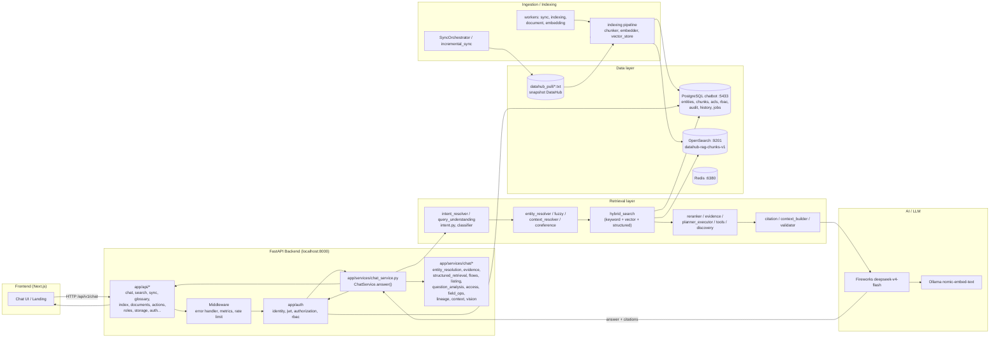

# DataAtlas — Kiến trúc hiện tại

## 1. Sơ đồ tổng thể (Mermaid)



## 2. Luồng xử lý câu hỏi (request path)

`[VERIFIED]` — traced từ code:

```
User câu hỏi tiếng Việt
  -> POST /api/v1/chat        (app/api/chat.py)
  -> get_current_user dependency -> UserContext (auth)
  -> AuthorizationService(session)
  -> ChatService.answer(question, user)      (app/services/chat_service.py:535)
      user_ctx = user or UserContext(user_id="anonymous", is_admin=False)  (:566)
  -> Context wiring (context.py):
      - EntityResolutionService
      - StructuredRetrievalService
      - EvidenceService, ListingService, LineageService
      - ChatFlowsService, DomainAccessService, VisionContextService
  -> QueryUnderstanding (retrieval/query_understanding.py) [opt-in QU_ENABLED]
      -> nếu bật, sinh structured JSON contract (intent, entities, subquestions)
  -> intent_resolver (retrieval/intent_resolver.py)
      - merge 3 tín hiệu: user message + selected action + context
      - deterministic path (regex/keyword), LLM disambiguation cho GENERAL
  -> entity resolution (retrieval/entity_resolver.py + fuzzy.py)
  -> hybrid search (retrieval/hybrid_search.py) — ladder:
      keyword (OpenSearch) + vector (embedding) + structured (DB)
  -> rerank (retrieval/reranker.py)
  -> context build (retrieval/context_builder.py -> XML)
  -> guardrails sanitize (mask_secrets)
  -> AnswerGenerator.generate() (llm/generator.py)
      - Fireworks unavailable -> deterministic fallback từ docs
      - không có docs -> NO_EVIDENCE_RESPONSE / TERM_DEFINITION path
  -> citation build + validate (retrieval/citation.py)
  -> validate_generation (guardrails/validation.py) — strip ungrounded URNs,
     downgrade confidence nếu thiếu evidence
  -> response JSON {answer, citations, confidence, intent, ...}
```

## 3. Intent taxonomy

`[VERIFIED]` — `retrieval/intent.py`, class `QueryIntent`:

**User-specified Metadata Intelligence taxonomy:**
`DATASET_LOOKUP`, `FIELD_LOOKUP`, `SCHEMA_LOOKUP`, `TERM_DEFINITION`, `OWNER_LOOKUP`, `DOMAIN_LOOKUP`, `LINEAGE_UPSTREAM`, `LINEAGE_DOWNSTREAM`, `IMPACT_ANALYSIS`, `RECURSIVE_IMPACT`, `COMPOSITE_QUERY`, `GRAPH_QUERY`, `RELATED_DATASETS`, `SEMANTIC_SEARCH`, `MULTI_ENTITY_QUERY`.

**Legacy intents (giữ tương thích routing):**
`FIND_ENTITY`, `TERM_TO_DATASETS`, `LINEAGE`, `IMPACT`, `ENTITY_DOMAIN`, `COUNT_ENTITIES`, `DOMAIN_QUERY`, `TAG_QUERY`, `PLATFORM_QUERY`, `ENTITIES_BY_OWNER`, `CERTIFIED_LIST`, `DOCUMENT_QA`, `GREETING`, `CHITCHAT`, `GENERAL`, `DATAHUB_URL`, `ENTITY_EXISTS`, `LISTING`, `SQL_GENERATION`.

> Có mapping taxonomy mới → legacy để routing cũ hoạt động không đổi. `[VERIFIED]`

## 4. Auth / Authorization

`[VERIFIED]` — `app/auth/authorization.py`:

- **UserContext** (`app/auth/models.py`): `user_id, email, groups, is_admin, tenant_id, request_id`.
- **get_current_user** dependency — inject từ `app/api/dependencies/auth.py`. `[VERIFIED]`
- **RbacService** (`app/auth/rbac.py`): domain-based RBAC. Roles seeded: *Tài chính, Logistics, Sản Xuất, VGreen, Sales*. `[OBSERVED]` — 5 rows `rbac_roles`, 14 rows `rbac_role_domains` (role→domain mapping). Nhưng **0 users, 0 user_roles** — RBAC domain filter hiện không có user nào bị giới hạn. `[OBSERVED]`
- **AuthorizationService**:
  - `filter_domains()`, `filter_results_by_domain()`, `filter_entities_by_domain()` — post-retrieval domain filtering.
  - `can_view_entity()`, `filter_entities()`, `filter_accessible_urns()` — entity-level ACL.
  - `build_database_acl_filter()` — trả về SQLAlchemy `and_/not_` expression hoặc `None` (admin). `[VERIFIED]` — KHÔNG còn luôn trả None (khác mô tả cũ trong AGENTS.md #4).
  - `build_opensearch_acl_filter()` — trả về bool query `{terms: entity_urn}` / `must_not`. `[VERIFIED]`
  - `_get_acl()` batch-load từ DB vào `_in_memory_acls` cache.
- **ACL persist**: bảng `entity_acls` đã tồn tại và có dữ liệu (884 rows). `[OBSERVED]` — trái với AGENTS.md cũ nói "ACL chỉ lưu in-memory".
- **Audit**: `_audit()` ghi event; nhưng `audit_logs` = **0 rows** — audit chưa từng được ghi thành công (hoặc chưa kích hoạt do `_save_audit` lỗi/không session). `[OBSERVED]`

## 5. ChatService.answer — auth/ACL wiring

`[VERIFIED]` — trạng thái mới nhất:

- Signature: `answer(self, question: str, user: UserContext | None = None, ...)` — **đã bỏ hardcode** `user_id="local-developer"` (khác AGENTS.md #5 cũ). Default `anonymous, is_admin=False`.
- ChatService nhận `auth_service` (line 452), `ctx.access = DomainAccessService(ctx)` (line 471).
- `filter_entities_by_domain` được gọi tại line 1389 khi lọc entities theo domain. `[VERIFIED]`
- API endpoint `/api/v1/chat` inject `get_current_user` + `AuthorizationService(session=session)`. `[VERIFIED]`

## 6. Retrieval layer chi tiết

`[VERIFIED]`:

- **intent_resolver**: deterministic regex/keyword router + ActionSpec registry + merge user message/selected action/context; LLM chỉ dùng khi `GENERAL` mơ hồ.
- **query_understanding**: opt-in (`settings.QU_ENABLED`, default **disabled**) LLM layer trả structured contract (field+property pair, thinking needs, decomposition, anaphora target). Khi off/fail → trả `None` để pipeline chạy y nguyên (regression-protected).
- **hybrid_search**: ladder nhiều bậc (keyword → vector → structured), score normalization.
- **entity_resolver + fuzzy**: name matching, exact/partial/fuzzy, ambiguity detection (runner-up), normalized term→datasets routing.
- **context_resolver + coreference**: giải anaphora ("nó", "bảng này") từ conversation history.
- **planner_executor**: DAG planner cho composite/multi-hop questions.
- **evidence**: FieldOp (data_type, description, nullable, is_primary_key...), route_evidence_context.
- **discovery**: semantic expansion / report discovery.
- **thinking/**: submodule cho Thinking Mode (complexity gate, `_complex=true`).
- **graph + graph_expander**: graph query / related datasets.

## 7. Generation & Guardrails

`[VERIFIED]`:

- **AnswerGenerator** (`llm/generator.py`): RAG answer với structured output (answer, citation_ids, confidence), streaming path, conversational path (GENERAL) với GENERAL_SYSTEM_PROMPT refusal.
- **Fallback**: Fireworks không available → `format_fallback_answer(docs, query)` deterministic từ retrieved docs. Không có docs → `NO_EVIDENCE_RESPONSE` ("I couldn't find this information...").
- **validate_generation** (`guardrails/validation.py`): strip ungrounded URNs → `[entity]`, downgrade confidence khi thiếu evidence/secret.
- **sanitizer** (`guardrails/sanitizer.py`): `mask_secrets`.

## 8. Indexing & Storage

`[VERIFIED]`:

- **chunker**: tách entity document thành chunks theo metadata.
- **embedder**: MockEmbedder (test) + OllamaEmbedder (`nomic-embed-text`, 768 dim).
- **vector_store**: OpenSearch index `datahub-rag-chunks-v1` — hiện 21,194 docs. `[OBSERVED]`
- **keyword_index / fake_search**: keyword index + fake OpenSearch cho test.
- `entity_chunks` table: chunk metadata (chunk_type, chunk_index, embedding_model, content_hash).

## 9. Sync & Workers

`[VERIFIED]`:

- **SyncOrchestrator** (`ingestion/sync.py`) + **incremental_sync** (`sync/incremental_sync.py`): checkpoints, event handler, DLQ, retry, locks, consumer.
- **workers**: `sync_worker`, `indexing_worker`, `document_worker`, `embedding_worker`, `scheduler`.
  - `document_worker` & `embedding_worker` từng là infinite-loop trống (AGENTS.md #8) — cần verify trạng thái hiện tại. `[UNKNOWN]`
- **compose.yaml**: 5 services (postgres, redis, opensearch, api, sync-worker, indexing-worker). **Không có service `ollama`** dù `OLLAMA_BASE_URL: http://ollama:11434/v1` — gap config. `[VERIFIED]`
- `datahub_network` là external network nối tới DataHub GMS container (`datahub-datahub-gms-quickstart-1`).

## 10. Vision

`[VERIFIED]` — `app/services/chat/vision.py`, `retrieval/visual/`, `indexing`:

- `image_records` = 1 row, `vision_cache_records` table tồn tại. `[OBSERVED]`
- VisionContextService wiring trong ChatService context. `[VERIFIED]`

## 11. API surface

`[VERIFIED]` — từ `app/main.py`:

- `/api/v1/auth`, `/api/v1/actions`, `/api/v1/chat`, `/api/v1/conversations`, `/api/v1/search`, `/api/v1/glossary`, `/api/v1/sync`, `/api/v1/admin` (roles), `/metrics`, `/api/v1/index`, `/documents`, `/api/v1/datasources`, `/api` (me, dev), `/api/v1/storage`, `/health`.
- Chat: `GET /api/v1/chat/models`, `POST /api/v1/chat`, `POST /api/v1/chat/stream`.

## 12. Ghi chú inconsistency với tài liệu cũ (AGENTS.md)

AGENTS.md mô tả các vấn đề "CRITICAL" nhưng nhiều vấn đề đã được xử lý trong code hiện tại:

| AGENTS.md vấn đề | Trạng thái code hiện tại |
|---|---|
| #4 ACL filtering "luôn return None", "chỉ in-memory" | ❌ Đã có `entity_acls` table (884 rows) + `build_database_acl_filter` / `build_opensearch_acl_filter` đầy đủ. |
| #5 Auth bypass hardcode `local-developer` | ❌ Đã đổi sang `UserContext` dependency + default `anonymous`. |
| #9 Hardcoded JWT secret | ❌ `JWT_SECRET_KEY: str = ""` (không còn default "dev-secret"). |
| #10 Index rebuild type error | ❌ `app/api/index.py` cần xem lại — AGENTS.md trỏ line 26-32. |

> Cần verify #1 (scroll pagination), #6 (Dockerfile paths), #7 (PyMuPDF dep), #8 (empty workers), #10 (index rebuild). Xem `04_current_failures_and_tests.md` và `08_constraints_and_goals.md`.