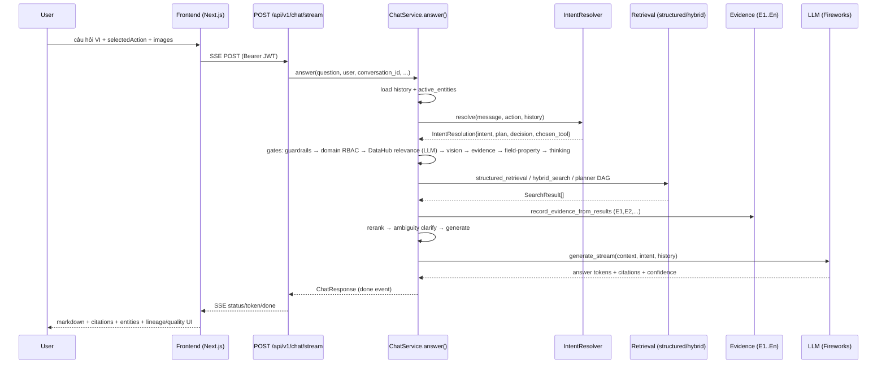

# DataAtlas — Project Work Report Source

> File này là **evidence-backed handoff document** dành cho việc viết báo cáo công việc hoàn chỉnh.
> Mọi claim đều có nguồn kiểm chứng (code file, config, test output, dữ liệu DB/OpenSearch).
> Đây KHÔNG phải README hay tài liệu marketing.
>
> - Thời điểm audit: 2026-08-18 (trạng thái code hiện tại = branch `main` + 52 file đang modified chưa commit).
> - Mọi đường dẫn tương đối với `datahub-ai-chatbot/`.

---

## 1. Project Overview

**DataAtlas (tên dự án) — "AI Chatbot cho DataHub"** là một hệ thống **chatbot hỏi-đáp metadata bằng tiếng Việt** cho nền tảng quản lý dữ liệu **DataHub** của VinFast, theo kiến trúc **RAG (Retrieval-Augmented Generation)**.

Bài toán: với ~8,500+ dataset, hàng trăm dashboard và glossary terms trong DataHub corporate, người dùng không chuyên muốn hỏi bằng tiếng Việt tự nhiên như:

- "Term Coverage Date nghĩa là gì?", "Dataset nào gắn term này?"
- "Dataset X có những field nào?", "field warehouse_id kiểu dữ liệu gì?"
- "Ai sở hữu dataset Y?", "Dataset này thuộc domain nào?"
- "Dataset Z lấy dữ liệu từ đâu?" (lineage)
- "Công thức tính của column X là gì?", "Tìm báo cáo về vendor capacity?"
- "Xóa dataset này thì ảnh hưởng gì?" (impact analysis)

Hệ thống trả lời **deterministic, grounded vào metadata thật** (từ DB đã sync) thay vì để LLM tự bịa — LLM chỉ đóng vai trò hẹp: phân loại intent bổ trợ, sinh SQL có kiểm soát, và trả lời RAG khi cần tổng hợp.

| Thuộc tính | Giá trị |
|---|---|
| Backend | FastAPI (Python 3.12), async SQLAlchemy |
| Database | PostgreSQL (metadata, chunks, RBAC, ACL, audit, image records) |
| Vector/Keyword search | OpenSearch (`datahub-rag-chunks-v1`, kNN) |
| Cache/Queue | Redis |
| LLM | Fireworks (deepseek-v4-flash) primary; NVIDIA (Llama 3.3 70B) secondary; Mock cho test |
| Embedding | Ollama `nomic-embed-text` (768-dim) hoặc MockEmbedder |
| Vision | Qwen3p7-plus (Fireworks) cho phân tích ảnh dashboard/ERD/SQL |
| Frontend | Next.js 16 (App Router), React 19, Tailwind v4 |
| Source metadata | DataHub GMS GraphQL (real) hoặc Mock source (JSON fixtures) |
| Deployment | Docker Compose (postgres, redis, opensearch, api, sync-worker, indexing-worker) + Helm chart |

---

## 2. Current Project Status

**Trạng thái tổng thể: production-usable với dữ liệu thật đã load; còn các limitation về semantic precision và một số gap kỹ thuật chưa xử lý.**

- App import OK (`from app.main import app` → OK, verified).
- **Toàn bộ 620 tests pass** (chạy `pytest tests/ -q` → `620 passed in 184s`, verified 2026-08-18).
- Dữ liệu thật đã sync vào DB: **8,542 dataset / 327 dashboard / 177 glossary_term / 21 glossary_node** (verified qua query DB `entities`).
- Vector index: **21,077 chunks** trong Postgres `entity_chunks` = **21,077 docs** trong OpenSearch `datahub-rag-chunks-v1` (verified count khớp nhau).
- ACL/RBAC: 884 rows `entity_acls` đã seed, 5 roles RBAC đã seed (Tài chính, Logistics, Sản Xuất, VGreen, Sales).
- DataHub corporate (datahub.vinfastauto.com) hiện **bị WAF chặn** → startup sync bị disable qua `DATAHUB_SKIP_STARTUP_SYNC=1` (xem `app/main.py:47`); hệ thống chạy từ local DB đã load qua `scripts/load_pulled_data.py`.
- Git: 6 commits trên `main`; 52 file đang modified (WIP, +2706/-391 dòng) — đây là trạng thái code đang audit.
- README.md **đã lỗi thời** (vẫn ghi "No user authentication", "No streaming", "No conversation memory", "No DataHub ACL integration" — tất cả đều đã có).

---

## 3. Completed Work

> Ghi "VERIFIED" khi có code + test hoặc runtime xác nhận. "Implemented — not fully verified" khi có code nhưng thiếu evidence kiểm chứng.

### 3.1 DataHub Integration
| Chức năng | Trạng thái | Evidence |
|---|---|---|
| Real DataHub GraphQL client (retry/WAF handling) | VERIFIED | `ingestion/graphql/client.py` + tests/unit/datahub/test_graphql_client.py |
| Mock data source (JSON fixtures) | VERIFIED | `ingestion/mock_source.py` + tests/test_mock_source.py |
| Full sync orchestrator (5 entity types) | VERIFIED | `ingestion/sync.py`, `config/constants.py` (MVP_ENTITY_TYPES) |
| Search-hit → CanonicalEntity mapping (giảm N+1) | VERIFIED | `ingestion/graphql_source.py:_search_hit_to_canonical` |
| URN routing theo type (dataset/glossary/dashboard/document + chart/dataFlow/...) | VERIFIED | `ingestion/graphql_source.py:_URN_TYPE_ROUTING` (14 patterns) |
| Lineage retrieval (up/downstream) | VERIFIED | `GET_DATASET_LINEAGE_QUERY`, `structured_retrieval.py:408` |
| Metadata pull tool (checkpoint/resume, 12 types) | VERIFIED | `scripts/pull_datahub_data.py`, `datahub_pull/` (45MB, ~11,259 entities) |
| Document ingestion từ URL (SSRF-guarded) | VERIFIED | `ingestion/document_ingestion.py`, `ingestion/document_parsers/ssrf_guard.py` |

### 3.2 AI / Agent
| Chức năng | Trạng thái | Evidence |
|---|---|---|
| Intent taxonomy (regex, ~60 rules, VI+EN) | VERIFIED | `retrieval/intent.py` |
| LLM intent classifier (semantic, opt-in) | VERIFIED | `retrieval/classifier.py`, `INTENT_CLASSIFIER_ENABLED=true` |
| Intent Resolver (merge message + action + history) | VERIFIED | `retrieval/intent_resolver.py` |
| Query Understanding layer (LLM JSON contract) | Implemented — default OFF | `retrieval/query_understanding.py`, `QU_ENABLED=false` |
| Entity resolution (exact/fuzzy/substring) | VERIFIED | `retrieval/entity_resolver.py` + tests |
| Entity extraction từ catalog (token-run match) | VERIFIED | `retrieval/entity_extraction.py` |
| Coreference/anaphora resolution (nó/đó/ấy) | VERIFIED | `retrieval/coreference.py` + tests/retrieval/test_coreference.py |
| Glossary alias resolution (Demand ↔ Component Demand) | VERIFIED | `app/services/chat/entity_resolution.py:resolve_glossary_by_alias` |
| Thinking Mode (deterministic planner/executor/synthesizer) | VERIFIED | `retrieval/thinking/` + tests/thinking/ |
| DAG planner executor (composite plans) | VERIFIED | `retrieval/planner_executor.py` |
| Multi-turn context / evidence (E1/E2) | VERIFIED | `app/services/conversation.py`, `app/services/chat/evidence.py` + tests/context/ |
| Citation generation + validation | VERIFIED | `retrieval/citation.py` + tests/test_citation.py |
| Domain-scoped glossary disambiguation (concept family "Demand") | VERIFIED | `app/services/chat_service.py:_domain_scoped_term_answer` |
| SQL generation (grounded, read-only) | VERIFIED | `app/services/action_service.py:generate_sql`, `app/services/sql_llm.py` + tests/integration/test_sql_generation.py |
| Quality report (deterministic, PDF/TXT export) | VERIFIED | `app/services/action_service.py:quality_check`, `app/services/quality_report.py` |
| Impact analysis (recursive downstream) | VERIFIED | `retrieval/graph.py`, `tests/e2e/test_impact_e2e.py` |
| Guardrails (scope, prompt injection, secret masking, URN grounding) | VERIFIED | `guardrails/` + tests/test_guardrails.py |
| Visual Understanding (image OCR + structured extraction) | VERIFIED | `retrieval/visual/`, `app/services/vision_service.py` + tests/visual/ |

### 3.3 Search / RAG
| Chức năng | Trạng thái | Evidence |
|---|---|---|
| Hybrid search (exact → resolver → OpenSearch BM25+vector → discovery → mock) | VERIFIED | `retrieval/hybrid_search.py` |
| Keyword search (OpenSearch match) | VERIFIED | `indexing/vector_store.py:keyword_search` |
| Vector search (kNN) | VERIFIED | `indexing/vector_store.py:vector_search` (fake mode degrade thành keyword) |
| Reranker 4-signal (retrieval/semantic/graph/metadata/citation) | VERIFIED | `retrieval/reranker.py` + tests/retrieval/test_reranker.py |
| Semantic expansion (VI↔EN synonyms) | VERIFIED | `retrieval/semantic_expansion.py` |
| Domain-scoped discovery (TokenDiscovery) | VERIFIED | `retrieval/discovery.py` |
| Metadata filtering (domain/platform/tag/owner/certified) | VERIFIED | `app/services/chat/listing.py`, `app/services/chat/structured_retrieval.py` |
| ACL filter (OpenSearch + DB builders) | Implemented — not fully verified | `app/auth/authorization.py:build_database_acl_filter/build_opensearch_acl_filter` + tests/integration/test_acl_filters.py |

### 3.4 Frontend
| Chức năng | Trạng thái | Evidence |
|---|---|---|
| Chat interface với streaming (SSE) | VERIFIED | `frontend/components/chat/*`, `frontend/lib/stream.ts`, `app/api/chat.py:stream` |
| Citations UI (pills) | VERIFIED | `frontend/components/chat/message-bubble.tsx` |
| Thinking-mode status indicator | VERIFIED | `frontend/components/chat/chat-layout.tsx` (step line) |
| Image upload (file picker + clipboard paste, base64) | VERIFIED | `frontend/components/chat/chat-input.tsx` |
| Conversation history CRUD + pin/favorite/search | VERIFIED | `frontend/components/chat/conversation-history.tsx`, `app/api/conversations.py` |
| Quality report card + PDF/TXT export | VERIFIED | `frontend/components/chat/quality-report-card.tsx` |
| Lineage SVG graph | VERIFIED | `frontend/components/chat/lineage-graph.tsx` |
| Search page, entities browser, glossary, admin, status pages | VERIFIED | `frontend/app/(app)/*` |
| Login + RBAC-gated routing | VERIFIED | `frontend/app/login/page.tsx`, `frontend/app/(app)/layout.tsx` |
| Landing page (marketing) | VERIFIED | `frontend/app/page.tsx`, `frontend/components/landing/*` |

### 3.5 Testing
- 620 tests, toàn bộ PASS (chạy lại verified 2026-08-18, `pytest tests/ -q` → 620 passed).
- Xem Section 9 để biết phân bố.

---

## 4. Current Architecture

### 4.1 Frontend (Presentation)
- **Next.js 16.3 App Router + React 19.2 + Tailwind v4**, riêng biệt hoàn toàn với backend (không phải static HTML cũ trong `app/static/`).
- Giao tiếp backend qua rewrite `next.config.ts` (`/api/:path*` → `localhost:8000`), SSE pass-through.
- Auth: JWT lưu localStorage (`dhab_token`), gửi qua `Authorization: Bearer`.
- Trạng thái: **complete**.

### 4.2 API / Backend
- **FastAPI**, entry `app/main.py`. Middleware: ErrorHandling → Metrics → RateLimit (optional).
- Routers mounted với prefix `/api/v1/*` (xem Section 6).
- DI: `app/api/dependencies/auth.py` (get_current_user, get_auth_service, get_admin_user, require_role).
- Session: `database/session.py` (async engine, in-memory SQLite khi `USE_IN_MEMORY_DATABASE`).
- Trạng thái: **complete**.

### 4.3 Agent / Orchestration
- **`ChatService.answer()`** (`app/services/chat_service.py`, ~2,428 dòng) là orchestrator trung tâm với chuỗi **gate** tuần tự:
  1. Intent resolution (message + action + history) → `retrieval/intent_resolver.py`
  2. Query Understanding (opt-in, `QU_ENABLED=false`) + Validator
  3. Greeting / Chitchat / Guardrails (scope + injection)
  4. **Domain RBAC gate** (pre-retrieval denial) → `app/services/chat/access.py`
  5. **DataHub relevance gate** (LLM) → `retrieval/datahub_intent.py`
  6. **Vision gate** (image = context, không phải intent)
  7. **Evidence gate** (follow-up theo E1/E2 trả lời từ evidence đã lưu, không re-search)
  8. **Field-property gate** (câu tự mang entity+field)
  9. **Thinking gate** (GENERAL + complex score ≥ 3)
  10. SQL / Sync-relation / Quality / conversational / Listing gates
  11. Planner DAG (COMPOSITE/MULTI_ENTITY) hoặc structured retrieval
  12. Anaphora / structured / hybrid retrieval → rerank → ambiguity clarify → generate
- Domain services (đều nhận `ChatContext` chung): `EntityResolutionService`, `StructuredRetrievalService`, `EvidenceService`, `ListingService`, `LineageService`, `ChatFlowsService`, `DomainAccessService`, `VisionContextService` — xem `app/services/chat/`.
- Trạng thái: **complete** (đây là phần refactor lớn: từ 1 service lớn → 8 service con theo responsibility).

### 4.4 Context & Evidence
- **`ConversationMemory`** (`app/services/conversation.py`): per `(user_id, conversation_id)` giữ turns (last 20), active_entities (last 3), image_focus, evidence store (last 8).
- **Evidence engine**: mỗi turn ghi `EvidenceRecord` có id **E1, E2, …** (`conversation.py:record_evidence`); record cùng `entity+kind` bị thay thế bằng record mới nhất; `record_evidence_from_results` tự ghi theo intent.
- **`retrieval/context_resolver.py:resolve_context`**: phát hiện câu tham chiếu evidence ("schema vừa lấy", "field đó", "chỉ dựa trên metadata") và trả `ContextResolution` (referenced_evidence, intent_hint, focus_field, operation...).
- **`EvidenceService.answer_from_evidence`** (`app/services/chat/evidence.py`): trả lời CHỈ từ `referenced_evidence.structured`, không re-search; hỗ trợ field-property, join, glossary, owner, domain, quality, lineage, schema-list.
- Field ops: `retrieval/evidence.py` (FieldOp, parse_field_operation) + `app/services/chat/field_ops.py` (answer_field_property).
- Trạng thái: **complete** (đây là core của tính năng "semantic context precision").

### 4.5 Retrieval / Search
- **HybridSearch.search** (`retrieval/hybrid_search.py`): decision ladder — exact match → resolver (khi câu đặt tên entity) → vector path (OpenSearch BM25 + kNN, weight 0.5/0.5) → TokenDiscovery → mock fallback.
- **Structured retrieval** (`app/services/chat/structured_retrieval.py`): intent-driven deterministic lookup trực tiếp từ DB/live source (term, owner, domain, lineage, schema, join, term→datasets) — đây là đường chính cho phần lớn câu hỏi metadata.
- **Reranker** (`retrieval/reranker.py`): 4 signal weighted (retrieval 0.5 / semantic 0.2 / graph 0.15 / metadata 0.1 / citation 0.05).
- **Entity resolution**: `retrieval/entity_resolver.py` (thresholds 1.0/0.9/0.7, ambiguity margin 0.2, trust 0.85) + `retrieval/entity_extraction.py` (token-run catalog match).
- Trạng thái: **complete** (retrieval lớn với 8,500+ dataset: 91.4% có schema, retrieval scale ~20k entities/token-run index).

### 4.6 DataHub Integration
- Source abstraction: `ingestion/source.py` (ABC) → `MockSource` / `GraphQLSource` (`ingestion/graphql_source.py`), factory `ingestion/factory.py` + `ingestion/__init__.py:create_datahub_source`.
- GraphQL client resilient: synchronous `requests` trong thread (httpx bị corporate DataHub trả HTTP 500), WAF detection, retry backoff+jitter, auth sniffing.
- Pull pipeline: `scripts/pull_datahub_data.py` (scroll/search enumeration, checkpoint/resume) → `datahub_pull/*.txt` (JSONL) → `scripts/load_pulled_data.py` → Postgres + OpenSearch.
- Mappers: dataset/dashboard/document/glossary → `CanonicalEntity`.
- Trạng thái: **complete**, nhưng có gap (xem Section 12): scroll query tồn tại nhưng `list_entities` vẫn dùng offset `search`; chỉ 4/12 type pulled được load.

### 4.7 LLM Layer
- Abstraction: `llm/base.py` (BaseLLM) → `FireworksLLM` (primary, working), `NVIDIAProvider` (working), `MockLLM` (test), OpenAI/Cohere/Bedrock = **stubs** (raise NotImplementedError, signature không khớp BaseLLM).
- `llm/generator.py` `AnswerGenerator`: build_context → sanitize secrets → generate_structured → citations → multi-signal confidence → validate_generation. Streaming dùng `STREAM_SYSTEM_PROMPT` (plain text, vì Fireworks `generate()` ép JSON).
- Prompts tập trung ở `config/prompts.py` + constants trong `fireworks.py`; `llm/prompt.py` là dead code.
- Vision LLM: `retrieval/visual/client.py` (Qwen2.5-VL via Fireworks, mock fallback).
- Trạng thái: **complete cho Fireworks/NVIDIA/Mock**, stubs chưa hoàn thiện.

### 4.8 Storage
- **PostgreSQL** (13 tables): `entities`, `entity_chunks`, `sync_checkpoints`, `entity_acls`, `conversation_history`, `rbac_roles`, `rbac_role_domains`, `rbac_users`, `rbac_user_roles`, `audit_logs`, `index_jobs`, `image_records`, `vision_cache_records`.
- **OpenSearch**: index `datahub-rag-chunks-v1`, mapping kNN 768-dim, denormalized metadata (owner_names, term_urns, domain, platform, environment, datahub_url, source_title).
- **Redis**: cache search (`search:{key}`, TTL 300s), rate limit, queues (lpush/brpop), healthcheck logs, sync locks (SETNX), DLQ.
- **Local filesystem**: `data/documents` (documents), `data/images` (image storage + thumbnails + trash).
- Trạng thái: **complete**.

---

## 5. Data Pipeline

Mermaid diagram của pipeline thực tế (verified từ code):

```mermaid
flowchart LR
    A[DataHub GMS GraphQL<br/>datahub.vinfastauto.com] -->|pull_datahub_data.py<br/>scroll/search + checkpoint| B[datahub_pull/*.txt<br/>JSONL - 12 types]
    B -->|load_pulled_data.py<br/>map + content_hash| C[(PostgreSQL<br/>entities)]
    A -.->|full_sync.py / SyncOrchestrator| C
    C -->|IndexingPipeline.process_entity<br/>chunk_text + embed| D[(entity_chunks<br/>21,077 rows)]
    D -->|IndexingPipeline| E[(OpenSearch<br/>datahub-rag-chunks-v1<br/>21,077 docs)]
    E -->|hybrid_search BM25+kNN| F[HybridSearch]
    C -->|structured_retrieval<br/>deterministic lookup| F
    F -->|rerank + build_context| G[AnswerGenerator<br/>Fireworks deepseek-v4-flash]
    G --> H[Answer + Citations<br/>ChatResponse]
    H --> I[Frontend Next.js<br/>chat UI]
```

**Chi tiết pipeline từng bước:**
- **Ingestion**: SyncOrchestrator (`ingestion/sync.py`) hoặc `load_pulled_data.py` → `compute_content_hash` (SHA-256 projection) → upsert `entities` + tạo `index_jobs`.
- **Indexing**: `IndexingPipeline.process_entity` — `build_chunks_for_entity` (type-specific: dataset→4 chunk types, glossary_term→2, dashboard→1, document→N sections) → `chunk_text` (paragraph-first, ~600 token estimate, overlap 75) → `embedder.embed` (Ollama `nomic-embed-text`, 768-dim) → dual-write Postgres `entity_chunks` + OpenSearch (id `{urn}_{chunk_type}_{chunk_index}`, delete-by-urn rồi upsert). Background: `process_pending_jobs` consume `index_jobs`.
- **Retrieval**: HybridSearch (ladder exact→resolver→vector) + StructuredRetrieval (intent-driven, DB/live source) → Reranker → `build_context` (max 8 chunks / 24,000 chars, XML `<entity id="E1">`) → LLM.
- **Generation**: `AnswerGenerator.generate/generate_stream` → citations (E1..En mapped từ docs) → multi-signal confidence → `validate_generation` (mask secrets, strip ungrounded URNs).
- **Embedding model**: `EMBEDDING_PROVIDER=ollama`, `EMBEDDING_MODEL=nomic-embed-text`, dim 768. `MockEmbedder` = deterministic SHA-256-seeded RNG (dùng khi mock).
- **Metadata được index**: urn, entity_type, name/display_name, description, platform, environment, domain, owner_names, term_urns, schema_fields (field_path/name/type/description/nullable/is_primary_key), upstreams/downstreams, datahub_url, certified, tags, source_title/page/section.

> Lưu ý scale: **8,542 dataset, 233,345 field entries** (~27 fields/dataset; max 4,561 fields trong `.Measure` powerbi). 91.4% dataset có schema_fields; 88.8% dataset **chưa có domain**; 75%+ dataset **không có description** (toàn bộ powerbi/redshift/glue/s3) → RAG phụ thuộc nặng vào tên + schema field.

---

## 6. API Architecture

### Router mount (`app/main.py:99-113`)

| Router | Prefix | Mô tả |
|---|---|---|
| auth | `/api/v1/auth` | Login (demo users), JWT |
| chat | `/api/v1/chat` | Chat single-turn + SSE stream |
| conversations | `/api/v1/conversations` | History CRUD |
| search | `/api/v1/search` | Hybrid search + stats |
| glossary | `/api/v1/glossary` | Term listing/detail |
| sync | `/api/v1/sync` | Full/entity sync |
| actions | `/api/v1/actions` | schema-compare, sql, impact, lineage, quality (+export), report |
| admin | `/api/v1/admin` | Roles/users/domains management |
| index | `/api/v1/index` | Rebuild index |
| documents | `/api/v1/documents` | Import document từ URL |
| storage | `/api/v1/storage` | Image storage management |
| datasources | `/api/v1/datasources` | DataHub health |
| me | `/api` | Dev profile |
| health/metrics | `/`, `/metrics` | Health, Prometheus metrics |

### Endpoints quan trọng

| Method + Path | Responsibility | Request | Response | Handler |
|---|---|---|---|---|
| POST `/api/v1/chat` | Trả lời 1 turn | `ChatRequest{question, conversation_id, suggested_name, model, selected_action, images[]}` | `ChatResponse{answer, intent, entities, citations, confidence, ambiguous, ...}` | `ChatService.answer` |
| POST `/api/v1/chat/stream` | Trả lời streaming (SSE) | giống trên | SSE events: `status`/`token`/`done`/`error` | `ChatService.answer` với `on_status`/`on_token` |
| GET `/api/v1/search` | Hybrid search + filter | `q, entity_type, domain, platform, owner, tag, column, limit` | `{results, total}` | `HybridSearch` + ACL filter |
| POST `/api/v1/actions/sql` | Sinh SQL grounded | `DatasetQuery` | `SqlResponse` | `ActionService.generate_sql` |
| POST `/api/v1/actions/impact` | Impact analysis | `DatasetQuery` | `ImpactResponse` | `ActionService.impact_analysis` |
| POST `/api/v1/actions/lineage` | Lineage data (SVG) | `DatasetQuery` | `LineageData` | `ActionService.build_lineage_data` |
| POST `/api/v1/actions/quality` | Quality report | `DatasetQuery` | `QualityReport` | `ActionService.quality_check` |
| POST `/api/v1/actions/quality/export` | Export PDF/TXT | `{report, format}` | file stream | `render_pdf_bytes`/`render_txt` |
| POST `/api/v1/admin/roles` | Tạo role (RBAC) | `{name, description, is_admin, group_names, domains}` | role | `RbacRepository` |
| POST `/api/v1/sync/full` | Full sync (admin) | — | `{status, results}` | `SyncOrchestrator` |
| POST `/api/v1/index/rebuild` | Rebuild index (admin) | — | `{status, jobs_created}` | `IndexingPipeline` |
| POST `/api/v1/documents/import` | Import document URL | `url, title` | `{success, urn, chunks}` | `DocumentIngestionService` |
| POST `/api/v1/storage` (GET list) | Image storage quản lý | filter/sort | `ImageListResponse` | `StorageRepository` |

**Auth**: JWT mode (AUTH_MODE=jwt, AUTH_REQUIRED=true). 3 demo users hardcoded: `admin/admin123` (admin), `finance/finance123` (viewer + finance-team), `logistics/logistics123` (viewer + logistics-team) — `app/api/auth.py`. Token 24h, HS256, secret từ `JWT_SECRET_KEY` env.

---

## 7. AI / Agent Pipeline

Luồng 1 request (verified từ `chat_service.py` + `app/api/chat.py`):

**Điểm quan trọng:**
- **LLM dùng ở đâu**: (1) DataHub relevance gate (`classify_datahub_relevance`), (2) semantic intent classifier (`classifier.classify`, override yếu), (3) Query Understanding (opt-in), (4) glossary alias suggestion (`llm_pick_suggestion`), (5) SQL enhancement (`GroundedSqlGenerator.enhance`, có validate chặt), (6) RAG answer generation. **Các câu metadata deterministic (schema/owner/domain/lineage/term/listing/quality/impact) KHÔNG gọi LLM sinh câu trả lời** — trả lời trực tiếp từ payload.
- **Intent**: regex taxonomy (~60 rules) là đường chính; LLM classifier chỉ override intent yếu (FIND_ENTITY, TERM_TO_DATASETS) và không bao giờ downgrade intent mạnh.
- **Entity resolution**: exact lookup → scored candidates (thresholds) → fuzzy/phonetic (min 0.6, max 8 candidates) → ambiguity clarify khi 2 top chênh < 0.15.
- **Retrieval trigger**: theo intent — structured cho phần lớn metadata; hybrid cho FIND/GENERAL; planner DAG cho COMPOSITE/MULTI_ENTITY; recursive impact cho IMPACT.
- **Context dùng lại**: evidence gate trả lời follow-up từ E1..En (không re-search); anaphora `resolve_followup_entity` dùng active_entities + image_focus; "còn X thì sao?" kế thừa tool của turn trước.
- **Thinking mode**: deterministic (không LLM), chỉ chạy khi GENERAL + complexity score ≥ 3; sinh `THINKING_OVERVIEW` với kết luận/lý do/rủi ro/khuyến nghị.
- **Citations**: `build_citations(docs, citation_ids)` map E<i> → Citation; `validate_citations` loại citation không nằm trong docs; Lineage answer tự gắn citation E1..En cho từng node.

---

## 8. Data / Metadata Overview

(Số liệu verified từ DB + audit/data_landscape_audit.md)

| Entity type | Count | Ghi chú |
|---|---|---|
| dataset | 8,542 | schema_fields 91.4%; description chỉ 8.2% |
| dashboard | 327 | Power BI dashboards |
| glossary_term | 177 | definition phong phú (2.4MB JSONL) |
| glossary_node | 21 | nhóm Business Terms, KPI Logic PFEP |
| **TOTAL trong DB** | **9,067** | |

Nguồn đã pull nhưng **chưa load vào DB** (chỉ nằm trong `datahub_pull/`): chart (1,487), container (347), data_flow (221), data_job (0), corp_user (32), corp_group (5), data_platform (86), tag (5), domain (9).

- Platform dataset: powerbi 3,396 / redshift 3,089 / glue 1,336 / SAP 430 / MES 141 / Excel 24 / DMS 23 / s3 17 / còn lại nhỏ. **Dirty data**: `Salesforce`/`Saleforce`, `Excel`/`EXCEL`, `Qualtrics`/`Qualrics`.
- Domain dataset: 88.8% chưa gán domain; SẢN XUẤT 489, TÀI CHÍNH 201, KINH DOANH 92, CUNG ỨNG (TT) 65, LOGISTIC 47, HẬU MÃI 34, CUNG ỨNG (NĐH) 21, PHÁT TRIỂN XE 12.
- Environment: 100% `PROD`.
- Schema: 233,345 field entries; không có glossary/tags gắn field-level (luôn rỗng).
- **Chunks**: 21,077 (Postgres `entity_chunks` = OpenSearch docs count, verified).
- **Index jobs**: 1,077 completed / 125 pending / 1 processing (verified tại thời điểm audit).
- ACL: 884 rows seeded (domain → allowed groups).

---

## 9. Testing & Validation

### Test suite (chạy lại đầy đủ 2026-08-18)
`pytest tests/ -q` → **620 passed in 184.34s** (verified).

| Directory | Count (test funcs) | Nội dung | Phụ thuộc |
|---|---|---|---|
| `tests/` (root) | 126 | chunker, citation, context_builder, embedder, entity_document, entity_resolver, fuzzy, graph_expander, guardrails, intent, mock_source, network_safety, normalizer | mock |
| `tests/retrieval/` | 98 | classifier, coreference, entity_extraction, graph, intent_resolver, intent_taxonomy, lineage_extraction, planner, query_understanding, reranker, semantic_guard, validator | mock |
| `tests/thinking/` | 10 | thinking-mode orchestrator | mock |
| `tests/context/` | 20 | context propagation (evidence-based follow-ups), field-level context | Postgres |
| `tests/e2e/` | 20 | chat e2e (full sync + answer), domain RBAC e2e, impact e2e | Postgres |
| `tests/evaluation/` | 23 | evaluator, golden dataset, metrics | mock |
| `tests/visual/` | 60 | parser, storage_services, visual_mode | mock + Postgres |
| `tests/unit/auth/` | 34 | authorization, rbac, jwt, identity, api_me, admin_roles_api | mock |
| `tests/unit/datahub/` | 28 | graphql_client, graphql_source_routing, sync_service, factory, url_builder | mock |
| `tests/unit/document_parsers/` | 34 | parsers (16), document_ingestion, ssrf_guard | mock |
| `tests/unit/mappers/` | 10 | dataset/dashboard/glossary mappers | mock |
| `tests/unit/services/` | 19 | evidence_field_specialisation, field_identifier, sql_filter_and_hybrid | Postgres |
| `tests/unit/sync/` | 26 | consumer, dlq, event_handler, incremental_sync, retry | mock |
| `tests/integration/` | 66 | acl_filters, chunk/entity/index/sync repos, count_listing, full_sync, lineage, quality_report, sql_generation | Postgres + Redis/OpenSearch |

### Evaluation framework
- `evaluation/golden_dataset.py`: 14 built-in Vietnamese Q&A samples + load từ JSON.
- `evaluation/metrics.py`: entity_recall/precision/F1, answer_accuracy, no_answer_accuracy, faithfulness.
- `evaluation/evaluator.py`: `Evaluator.evaluate(dataset)` chạy `ChatService.answer` cho từng sample.
- `scripts/evaluate.py`: CLI chạy evaluation.
- `scripts/complex_qa_suite.py`: ~35 case multi-turn, chấm theo 8 tiêu chí (Intent, Entity, Context Resolution, Tool Selection, Data, Permission, Relevance) qua live API, login bằng 3 roles.

### Benchmark audit (audit/)
- `audit/final_metrics.json` + `audit/final_benchmark_report.md`: 48 tests sinh từ golden benchmark 8,500+ dataset.
- **Final (2026-08-18)**: pipeline pass **15/48 (31.3%)** (baseline 7/48), rich semantic pass 24/48 (50%). **0 regression**. 8 tests được fix.
- Metrics: hallucination_rate 0.000, forbidden_exclusion 1.000, citation_accuracy 0.854, abstention_accuracy 0.875, intent_accuracy 0.938, evidence_grounding 0.521.
- Failure clusters chính: ambiguity clarify over-fire (13 tests), domain-scoped glossary không decompose (3), composite/end-to-end insufficient_context (3), evidence thiếu (4), wrong entity trước evidence (2).

---

## 10. Recent Improvements

> "Đã thay đổi gì → tại sao → ảnh hưởng."

| Cải tiến | Tại sao | Ảnh hưởng |
|---|---|---|
| **Tách ChatService thành 8 service con** (`app/services/chat/`) | Service cũ quá lớn, khó bảo trì | Phân tách responsibility rõ: entity_resolution, structured_retrieval, evidence, listing, lineage, flows, access, vision |
| **Evidence engine (E1..En) + context propagation** | Câu follow-up ("field đó", "kết quả vừa rồi") phải grounded vào metadata đã lấy, không re-search | `tests/context/test_context_propagation.py` (11 tests) + `test_field_level_context.py` (9 tests) |
| **Field-property direct answering** (`field_ops.py`, `_answer_direct_field_op`) | "warehouse_id của X có kiểu gì?" trả lời chính xác từ schema | Focused answer thay vì schema dump (commit `a6dcb717`) |
| **Domain-scoped glossary disambiguation** | "Demand là gì?" có nhiều term theo domain | Concept-family handling (`_GLOSSARY_CONCEPT_KEYWORDS`, `_domain_scoped_term_answer`) |
| **Query Understanding layer (opt-in)** | LLM đọc câu hỏi thành JSON contract (focus_field/property/anaphora) | `QU_ENABLED=false` mặc định; shadow mode để đo trước khi bật (commit `14aa0c8b`) |
| **Semantic context precision + RBAC + quality reports + storage + vision** (commit `0d5349ba`) | Nhóm tính năng lớn v2 | Vision (Qwen VL), image storage, RBAC roles/domains, quality report PDF/TXT |
| **Deterministic answers cho owner/domain/impact** (commit `8a87be5c`) | Tránh LLM paraphrase sai | Trả lời từ enrichment metadata |
| **R1 LLM-first intent classifier** | Intent semantic override intent regex yếu | `llm_intent_override` không downgrade intent mạnh |
| **Exact-name fast path** (`try_explicit_entity_lookup`) | Câu nêu tên chính xác entity phải resolve deterministic | Ngăn fuzzy search chọn sai entity |
| **ACL/RBAC thật sự hoạt động** (DB-backed) | AGENTS.md critical #4 | `entity_acls` + `rbac_*` tables, `build_*_acl_filter` có thật, seed trên startup, integration tests pass |
| **GraphQL source cải thiện** (client + queries + routing) | WAF block, N+1, URN routing | `_search_hit_to_canonical` giảm N+1 cho listing path; `_URN_TYPE_ROUTING` 14 patterns |
| **Index rebuild sạch** | AGENTS.md #10 | `index.py` dùng list comprehension, verified fix |
| **JWT secret bắt buộc** | AGENTS.md #9 | `JWT_SECRET_KEY=""` + model_validator raise khi AUTH_MODE=jwt |
| **PyMuPDF thêm vào pyproject** | AGENTS.md #7 | `PyMuPDF>=1.23.0`, verified installed 1.28.0 |
| **CI Dockerfile paths đồng bộ** | AGENTS.md #6 | CI dùng `deploy/docker/api.Dockerfile` + `worker.Dockerfile` (files tồn tại) |
| **Frontend Next.js đầy đủ** | Thay static HTML | Chat streaming, citations UI, thinking indicator, image upload, admin pages |

---

## 11. Business Requirements Alignment

| Use case | Trạng thái | Evidence | Ghi chú |
|---|---|---|---|
| 1. Domain-specific glossary (cùng term, khác definition theo domain) | **Implemented** | `_domain_scoped_term_answer` (concept family "Demand"), `_GLOSSARY_CONCEPT_KEYWORDS`; so sánh Demand giữa domains | Chỉ hỗ trợ concept family "demand"; generic term ambiguity vẫn cần clarify |
| 2. Report discovery ("tìm báo cáo capacity của vendor") | **Partially implemented** | `FIND_ENTITY` intent + `TokenDiscovery` + report-listing | Benchmark: report/dashboard discovery 4/8 pass; ambiguity clarify over-fire chặn nhiều case |
| 3. Column semantics ("công thức tính coverage date?") | **Implemented** | `field_ops.answer_field_property`, `_field_meaning` (name-derived VI), formula-column guard → TERM_DEFINITION | Phụ thuộc glossary term có formula; field description thường rỗng → fallback tên trường |
| 4. Report lineage ("report này lấy dữ liệu từ đâu?") | **Implemented** | `LINEAGE` intent, `LineageService`, live GraphQL lineage + persisted fallback, SVG graph | Lineage accuracy 4/5 pass benchmark |
| 5. Multi-hop reasoning (dataset→field→glossary→domain→report→lineage→document) | **Partially implemented** | Thinking Mode (complexity ≥ 3), QU decomposition (opt-in), planner DAG | Benchmark: multi-hop/multi-turn 1/7 pass; composite end-to-end `insufficient_context` |

---

## 12. Current Limitations

> Chỉ ghi limitation có evidence. Không biến thành bug nếu chưa chứng minh.

1. **Metadata nguồn thiếu**: 88.8% dataset không có domain; 75%+ không có description (toàn bộ powerbi/redshift/glue/s3); không có glossary/tags field-level; field description thường null. → RAG phụ thuộc tên + schema field.
2. **Dirty platform names**: `Salesforce`/`Saleforce`, `Excel`/`EXCEL`, `Qualtrics`/`Qualrics`.
3. **Chỉ 4/12 type pulled được load vào DB**: chart/container/data_flow/corp_user/corp_group/platform/tag/domain nằm trong `datahub_pull/` nhưng không có row trong `entities` (evidence: data_landscape_audit.md + query DB).
4. **GraphQL pagination**: `SCROLL_ACROSS_ENTITIES_QUERY` đã định nghĩa nhưng `graphql_source.list_entities` vẫn dùng offset `search` (AGENTS.md #1 chưa hoàn tất).
5. **N+1 vẫn còn ở sync paths**: `SyncOrchestrator.sync_entity_type` gọi `get_entity` cho từng dataset/dashboard; incremental sync cũng vậy (AGENTS.md #2 — listing path đã fix, sync path chưa).
6. **URN routing default "dataset"**: type không match pattern → search fallback (AGENTS.md #3 — đã cải thiện nhiều nhưng default vẫn dataset).
7. **Workers trống**: `document_worker.py`, `embedding_worker.py` là no-op loops; `scheduler.py` raise NotImplementedError (AGENTS.md #8). `compose.yaml` không define document/embedding workers.
8. **Semantic precision chưa đạt target**: benchmark pipeline pass 31.3%, rich pass 50%; ambiguity clarify over-fire (13 tests), domain-scoped glossary chưa decompose (3), composite insufficient_context (3). 8 root-cause được ghi trong `docs/semantic_context_precision_report.md` + `docs/SYSTEM_CONTEXT.md`.
9. **Evidence grounding thấp**: 0.521 (52%) trong benchmark.
10. **Glossary resolution thấp**: 6/18 pass (33%).
11. **LLM providers khác là stub**: OpenAI/Cohere/Bedrock raise NotImplementedError, signature không khớp BaseLLM.
12. **Fake mode hạn chế**: `FakeSearchBackend.vector_search` degrade thành keyword search (embeddings không dùng trong fake mode); `KeywordIndex` là stub; embedding dimension mismatch (constants 384 vs settings 768).
13. **`USE_MOCK_EMBEDDING` setting bị bỏ qua** bởi `create_embedder()` (chỉ kiểm tra `EMBEDDING_PROVIDER`).
14. **README lỗi thời** so với thực trạng code (auth/streaming/memory/ACL đã có).
15. **Code duplication**: `app/metrics.py` vs `app/api/metrics.py` (chỉ cái sau được mount); 2 session dependencies (`app/dependencies.py` vs `database/session.py`); `app/schemas/entity.py` + `app/schemas/sync.py` không được router dùng.
16. **Demo auth hardcoded**: 3 users trong code; `JWT_SECRET_KEY` trong `.env` là "dev-secret-change-in-production" (đã có raise khi rỗng nhưng giá trị demo vẫn trong file .env local).
17. **LLM temperature/JSON**: Fireworks `generate()` ép `response_format=json_object` → conversational answer phải dùng prompt riêng (`generate_conversational`), streaming dùng prompt riêng — một hạn chế kiến trúc provider.

---

## 13. Next Steps

> TODO — To be defined by project owner.

---

## 14. Important Files / Modules

| Module/File | Vai trò |
|---|---|
| `app/services/chat_service.py` | Orchestrator trung tâm (các gate + routing) |
| `app/services/chat/evidence.py` | Evidence engine (E1..En), trả lời từ evidence |
| `app/services/chat/context.py` | `ChatContext` — container dependency chung |
| `app/services/chat/question_analysis.py` | Helpers regex phân tích câu hỏi (listing, field, anaphora, ...) |
| `app/services/chat/structured_retrieval.py` | Retrieval deterministic theo intent (schema/owner/domain/lineage/term/join) |
| `app/services/chat/flows.py` | SQL/quality/sync-relation/term-datasets flows |
| `app/services/chat/access.py` | Domain RBAC gate |
| `app/services/action_service.py` | "+" actions: schema-compare, SQL, impact, quality, report |
| `app/services/conversation.py` | ConversationMemory (turns, active_entities, evidence, image_focus) |
| `retrieval/intent.py` | Intent taxonomy + regex router |
| `retrieval/intent_resolver.py` | Merge message + action + history → decision |
| `retrieval/classifier.py` | LLM semantic intent classifier |
| `retrieval/query_understanding.py` | QU layer (opt-in) |
| `retrieval/validator.py` | Guardrail cho QU contract |
| `retrieval/entity_resolver.py` / `entity_extraction.py` | Resolve/extract entity |
| `retrieval/context_resolver.py` | Resolve follow-up → evidence |
| `retrieval/hybrid_search.py` | Search ladder (exact→resolver→vector→discovery→mock) |
| `retrieval/reranker.py` | 4-signal reranker |
| `retrieval/thinking/` | Thinking mode (complexity, planner, executor, synthesizer, orchestrator) |
| `retrieval/visual/` | Visual understanding skill (Qwen VL) |
| `retrieval/graph.py` | Metadata graph + recursive impact |
| `llm/generator.py` | AnswerGenerator (RAG answer orchestration) |
| `llm/fireworks.py` | FireworksLLM (provider chính) |
| `config/settings.py` / `config/prompts.py` | Settings + prompt library |
| `ingestion/graphql_source.py` | Real DataHub GraphQL source |
| `ingestion/graphql/client.py` | Resilient GraphQL HTTP client |
| `ingestion/graphql/queries.py` | GraphQL queries (search/scroll/get/lineage) |
| `ingestion/sync.py` / `sync_service.py` | Sync orchestrators |
| `indexing/pipeline.py` | Indexing pipeline (chunk→embed→dual-write) |
| `indexing/vector_store.py` | OpenSearch vector store (keyword/kNN/hybrid) |
| `database/models.py` | 13 ORM models |
| `scripts/pull_datahub_data.py` | Pull metadata corporate → JSONL (checkpoint) |
| `scripts/load_pulled_data.py` | Load JSONL → Postgres + OpenSearch |
| `scripts/complex_qa_suite.py` | Live multi-turn evaluation script |
| `app/api/chat.py` | Chat endpoints (POST + SSE stream) |
| `app/api/actions.py` | Action endpoints |
| `app/auth/authorization.py` | AuthorizationService (ACL + RBAC) |
| `app/auth/rbac.py` | RbacService (domain RBAC, DB-backed) |
| `guardrails/` | Scope, prompt injection, secret masking, generation validation |
| `frontend/components/chat/*` | Chat UI (input, bubbles, citations, lineage, quality) |
| `frontend/lib/stream.ts` / `use-chat.ts` | SSE client + chat state |

---

## 15. Evidence & Verification Notes

### Commands đã chạy (read-only, 2026-08-18)

| Command | Kết quả |
|---|---|
| `python -c "from app.main import app; print('OK')"` | `OK - app imports` |
| `pytest tests/ -q` | `620 passed in 184.34s` |
| SELECT `entity_type, count(*)` từ `entities` | dataset 8542, dashboard 327, glossary_term 177, glossary_node 21 |
| SELECT `count(*)` từ `entity_chunks` | 21,077 |
| SELECT `count(*)` từ `entity_acls` | 884 |
| SELECT status/count từ `index_jobs` | completed 1077, pending 125, processing 1 |
| OpenSearch `_count` index `datahub-rag-chunks-v1` | 21,077 |
| Port check postgres 5433 / opensearch 9201 / redis 6380 | all UP |
| `pip list` | PyMuPDF 1.28.0, pytest 9.1.1, asyncpg, opensearch-py installed |

### Bảng evidence cho các claim quan trọng

| Claim | Evidence | Status |
|---|---|---|
| Dữ liệu thật 8,542 dataset đã load | DB `entities` count + `datahub_pull/dataset.txt` (8,542 lines) | VERIFIED |
| Vector index hoạt động | Postgres `entity_chunks` = 21,077 = OpenSearch count 21,077 | VERIFIED |
| Evidence/context propagation hoạt động | `evidence.py` + `context_resolver.py` + tests/context 20 tests pass | VERIFIED |
| Thinking mode hoạt động | `retrieval/thinking/` + tests/thinking 10 tests pass | VERIFIED |
| Vision/image context hoạt động | `retrieval/visual/` + `vision_service.py` + tests/visual 60 tests pass | VERIFIED |
| ACL/RBAC DB-backed | `entity_acls` 884 rows + `rbac_*` tables + tests/integration/test_acl_filters.py 6 tests pass | VERIFIED |
| Auth bypass đã sửa (#5) | `chat_service.py:443` `user: UserContext | None`, fallback anonymous | VERIFIED |
| JWT secret bắt buộc (#9) | `settings.py:34,148` raise khi empty | VERIFIED |
| PyMuPDF (#7) | pyproject + installed 1.28.0 | VERIFIED |
| Index rebuild (#10) | `index.py` list comprehension | VERIFIED |
| Scroll pagination (#1) | `SCROLL_ACROSS_ENTITIES_QUERY` defined, `list_entities` vẫn dùng `search` | PARTIALLY VERIFIED (chưa hoàn tất) |
| Workers trống (#8) | `document_worker.py`/`embedding_worker.py` no-op, `scheduler.py` NotImplementedError | VERIFIED (tồn tại gap) |
| Benchmark semantic precision | `audit/final_metrics.json`, `final_benchmark_report.md` | VERIFIED (15/48 pipeline, 24/48 rich) |
| README lỗi thời | README "No auth/streaming/memory/ACL" vs code đã có | VERIFIED |
| N+1 sync path (#2) | `sync.py:38-41`, `sync_service.py:128`, `incremental_sync.py:51` gọi `get_entity` per item | VERIFIED (gap) |

### Notes
- **Source code KHÔNG bị thay đổi** trong quá trình audit. Chỉ tạo file `docs/for_claude.md`.
- Không chạy migration, không re-index, không ghi DB (chỉ SELECT), không chạy lệnh ghi.
- Test chạy được là read-only đối với project data (test DB `chatbot_test` riêng, mock source, không ghi vào main DB `chatbot`).
- Số test 620 đã bao gồm toàn bộ 14 test directories.
- Các con số line number trong file này theo trạng thái code hiện tại (52 file WIP chưa commit); nếu code đã di chuyển, tra theo tên hàm.