# Tài Liệu Kiến Trúc Xử Lý Câu Hỏi Phức Hợp (Complex Query Processing Architecture)

Tài liệu này mô tả chi tiết quy trình xử lý câu hỏi phức hợp (**Complex Query Processing Pipeline**) trong hệ thống **V-DataAtlas (DataHub AI Chatbot)** dựa trên sơ đồ quy trình 5 bước bên dưới.

---

## 1. Sơ Đồ Quy Trình Xử Lý Câu Hỏi Phức Hợp (Complex Query Diagram)

```mermaid
flowchart LR

    A["Complex Query"]

    subgraph B["1. Query Understanding"]
        direction TB
        B1["Intent Detection"]
        B2["Multi-Entity Extraction"]
        B1 --> B2
    end

    subgraph C["2. Query Planning"]
        direction TB
        C1["Entity Resolution"]
        C2["Execution DAG"]
        C1 --> C2
    end

    subgraph D["3. Secure Parallel Retrieval"]
        direction TB
        D1["Security & RBAC"]
        D2["Entity A<br/>Schema + Lineage"]
        D3["Entity B<br/>Schema + Lineage"]
        D4["Merge & Deduplicate"]

        D1 --> D2
        D1 --> D3
        D2 --> D4
        D3 --> D4
    end

    subgraph E["4. Answer Generation"]
        direction TB
        E1["Context Assembly"]
        E2["LLM"]
        E3["Citation Validation"]

        E1 --> E2 --> E3
    end

    F["5. Chat UI"]

    A --> B1
    B2 --> C1
    C2 --> D1
    D4 --> E1
    E3 --> F

    style A fill:#E8F1FF,stroke:#3B82F6,stroke-width:2px,color:#1E3A8A

    style B fill:#EEF2FF,stroke:#6366F1,stroke-width:2px,color:#312E81
    style B1 fill:#F5F7FF,stroke:#818CF8,color:#312E81
    style B2 fill:#F5F7FF,stroke:#818CF8,color:#312E81

    style C fill:#F5F3FF,stroke:#8B5CF6,stroke-width:2px,color:#5B21B6
    style C1 fill:#FAF9FF,stroke:#A78BFA,color:#5B21B6
    style C2 fill:#FAF9FF,stroke:#A78BFA,color:#5B21B6

    style D fill:#ECFDF5,stroke:#10B981,stroke-width:2px,color:#065F46
    style D1 fill:#F3FCF8,stroke:#34D399,color:#065F46
    style D2 fill:#F3FCF8,stroke:#34D399,color:#065F46
    style D3 fill:#F3FCF8,stroke:#34D399,color:#065F46
    style D4 fill:#F3FCF8,stroke:#34D399,color:#065F46

    style E fill:#FFF7ED,stroke:#F97316,stroke-width:2px,color:#9A3412
    style E1 fill:#FFFBF5,stroke:#FB923C,color:#9A3412
    style E2 fill:#FFFBF5,stroke:#FB923C,color:#9A3412
    style E3 fill:#FFFBF5,stroke:#FB923C,color:#9A3412

    style F fill:#E0F2FE,stroke:#0EA5E9,stroke-width:2px,color:#075985

    linkStyle default stroke:#64748B,stroke-width:2px
```

---

## 2. Chi Tiết Các Bước Trong Quy Trình Xử Lý

### 🔵 Bước 0: Input Complex Query (Câu Hỏi Phức Hợp)
* Nhận truy vấn đa chiều từ người dùng (Ví dụ: *"So sánh cấu trúc schema và dòng chảy dữ liệu lineage giữa bảng Fact_Sales và Dim_Customer"*).

---

### 🟣 Bước 1: Query Understanding (Thấu Hiểu Truy Vấn)
1. **`Intent Detection` (`retrieval/intent.py`)**:
   - Bộ phân loại ý định xác định câu hỏi chứa intent phức hợp (như `COMPOSITE_QUERY`, `MULTI_ENTITY_QUERY`, `COMPARISON`, `MULTI_HOP_CHAIN`).
2. **`Multi-Entity Extraction` (`retrieval/entity_detection.py`)**:
   - Trích xuất đồng thời danh sách nhiều đối tượng/thực thể dữ liệu được nhắc tới trong câu hỏi (Ví dụ: `Entity A = Fact_Sales`, `Entity B = Dim_Customer`).

---

### 🟣 Bước 2: Query Planning (Lập Kế Hoạch Truy Vấn)
1. **`Entity Resolution` (`retrieval/entity_resolver.py`)**:
   - Giải mã và định danh chính xác URN/Tên chuẩn cho từng thực thể trong kho Metadata (Fuzzy Matching + Dictionary Mapping).
2. **`Execution DAG` (`app/services/chat_service.py`)**:
   - Lập đồ thị thực thi hướng không chu trình (DAG - Directed Acyclic Graph) để chuẩn bị các tác vụ truy xuất dữ liệu song song (Async Concurrency) tối ưu thời gian phản hồi.

---

### 🟢 Bước 3: Secure Parallel Retrieval (Truy Xuất Song Song Bảo Mật)
1. **`Security & RBAC` (`app/auth/authorization.py`)**:
   - Áp dụng bộ lọc phân quyền `entity_acls` và `Domain RBAC Gate` đảm bảo người dùng chỉ được phép truy xuất các entity thuộc quyền hạn cho phép.
2. **`Entity A (Schema + Lineage)` & `Entity B (Schema + Lineage)`**:
   - Thực thi đồng thời các truy vấn con (Parallel Concurrency via `asyncio.gather`):
     - Lấy danh sách cột, kiểu dữ liệu (Schema).
     - Tra cứu cây dòng chảy Upstream/Downstream (Lineage Graph).
3. **`Merge & Deduplicate`**:
   - Tổng hợp kết quả từ các nhánh truy vấn song song, loại bỏ thông tin trùng lặp và làm sạch ngữ cảnh.

---

### 🟠 Bước 4: Answer Generation (Sinh Câu Trả Lời)
1. **`Context Assembly` (`retrieval/context.py`)**:
   - Đóng gói ngữ cảnh đa thực thể đã được lọc thành cấu trúc Prompt chuẩn hóa cho LLM.
2. **`LLM` (`llm/`)**:
   - Đẩy Prompt qua mô hình **Fireworks AI API** (hoặc Ollama / NVIDIA fallback) để sinh câu trả lời bằng tiếng Việt chi tiết.
3. **`Citation Validation` (`retrieval/citation.py`)**:
   - Kiểm tra tính hợp lệ của các trích dẫn (Citations), đối chiếu mã URN thực thể và đảm bảo tính chính xác của các bằng chứng (Evidence attribution).

---

### 🔵 Bước 5: Chat UI (Hiển Thị Giao Diện)
* Truyền tải luồng token thời gian thực về giao diện **Next.js Chat UI** via SSE Stream.
* Hiển thị câu trả lời hoàn chỉnh kèm Badge **Response Time**, danh sách trích dẫn (Citations) và các thẻ thực thể liên quan.
