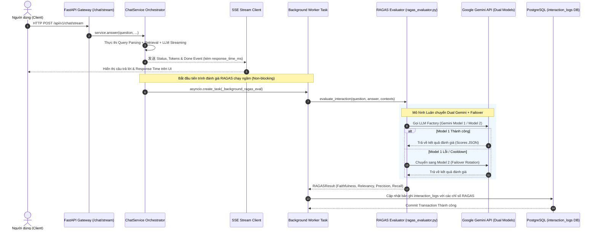

# Tài Liệu Kỹ Thuật: Chức Năng Đánh Giá Phản Hồi LLM Bằng RAGAS (V-DataAtlas)

Tài liệu này mô tả chi tiết kiến trúc, các chỉ số (metrics), luồng thực thi bất đồng bộ, cơ chế Failover và lưu trữ persistent cho chức năng đánh giá chất lượng phản hồi LLM sử dụng khung **RAGAS (Retrieval-Augmented Generation Assessment System)** trong hệ thống V-DataAtlas.

---

## 1. Tổng Quan Về Chức Năng Đánh Giá RAGAS

RAGAS là khung đánh giá chuẩn công nghiệp cho các hệ thống RAG (Retrieval-Augmented Generation). Trong V-DataAtlas, RAGAS được tích hợp để tự động đánh giá định lượng chất lượng phản hồi của LLM và hiệu quả của pipeline truy vấn dữ liệu mà **không làm chậm thời gian phản hồi (Response Time)** tới người dùng.

### Các Đặc Điểm Nổi Bật:
* **Background Async Execution**: Đánh giá chạy ngầm 100% bất đồng bộ sau khi câu trả lời đã gửi xong tới client.
* **Dual Model Failover & Rotation**: Luân chuyển tự động giữa 2 mô hình Gemini (Round-Robin) với cơ chế tự động bỏ qua mô hình bị lỗi (Cooldown Skip).
* **Multi-Metric Assessment**: Đánh giá 4 chỉ số cốt lõi (`Faithfulness`, `Answer Relevancy`, `Context Precision`, `Context Recall`).
* **Persistence & Admin Observability**: Lưu trữ toàn bộ điểm số RAGAS vào PostgreSQL (`interaction_logs`) và hiển thị trực quan tại Admin Interactions Panel.

---

## 2. Danh Sách 4 Chỉ Số RAGAS Cốt Lõi (Core Metrics)

| Tên Chỉ Số (Metric) | Phạm Vi Điểm | Ý Nghĩa Kỹ Thuật | Phương Thức Đánh Giá |
| :--- | :---: | :--- | :--- |
| **`Faithfulness`**<br>*(Độ trung thực)* | `0.0 - 1.0` | Đo lường mức độ câu trả lời dựa trên thông tin thực tế từ Context truy vấn được (chống Hallucination). | Trích xuất các khẳng định (claims) trong câu trả lời và kiểm tra xem từng claim có được suy ra từ Context hay không. |
| **`Answer Relevancy`**<br>*(Độ liên quan)* | `0.0 - 1.0` | Đo lường mức độ câu trả lời giải quyết trực tiếp và tập trung vào câu hỏi của người dùng. | Tạo ngược các câu hỏi giả định từ câu trả lời, sau đó tính độ tương đồng cosin (Cosine Similarity) bằng Vector Embedding. |
| **`Context Precision`**<br>*(Độ chính xác Context)* | `0.0 - 1.0` | Đo lường tỷ lệ các đoạn context có liên quan thực sự ở vị trí đầu của kết quả tìm kiếm. | Đánh giá thứ hạng (rank) của các đoạn context có thông tin hữu ích trong danh sách retrieved contexts. |
| **`Context Recall`**<br>*(Độ đầy đủ Context)* | `0.0 - 1.0` | Đo lường mức độ thu thập đầy đủ các context cần thiết so với đáp án chuẩn (Ground Truth/Reference). | Kiểm tra xem từng câu trong đáp án chuẩn có thể được hỗ trợ bởi các đoạn context retrieved hay không. |

---

## 3. Kiến Trúc Xử Lý Bất Đồng Bộ (Background Async Flow)



---

## 4. Mô Hình Chống Lỗi & Tự Động Luân Chuyển Mô Hình (Failover & Rotation)

Để đảm bảo tính sẵn sàng cao và hạn chế bị Rate Limit/Timeout khi gọi API LLM đánh giá, module `evaluation/ragas_evaluator.py` triển khai cơ chế luân chuyển thông minh:

### 1. Cấu Hình Mô Hình Kép (Dual Models):
- **Model 1**: Configured via `GEMINI_MODEL_1` (mặc định: `gemini-2.5-flash-lite` / `gemini-1.5-flash`)
- **Model 2**: Configured via `GEMINI_MODEL_2` (mặc định: `gemini-2.0-flash`)
- **Base URL**: `https://generativelanguage.googleapis.com/v1beta/openai/` (OpenAI-compatible Endpoint)

### 2. Thuật Toán Round-Robin Với Cooldown Skip:
- Các mô hình được chọn luân phiên theo thuật toán Round-Robin.
- Khi một mô hình gặp lỗi (Rate Limit, Timeout, API Error), hệ thống kích hoạt **Cooldown Timer**:
  $$\text{skip\_until} = \text{current\_time} + \text{SKIP\_COOLDOWN (10s)}$$
- Trong 10 giây tiếp theo, mô hình bị lỗi sẽ tự động bị bỏ qua và mô hình còn lại lập tức tiếp quản công việc (Failover).

### 3. Embeddings Tích Hợp:
- `AnswerRelevancy` sử dụng Embeddings chuẩn OpenAI-compatible thông qua `OllamaEmbeddingsWrapper` kết hợp mô hình `nomic-embed-text` (768 dimensions), đảm bảo tính đồng bộ với kho Vector Index của OpenSearch.

---

## 5. Cơ Sở Dữ Liệu & Bảng Lưu Trữ (Database Persistence)

Kết quả đánh giá RAGAS được lưu trữ bền vững vào bảng **`interaction_logs`** trong PostgreSQL với cấu trúc trường dữ liệu như sau:

```sql
ALTER TABLE interaction_logs ADD COLUMN faithfulness FLOAT;
ALTER TABLE interaction_logs ADD COLUMN answer_relevancy FLOAT;
ALTER TABLE interaction_logs ADD COLUMN context_precision FLOAT;
ALTER TABLE interaction_logs ADD COLUMN context_recall FLOAT;
ALTER TABLE interaction_logs ADD COLUMN eval_status VARCHAR(64);
ALTER TABLE interaction_logs ADD COLUMN eval_model VARCHAR(128);
ALTER TABLE interaction_logs ADD COLUMN eval_error TEXT;
```

### Các Trạng Thái Đánh Giá (`eval_status`):
- **`EVALUATED`**: Đánh giá thành công đầy đủ các chỉ số.
- **`NOT_EVALUATED`**: Không có dữ liệu context hoặc chưa đủ điều kiện đánh giá.
- **`TIMEOUT`**: Quá thời gian chờ (mặc định 45 giây).
- **`FAILED`**: Xảy ra lỗi trong quá trình tính toán chỉ số.

---

## 6. Hướng Dẫn Kiểm Thử & Kiểm Tra Chức Năng (Verification)

### 1. Chạy Unit Test Đánh Giá RAGAS:
```bash
.venv/bin/pytest tests/unit/test_ragas_evaluation.py -q
```

### 2. Kiểm Tra Chạy Đánh Giá Trực Tiếp Trên Golden Dataset:
```bash
.venv/bin/python -m evaluation.run_real_data_golden_tests
```

### 3. Xem Kết Quả Điểm Số Trên Giao Diện Admin:
- Truy cập giao diện Admin tại đường dẫn: `/admin`.
- Chọn tab **Interactions Panel** để xem danh sách log tương tác, bao gồm các badge điểm số **Faithfulness**, **Answer Relevancy**, **Context Precision** và **Context Recall** của từng cuộc hội thoại.
