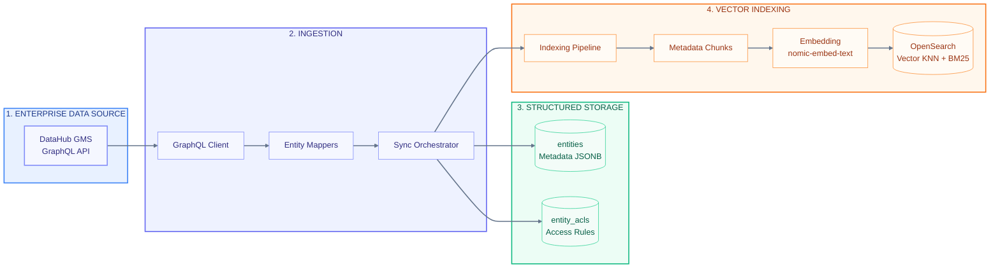

# Tài Liệu Kiến Trúc Đường Đi Của Dữ Liệu (Data Pipeline Architecture)

Tài liệu này mô tả chi tiết kiến trúc luồng đường đi của dữ liệu (**Data Pipeline Architecture**) trong hệ thống **V-DataAtlas (DataHub AI Chatbot)** dựa trên sơ đồ phân tầng luồng dữ liệu chuẩn bên dưới.

---

## 1. Sơ Đồ Kiến Trúc Luồng Dữ Liệu (Data Pipeline Diagram)

---

## 2. Chi Tiết Các Tầng Trong Data Pipeline

### 🟢 Tầng 1: Enterprise Data Source (Nguồn Dữ Liệu Doanh Nghiệp)
* **`DataHub GMS GraphQL API`**:
  - Đóng vai trò là nguồn dữ liệu Metadata trung tâm của toàn bộ doanh nghiệp.
  - Cung cấp các giao diện GraphQL API để truy xuất toàn bộ danh mục dữ liệu bao gồm: Datasets, Schemas, Domains, Tags, Glossary Terms, Ownership và Data Lineage.
  - Sử dụng cơ chế phân trang dựa trên con trỏ `scrollAcrossEntities` để thu thập dữ liệu quy mô lớn không bị giới hạn.

---

### 🟣 Tầng 2: Ingestion (Thu Thập & Xử Lý Đồng Bộ)
Tầng Ingestion chịu trách nhiệm thu thập, biến đổi và điều phối dữ liệu từ DataHub GMS:
1. **`GraphQL Client` (`ingestion/graphql/`)**:
   - Khởi tạo kết nối HTTP/GraphQL tới DataHub GMS API.
   - Sử dụng các GraphQL Fragments tối ưu để lấy đầy đủ thông tin thực thể mà không gặp phải vấn đề N+1 API calls.
2. **`Entity Mappers` (`ingestion/mappers/`)**:
   - Chuyển đổi dữ liệu thô (raw GraphQL responses) thành các đối tượng dữ liệu chuẩn hóa (`CanonicalEntity`).
   - Hỗ trợ mapper cho đa dạng loại thực thể: Dataset, Dashboard, GlossaryTerm, Document.
3. **`Sync Orchestrator` (`ingestion/sync.py`)**:
   - Điều phối toàn bộ tiến trình đồng bộ dữ liệu (Incremental Sync & Full Sync).
   - Quản lý khóa phân tán (Distributed Locks) và hàng chờ lỗi DLQ (Dead Letter Queue) qua Redis.
   - Đẩy dữ liệu sau khi map sang **Structured Storage** và **Indexing Pipeline**.

---

### 🟢 Tầng 3: Structured Storage (Lưu Trữ Cấu Trúc - PostgreSQL)
Lưu trữ toàn bộ thông tin quan hệ và dữ liệu gốc dưới dạng cấu trúc trong PostgreSQL 16:
1. **`entities` (Metadata JSONB)**:
   - Lưu trữ thông tin chi tiết của từng thực thể dữ liệu dưới dạng JSONB linh hoạt.
   - Cho phép tìm kiếm SQL nhanh chóng theo Domain, Tag, Owner, Platform, Certified Status qua `MetadataFilterEngine`.
2. **`entity_acls` (Access Rules)**:
   - Lưu trữ bảng phân quyền truy cập ACL (Access Control List) cho từng mã `entity_urn`.
   - Phục vụ cho bộ lọc quyền **Domain RBAC Gate** (`AuthorizationService`) để chặn sớm các truy vấn không có quyền.

---

### 🟠 Tầng 4: Vector Indexing (Đánh Chỉ Mục Vector & BM25 - OpenSearch)
Xử lý dữ liệu văn bản thành chỉ mục tìm kiếm hybrid cho RAG:
1. **`Indexing Pipeline` (`indexing/pipeline.py`)**:
   - Nhận dữ liệu thực thể từ `Sync Orchestrator` và thực thi tiến trình đánh chỉ mục bất đồng bộ qua `indexing_worker`.
2. **`Metadata Chunks` (`indexing/chunker.py`)**:
   - Chia nhỏ thông tin metadata và tài liệu thành các đoạn văn bản (chunks) ngắn, tối ưu ngữ nghĩa kèm theo thông tin tiêu đề ngữ cảnh.
3. **`Embedding nomic-embed-text` (`infrastructure/` & Ollama)**:
   - Sử dụng mô hình `nomic-embed-text` qua Ollama Service để biến đổi các đoạn văn bản thành các Vector 768 chiều (768d dense vectors).
4. **`OpenSearch Vector KNN + BM25` (`indexing/vector_store.py`)**:
   - Đánh chỉ mục vào OpenSearch cluster 2.15 (Index: `datahub-rag-chunks-v1`).
   - Lưu trữ song song cả **K-NN Dense Vector** và **BM25 Text Index**, sẵn sàng phục vụ thuật toán tìm kiếm kết hợp **Hybrid Search (RRF)** cho Chatbot RAG Pipeline.
