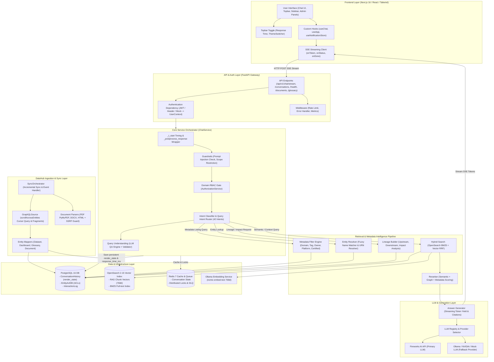

# Sơ Đồ Kiến Trúc Cấp Cao (High-Level Architecture) V-DataAtlas

Tài liệu này mô tả sơ đồ kiến trúc cấp cao theo chuẩn Mermaid của hệ thống **V-DataAtlas (DataHub AI Chatbot)**, thể hiện luồng xử lý end-to-end từ Frontend Next.js, API Gateway FastAPI, ChatService Orchestrator, Retrieval Pipeline, Ingestion, LLM đến các kho lưu trữ PostgreSQL, OpenSearch và Redis.

---

## 1. Sơ Đồ Mermaid Kiến Trúc Tổng Quan Cấp Cao

---

## 2. Mô Tả Luồng Xử Lý Cấp Cao (Execution Flow)

1. **Frontend Request & Topbar Toggle**:
   - Người dùng tương tác trên giao diện Next.js 16. Nút toggle **Response Time** trên Topbar quản lý state `showResponseTime` (lưu persistent tại `localStorage`).
   - Khi gửi câu hỏi, `useChat` hook thực hiện kết nối HTTP SSE Stream tới API Gateway.

2. **API & Authentication Layer**:
   - FastAPI nhận request tại `/api/v1/chat/stream`.
   - Dependency `get_current_user` xác thực JWT Token / Header và inject đối tượng `UserContext` vào `ChatService`.

3. **ChatService Orchestrator & Timing**:
   - `_t_start = time.perf_counter()` bắt đầu bấm giờ request.
   - Kiểm tra Guardrails (Prompt Injection & Scope Restriction).
   - Kiểm tra quyền truy cập **Domain RBAC Gate** (`AuthorizationService`).
   - Phân loại ý định **Intent Classification** (42 intents).

4. **Retrieval & Metadata Intelligence**:
   - Tùy theo Intent, truy vấn điều hướng qua:
     - **Metadata Filter Engine**: Lọc SQL trực tiếp theo Domain, Tag, Owner, Platform, Certified.
     - **Entity Resolver**: Khớp tên mờ (Fuzzy) hoặc mã URN.
     - **Hybrid Search**: Kết hợp OpenSearch BM25 + Vector Embeddings qua Reciprocal Rank Fusion (RRF).
     - **Lineage Builder**: Xây dựng cây dòng chảy Upstream/Downstream và phân tích ảnh hưởng.

5. **LLM Streaming & SSE Response**:
   - **Answer Generator** gọi LLM (Fireworks AI / Ollama fallback) sinh phản hồi theo luồng token.
   - SSE Stream đẩy trực tiếp các event `status`, `token` về Frontend.

6. **Post-processing & Persistence**:
   - Khi hoàn tất, wrapper `_postprocess_response` tính toán chính xác tổng thời gian `response_time_ms = (t_end - t_start) * 1000`.
   - Ghi nhận `response_time_ms` cùng toàn bộ thuộc tính `render_state` vào bảng `ConversationHistory` trong PostgreSQL.
   - SSE phát event `done` chứa payload hoàn chỉnh về Client để render badge Response Time.
