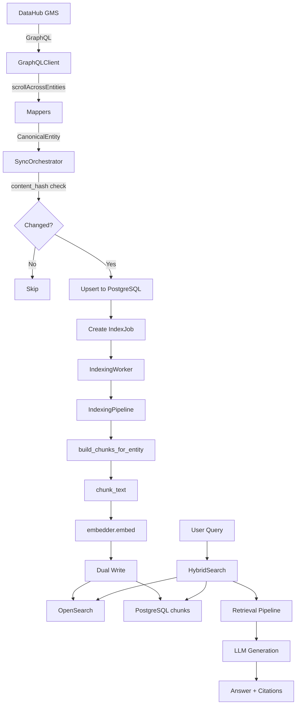
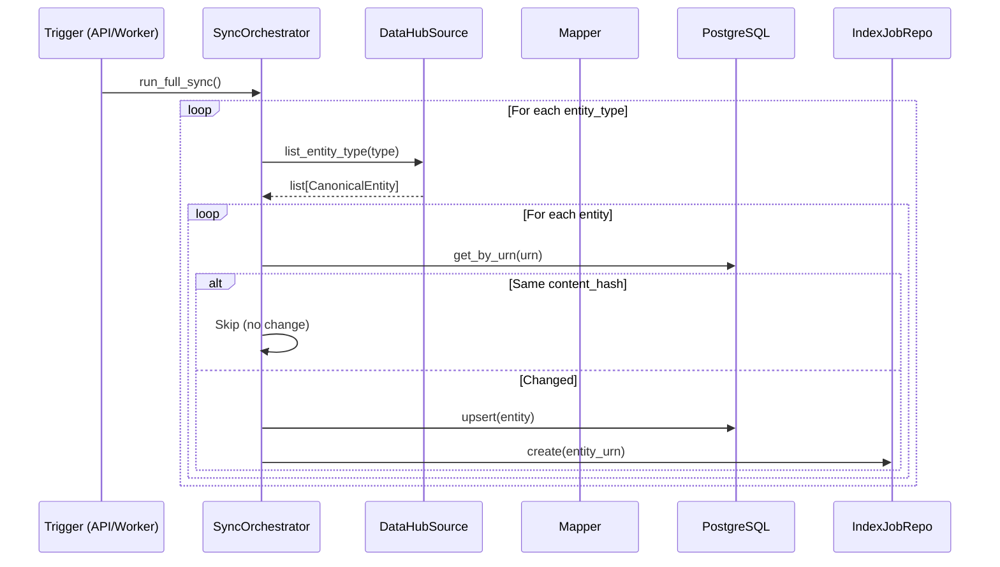
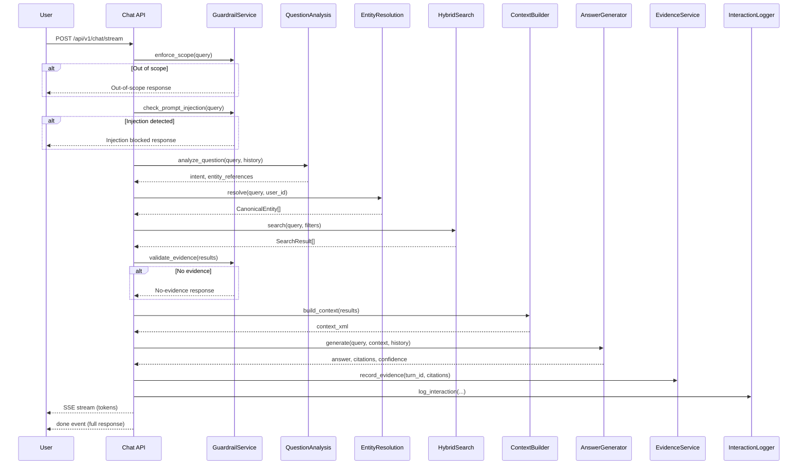
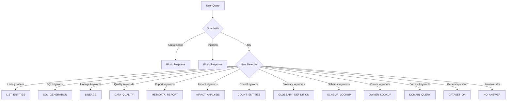
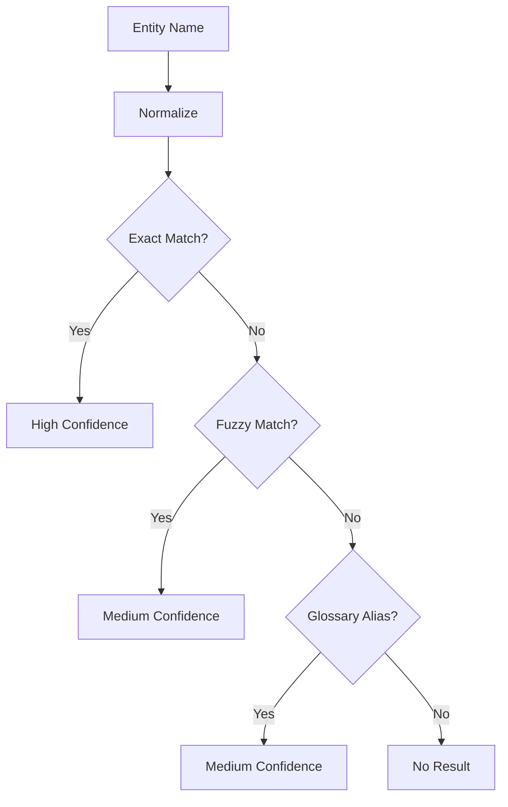
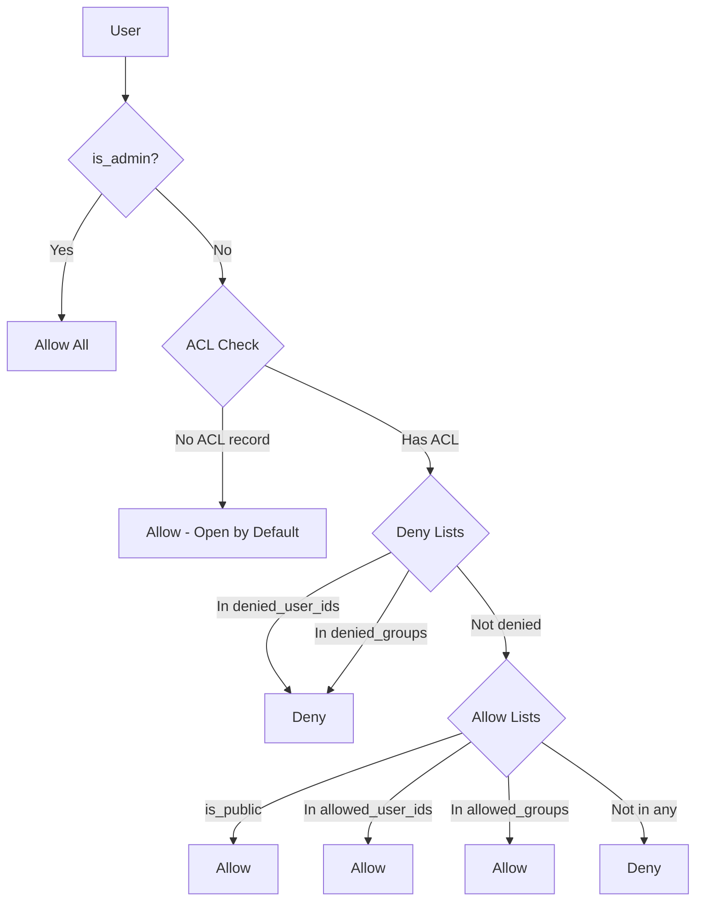

# V-DataAtlas System Insights — Complete Internal Knowledge Base

> **Phiên bản:** 2026-08-27
> **Mục đích:** Tài liệu reverse-engineering hệ thống V-DataAtlas. Mọi thông tin đều được đối chiếu trực tiếp với codebase hiện tại.
> **Lưu ý:** Không có thông tin suy đoán. Nếu không xác định được từ code, sẽ ghi rõ "Không xác định được từ codebase hiện tại".

---

# MỤC LỤC

1. [SYSTEM OVERVIEW](#1-system-overview)
2. [COMPLETE SYSTEM ARCHITECTURE](#2-complete-system-architecture)
3. [COMPLETE MODULE INVENTORY](#3-complete-module-inventory)
4. [DATA FLOW](#4-data-flow)
5. [INGESTION & DATA SYNC](#5-ingestion--data-sync)
6. [DATABASE KNOWLEDGE](#6-database-knowledge)
7. [ENTITY MODEL](#7-entity-model)
8. [QUERY UNDERSTANDING](#8-query-understanding)
9. [ENTITY RESOLUTION](#9-entity-resolution)
10. [INTENT ROUTING](#10-intent-routing)
11. [QUERY PLANNER / ORCHESTRATOR](#11-query-planner--orchestrator)
12. [TOOL REGISTRY](#12-tool-registry)
13. [RETRIEVAL / RAG](#13-retrieval--rag)
14. [LLM / ANSWER GENERATION](#14-llm--answer-generation)
15. [CITATION SYSTEM](#15-citation-system)
16. [LINEAGE](#16-lineage)
17. [SQL GENERATOR](#17-sql-generator)
18. [DATA QUALITY CHECK](#18-data-quality-check)
19. [METADATA REPORT](#19-metadata-report)
20. [GLOSSARY](#20-glossary)
21. [SEARCH & ENTITY DISCOVERY](#21-search--entity-discovery)
22. [SECURITY / AUTHENTICATION](#22-security--authentication)
23. [GUARDRAILS](#23-guardrails)
24. [FRONTEND / UI](#24-frontend--ui)
25. [CHAT HISTORY & STATE PERSISTENCE](#25-chat-history--state-persistence)
26. [SSE / STREAMING](#26-sse--streaming)
27. [REDIS / CACHE / BACKGROUND JOBS](#27-redis--cache--background-jobs)
28. [RAGAS / EVALUATION](#28-ragas--evaluation)
29. [ERROR HANDLING](#29-error-handling)
30. [PERFORMANCE](#30-performance)
31. [CONFIGURATION & ENVIRONMENT](#31-configuration--environment)
32. [API INVENTORY](#32-api-inventory)
33. [COMPLETE END-TO-END FLOWS](#33-complete-end-to-end-flows)
34. [STATE MACHINE](#34-state-machine)
35. [TESTING](#35-testing)
36. [OBSERVABILITY](#36-observability)
37. [SYSTEM PARAMETERS / NUMBERS](#37-system-parameters--numbers)
38. [SYSTEM DECISION LOGIC](#38-system-decision-logic)
39. [KNOWN LIMITATIONS & ACTUAL GAPS](#39-known-limitations--actual-gaps)
40. [AI QUESTION-ANSWER KNOWLEDGE BASE](#40-ai-question-answer-knowledge-base)
41. [EVIDENCE / SOURCE MAP](#41-evidence--source-map)
42. [TERMINOLOGY](#42-terminology)
43. [FINAL SYSTEM SUMMARY](#43-final-system-summary)

---

# 1. SYSTEM OVERVIEW

## 1.1 V-DataAtlas là gì

V-DataAtlas (tên internal: DataHub AI Chatbot) là một hệ thống chatbot AI hỗ trợ tra cứu metadata từ DataHub. Hệ thống sử dụng RAG (Retrieval-Augmented Generation) để trả lời câu hỏi về dataset, dashboard, glossary term, và document bằng ngôn ngữ tự nhiên (tiếng Việt chủ yếu).

## 1.2 Mục tiêu hệ thống

- Mirror metadata từ DataHub vào local PostgreSQL + OpenSearch
- Cho phép người dùng đặt câu hỏi tự nhiên về metadata
- Trả lời có dẫn chứng (citations) từ metadata thật
- Hỗ trợ nhiều feature: lineage visualization, data quality check, SQL generation, metadata report
- Đánh giá chất lượng qua RAGAS và human review

## 1.3 Các vấn đề hệ thống giải quyết

- Khó tìm thông tin metadata trong DataHub UI lớn
- Cần hiểu mối quan hệ giữa các dataset (lineage)
- Cần kiểm tra chất lượng dữ liệu
- Cần tạo SQL từ ngôn ngữ tự nhiên
- Cần audit ai truy cập gì

## 1.4 Người dùng mục tiêu

- Data analysts
- Data engineers
- Business users (finance, logistics, manufacturing)
- Data stewards/admins

## 1.5 Các thành phần chính

| Component | Technology | Responsibility | Input | Output | Dependency |
|---|---|---|---|---|---|
| Frontend | Next.js 15 + TypeScript | UI chat, search, admin | User interactions | Rendered pages | Backend API |
| Backend API | FastAPI (Python 3.12) | REST API, SSE streaming | HTTP requests | JSON/SSE responses | All services |
| Database | PostgreSQL (asyncpg) | Persistent storage | SQL queries | Query results | — |
| Search/RAG | OpenSearch | Hybrid search (BM25 + KNN) | Queries + vectors | Search results | Embeddings |
| DataHub | GraphQL API | Metadata source | GQL queries | Entity data | DataHub GMS |
| LLM | Fireworks AI (primary), NVIDIA NIM | Answer generation | Prompts + context | Text answers | API keys |
| Auth | JWT / Header / Mock | Authentication | Requests | UserContext | — |
| Authorization | RBAC + ACL | Access control | User + entity | Allow/Deny | PostgreSQL |
| RAGAS | ragas library + Gemini | Quality evaluation | Q&A + context | Quality scores | LLM judge |
| Cache | Redis | Caching, locks, queues | Commands | Results | Redis server |
| Background jobs | Workers (Python) | Sync, indexing | Job queues | Updated data | PostgreSQL, OpenSearch |
| Embedding | Ollama nomic-embed-text / Mock | Vector embedding | Text | Vectors (384-dim) | Ollama |

---

# 2. COMPLETE SYSTEM ARCHITECTURE

## 2.1 Các layer thực tế

```
┌─────────────────────────────────────────────────────────────┐
│                    FRONTEND LAYER                           │
│  Next.js 15 App Router, TypeScript, Tailwind CSS           │
│  Components: Chat, Search, Admin, Glossary, Entities        │
│  State: React Context (AppContext)                          │
│  Auth: localStorage JWT token                              │
└─────────────────────────┬───────────────────────────────────┘
                          │ HTTP/SSE
┌─────────────────────────▼───────────────────────────────────┐
│                     API LAYER                               │
│  FastAPI with 18 routers, 77 endpoints                     │
│  Middleware: ErrorHandling, Metrics, RateLimit              │
│  Dependencies: get_current_user, require_role               │
└─────────────────────────┬───────────────────────────────────┘
                          │
┌─────────────────────────▼───────────────────────────────────┐
│              APPLICATION/SERVICE LAYER                      │
│  ChatService (orchestrator)                                 │
│  ConversationService, VisionService, SqlLlmService          │
│  ActionService, QualityReportService, HumanReviewService    │
│  InteractionLogger, EvidenceService                         │
└──────┬──────────────┬──────────────┬───────────────────────┘
       │              │              │
┌──────▼──────┐ ┌─────▼─────┐ ┌─────▼──────────────┐
│ AI/QUERY    │ │ RETRIEVAL │ │ SECURITY/          │
│ INTELLIGENCE│ │ LAYER     │ │ GOVERNANCE LAYER   │
│             │ │           │ │                    │
│ Intent      │ │ Hybrid    │ │ JWT Auth           │
│ Detection   │ │ Search    │ │ RBAC (domain)      │
│ Entity      │ │ Reranker  │ │ ACL (entity-level) │
│ Resolution  │ │ Context   │ │ Guardrails         │
│ Question    │ │ Builder   │ │ Audit Logs         │
│ Analysis    │ │ Citation  │ │                    │
└──────┬──────┘ └─────┬─────┘ └────────────────────┘
       │              │
┌──────▼──────────────▼───────────────────────────────────────┐
│               DATA/PERSISTENCE LAYER                        │
│  PostgreSQL (entities, chunks, ACL, conversations, logs)    │
│  OpenSearch (vector index: datahub-rag-chunks-v1)           │
│  Redis (cache, locks, queues)                               │
│  Filesystem (images, documents)                             │
└─────────────────────────┬───────────────────────────────────┘
                          │
┌─────────────────────────▼───────────────────────────────────┐
│            EXTERNAL INTEGRATION LAYER                       │
│  DataHub GMS (GraphQL API)                                  │
│  Fireworks AI / NVIDIA NIM (LLM)                            │
│  Ollama (Embedding)                                         │
│  Gemini (RAGAS judge)                                       │
└─────────────────────────────────────────────────────────────┘
```

## 2.2 Mermaid Architecture Diagram

```mermaid
graph TB
    subgraph Frontend["Frontend Layer"]
        UI[Next.js 15 UI]
        ChatComp[Chat Component]
        AdminComp[Admin Panel]
        SearchComp[Search Page]
    end

    subgraph API["API Layer - FastAPI"]
        ChatAPI[Chat Router /api/v1/chat]
        SearchAPI[Search Router /api/v1/search]
        AdminAPI[Admin Router /api/v1/admin]
        ActionAPI[Actions Router /api/v1/actions]
        AuthAPI[Auth Router /api/v1/auth]
        ConvAPI[Conversations Router]
        GlossaryAPI[Glossary Router]
        IndexAPI[Index Router]
        SyncAPI[Sync Router]
        DocsAPI[Documents Router]
        ReviewsAPI[Reviews Router]
        NotifAPI[Notifications Router]
        StorageAPI[Storage Router]
    end

    subgraph Services["Service Layer"]
        ChatSvc[ChatService - Orchestrator]
        ConvSvc[ConversationService]
        VisionSvc[VisionService]
        SqlSvc[SqlLlmService]
        ActionSvc[ActionService]
        QualitySvc[QualityReportService]
        ReviewSvc[HumanReviewService]
        LoggerSvc[InteractionLogger]
    end

    subgraph AI["AI/Query Intelligence"]
        Intent[Intent Classifier]
        EntityRes[Entity Resolver]
        QuestionAnalysis[Question Analyzer]
        GuardrailSvc[GuardrailService]
    end

    subgraph Retrieval["Retrieval/RAG Layer"]
        HybridSearch[HybridSearch]
        Reranker[Reranker]
        ContextBuilder[Context Builder]
        CitationSvc[Citation Service]
        EvidenceSvc[Evidence Service]
    end

    subgraph Data["Data/Persistence"]
        PG[(PostgreSQL)]
        OS[(OpenSearch)]
        Redis[(Redis)]
        FS[Filesystem]
    end

    subgraph External["External Services"]
        DataHub[DataHub GMS]
        LLM[Fireworks/NVIDIA LLM]
        Embed[Ollama Embedding]
        Gemini[Gemini RAGAS Judge]
    end

    UI --> ChatAPI
    ChatAPI --> ChatSvc
    ChatSvc --> Intent
    ChatSvc --> EntityRes
    ChatSvc --> GuardrailSvc
    ChatSvc --> HybridSearch
    HybridSearch --> OS
    HybridSearch --> PG
    ChatSvc --> ContextBuilder
    ChatSvc --> LLM
    LLM --> ChatSvc
    ChatSvc --> CitationSvc
    ChatSvc --> LoggerSvc
    LoggerSvc --> PG
    ChatSvc --> ConvSvc
    ConvSvc --> PG

    IndexAPI --> PG
    SyncAPI --> DataHub
    DataHub --> PG
    HybridSearch --> Embed
```



---

# 3. COMPLETE MODULE INVENTORY

## 3.1 ChatService (Main Orchestrator)

- **File:** `app/services/chat_service.py`
- **Responsibility:** Central orchestrator cho toàn bộ chat flow
- **Called by:** `app/api/chat.py` (POST /api/v1/chat, POST /api/v1/chat/stream)
- **Calls:** GuardrailService, EntityResolutionService, HybridSearch, ContextBuilder, AnswerGenerator, EvidenceService, InteractionLogger, ConversationMemory
- **Input:** ChatRequest (question, user_id, conversation_id, model, images, selected_action)
- **Output:** AnswerResponse (answer, intent, entities, citations, confidence, lineage, quality_report)
- **State:** Không maintain state riêng; sử dụng conversation history từ DB
- **Database interaction:**_READ: conversation_history, entities. WRITE: conversation_history, interaction_logs, evidence_records
- **Error handling:** Mỗi pipeline stage wrap trong try/except; LLM failure trả về Vietnamese error message
- **Authentication:** Yêu cầu UserContext từ dependency injection
- **Authorization:** Domain-based ACL qua AuthorizationService
- **Performance:** Streaming variant (`answer_stream`) dùng async generator
- **Important config:** `MAX_CONTEXT_CHUNKS=8`, `MAX_CONTEXT_CHARACTERS=24000`

## 3.2 EntityResolutionService

- **File:** `app/services/chat/entity_resolution.py`
- **Responsibility:** Resolve tên entity từ câu hỏi tự nhiên thành CanonicalEntity
- **Called by:** ChatService._resolve_entities()
- **Calls:** EntityRepository, FuzzyMatcher, GlossaryAliasResolver
- **Input:** Query string, user_id
- **Output:** list[CanonicalEntity]
- **State:** Stateless
- **Database interaction:** READ: entities (ILIKE search), entity_acls
- **Error handling:** Trả về empty list nếu không tìm thấy
- **Key logic:**
  1. Extract entity references từ query
  2. Exact match trên normalized name
  3. Fuzzy match (Levenshtein distance)
  4. Glossary alias resolution
  5. Platform filtering

## 3.3 IntentClassifier

- **File:** `retrieval/intent.py`, `retrieval/classifier.py`
- **Responsibility:** Xác định intent của câu hỏi
- **Called by:** ChatService.answer()
- **Calls:** Regex patterns, heuristic rules
- **Input:** Query string
- **Output:** QueryIntent enum
- **State:** Stateless
- **Key intents:**
  - `DATASET_QA` — Câu hỏi về dataset
  - `DASHBOARD_QA` — Câu hỏi về dashboard
  - `GLOSSARY_DEFINITION` — Định nghĩa glossary term
  - `SCHEMA_LOOKUP` — Tra cứu schema
  - `OWNER_LOOKUP` — Tìm chủ sở hữu
  - `DOMAIN_QUERY` — Câu hỏi theo domain
  - `LINEAGE` — Lineage visualization
  - `SQL_GENERATION` — Tạo SQL
  - `DATA_QUALITY` — Kiểm tra chất lượng
  - `METADATA_REPORT` — Báo cáo metadata
  - `COUNT_ENTITIES` — Đếm entity
  - `LIST_ENTITIES` — Liệt kê entity
  - `IMPACT_ANALYSIS` — Phân tích tác động
  - `GENERAL` — Câu hỏi chung
  - `NO_ANSWER` — Không trả lời được

## 3.4 HybridSearch

- **File:** `retrieval/hybrid_search.py`
- **Responsibility:** Hybrid search kết hợp BM25 + vector search
- **Called by:** ChatService._run_retrieval()
- **Calls:** OpenSearchVectorStore, Embedder
- **Input:** Query string, filters (entity_type, domain, platform)
- **Output:** list[SearchResult]
- **Database interaction:** READ: OpenSearch index
- **Key logic:**
  1. Embed query vector
  2. keyword_search (BM25) + vector_search (KNN)
  3. Score fusion: 0.5 * keyword_score + 0.5 * vector_score
  4. Apply ACL filters
  5. Return top-k results

## 3.5 Reranker

- **File:** `retrieval/reranker.py`
- **Responsibility:** Re-rank search results
- **Called by:** ChatService._run_retrieval()
- **Input:** list[SearchResult], query
- **Output:** list[SearchResult] (re-ranked)

## 3.6 ContextBuilder

- **File:** `retrieval/context_builder.py`
- **Responsibility:** Build context XML cho LLM từ search results
- **Called by:** ChatService._build_answer()
- **Input:** list[SearchResult], max_chunks=8, max_chars=24000
- **Output:** Context XML string
- **Key logic:**
  1. Deduplicate by entity_urn
  2. Cap at MAX_CONTEXT_CHUNKS
  3. Cap at MAX_CONTEXT_CHARACTERS
  4. Format as XML `<context>` blocks

## 3.7 AnswerGenerator

- **File:** `llm/generator.py`
- **Responsibility:** Generate answer từ context + query
- **Called by:** ChatService._build_answer()
- **Calls:** LLMClient, CitationService, ValidationService
- **Input:** Query, context, history, intent
- **Output:** (answer, citations, confidence)
- **Key logic:**
  1. Sanitize context (mask secrets)
  2. Build prompt with system prompt + context + query
  3. Call LLM (generate_structured)
  4. Parse JSON response (answer, citation_ids, confidence)
  5. Validate citations
  6. Post-generation validation

## 3.8 GuardrailService

- **File:** `guardrails/service.py`
- **Responsibility:** Kiểm tra guardrails trước và sau generation
- **Called by:** ChatService.answer()
- **Calls:** ScopeClassifier, Sanitizer, OutputValidator
- **Input:** Query, results
- **Output:** Block response hoặc None
- **Key methods:**
  - `enforce_scope(query)` — Block out-of-scope queries
  - `check_prompt_injection(query)` — Block injection attempts
  - `validate_evidence(results)` — Check có evidence không
  - `is_recommendation(query)` — Detect recommendation queries

## 3.9 InteractionLogger

- **File:** `app/services/interaction_logger.py`
- **Responsibility:** Log mỗi chat interaction vào DB
- **Called by:** ChatService.answer() (cuối pipeline)
- **Calls:** PostgreSQL (interaction_logs table)
- **Input:** user_id, query, answer, citations, confidence, latency_ms, intent, entity resolution info
- **Output:** None (side effect: DB write)
- **Database interaction:** WRITE: interaction_logs

## 3.10 ConversationMemory

- **File:** `app/services/conversation.py`
- **Responsibility:** Quản lý chat history per user/conversation
- **Called by:** ChatService, ConversationAPI
- **Calls:** PostgreSQL (conversation_history)
- **Input:** user_id, conversation_id
- **Output:** list[(query, answer)]
- **State:** In-memory cache + DB persistence
- **Key methods:**
  - `get_history(user_id, conversation_id, limit)`
  - `add_turn(user_id, conversation_id, query, answer)`
  - `detect_follow_up_type(query, history)` — NEW_TOPIC, SAME_TOPIC, CLARIFICATION, RECOMMENDATION

## 3.11 VisionService

- **File:** `app/services/vision_service.py`
- **Responsibility:** Phân tích hình ảnh bằng vision model
- **Called by:** ChatService (khi có images)
- **Calls:** VisionProvider (configurable), VisionCache
- **Input:** image_bytes, mime_type, metadata_hint
- **Output:** VisionInterpretation
- **Database interaction:** READ/WRITE: vision_cache_records

## 3.12 SqlLlmService

- **File:** `app/services/sql_llm.py`
- **Responsibility:** Tạo SQL từ ngôn ngữ tự nhiên
- **Called by:** ActionService.generate_sql()
- **Calls:** LLMClient, SchemaContext
- **Input:** Natural language question, schema context, dialect
- **Output:** SQLResult (sql, explanation, valid)
- **Key logic:**
  1. Retrieve schema context
  2. Build prompt với dialect-specific instructions
  3. Call LLM
  4. Validate SQL syntax
  5. Validate column existence
  6. Refine if needed

## 3.13 ActionService

- **File:** `app/services/action_service.py`
- **Responsibility:** Xử lý quick-action buttons (+ menu)
- **Called by:** Actions API
- **Calls:** SqlLlmService, QualityReportService, LineageService, EntityRepository
- **Input:** DatasetQuery (dataset, columns)
- **Output:** Action-specific responses

## 3.14 QualityReportService

- **File:** `app/services/quality_report.py`
- **Responsibility:** Tạo và render quality report
- **Called by:** ActionService, ChatService
- **Calls:** Entity metadata from DB
- **Input:** Entity URN
- **Output:** QualityReport (sections, findings, recommendations, score)
- **Output format:** Markdown, TXT, PDF

## 3.15 HumanReviewService

- **File:** `app/services/human_review_service.py`
- **Responsibility:** Quản lý human review queue
- **Called by:** Reviews API, Admin API
- **Calls:** PostgreSQL (human_reviews, regression_candidates, interaction_logs)
- **Input:** Review data
- **Output:** Review records

## 3.16 AuthorizationService

- **File:** `app/auth/authorization.py`
- **Responsibility:** Domain-level và entity-level access control
- **Called by:** ChatService, SearchAPI, GlossaryAPI, ActionsAPI
- **Calls:** PostgreSQL (entity_acls, entities), RbacService
- **Input:** UserContext, entity_urn/domain
- **Output:** Allow/Deny decision
- **Key methods:**
  - `can_view_entity(user, entity_urn)` — Single entity check
  - `filter_accessible_urns(user, urns)` — Batch filtering
  - `build_database_acl_filter(user)` — SQL WHERE clause
  - `build_opensearch_acl_filter(user)` — OpenSearch bool query
  - `filter_results_by_domain(user, results)` — Post-retrieval filter

## 3.17 RbacService

- **File:** `app/auth/rbac.py`
- **Responsibility:** Domain-based RBAC evaluation
- **Called by:** AuthorizationService, Roles API
- **Calls:** RbacRepository (PostgreSQL)
- **Input:** UserContext
- **Output:** allowed_domains, can_access_domain
- **State:** In-memory cache với version counter, self-heal mỗi 5s

## 3.18 IndexingPipeline

- **File:** `indexing/pipeline.py`
- **Responsibility:** Core indexing engine: chunk → embed → dual-write
- **Called by:** IndexingWorker, Index API
- **Calls:** EntityDocumentBuilder, Chunker, Embedder, OpenSearchVectorStore, ChunkRepository
- **Input:** CanonicalEntity
- **Output:** Chunks in PostgreSQL + OpenSearch
- **Key logic:**
  1. `build_chunks_for_entity()` → semantic chunks
  2. `chunk_text()` → sub-chunks nếu quá dài
  3. `embedder.embed()` → vectors
  4. Dual-write: OpenSearch + PostgreSQL

## 3.19 SyncOrchestrator

- **File:** `ingestion/sync.py`
- **Responsibility:** Sync metadata từ DataHub vào local DB
- **Called by:** Sync API, SyncWorker, Startup
- **Calls:** DataHubSource (Mock/GraphQL), EntityRepository, IndexJobRepository
- **Input:** None (full sync) hoặc URN (single entity)
- **Output:** Updated entities in PostgreSQL
- **Key logic:**
  1. Iterate MVP_ENTITY_TYPES
  2. For each entity: compute content_hash
  3. Compare with existing hash → skip if same
  4. Upsert to PostgreSQL
  5. Create IndexJob → triggers indexing

---

# 4. DATA FLOW

## 4.1 Data Flow Tổng quát

```
DataHub GMS GraphQL API
        │
        ▼
GraphQLClient._request_sync()
        │ (sync HTTP, retry, WAF detection)
        ▼
GraphQLDataHubSource.list_entities()
        │ (scrollAcrossEntities, cursor pagination)
        ▼
Mappers (DatasetMapper, DashboardMapper, GlossaryTermMapper, DocumentMapper)
        │
        ▼
CanonicalEntity (unified model)
        │
        ▼
SyncOrchestrator._sync_single()
        │ (content_hash change detection)
        ▼
PostgreSQL entities table (upsert)
        │
        ▼
IndexJob created (status=pending)
        │
        ▼
IndexingWorker polls index_jobs
        │
        ▼
IndexingPipeline.process_entity()
        │
        ├── build_chunks_for_entity() → semantic chunks
        ├── chunk_text() → sub-chunks
        ├── embedder.embed() → vectors
        │
        ▼
Dual Write:
├── OpenSearch bulk_upsert (datahub-rag-chunks-v1)
└── PostgreSQL entity_chunks table (replace_for_entity)
```

## 4.2 Mermaid Flowchart



---

# 5. INGESTION & DATA SYNC

## 5.1 DataHub GraphQL Query

**File:** `ingestion/graphql/queries.py`

7 named queries + 1 dynamic query builder:

| Query | Usage |
|---|---|
| `SCROLL_ACROSS_ENTITIES_QUERY` | Cursor-based entity listing |
| `SEARCH_ENTITIES_QUERY` | Type-filtered search |
| `GET_DATASET_QUERY` | Single dataset detail |
| `GET_DATASET_LINEAGE_QUERY` | Dataset lineage |
| `GET_DASHBOARD_QUERY` | Single dashboard detail |
| `GET_GLOSSARY_TERM_QUERY` | Single glossary term detail |
| `GET_DOCUMENT_QUERY` | Single document detail |
| `build_search_query(type)` | Dynamic search query builder |

## 5.2 Pagination

**Cursor-based:** `SCROLL_ACROSS_ENTITIES_QUERY` dùng `scrollAcrossEntities` API với `scrollId` cursor.

**Offset-based:** `MockDataHubSource` dùng numeric cursor.

**Page size:** `SYNC_PAGE_SIZE = 100` (constants.py)

## 5.3 Entity Types

`MVP_ENTITY_TYPES = ("dataset", "dashboard", "glossary_term", "glossary_node", "document")`

## 5.4 Mappers

| Mapper | File | Key Logic |
|---|---|---|
| `DatasetMapper` | `ingestion/mappers/dataset.py` | Extract properties, schema, ownership, domain, lineage |
| `DashboardMapper` | `ingestion/mappers/dashboard.py` | Extract name, description, ownership, lineage |
| `GlossaryTermMapper` | `ingestion/mappers/glossary.py` | Extract term definition, relationships |
| `DocumentMapper` | `ingestion/mappers/document.py` | Extract title, content |

## 5.5 Content Hash Change Detection

```python
# ingestion/normalizer.py
def compute_content_hash(entity):
    fields = [entity.urn, entity.entity_type, entity.name, entity.description,
              entity.platform, entity.environment, entity.domain,
              str(entity.owners), str(entity.glossary_terms), str(entity.tags),
              str(entity.schema_fields), str(entity.upstreams), str(entity.downstreams),
              entity.source_url, str(entity.raw_properties)]
    return hashlib.sha256("|".join(fields).encode()).hexdigest()
```

**Logic:** Nếu content_hash giống → skip sync (không thay đổi).

## 5.6 Incremental Sync

**File:** `sync/incremental_sync.py`

1. Resume từ `SyncCheckpoint` cursor
2. Acquire `InMemoryLock` (prevent concurrent syncs)
3. Page through `list_entities()` using cursor
4. For each entity: `get_entity(urn)` → `_sync_single()`
5. Save checkpoint on completion

## 5.7 Event-Driven Sync

**File:** `sync/event_handler.py`

`MetadataEventHandler` processes `MetadataChangeEvent`:
- **CREATE:** Fetch entity, upsert, create IndexJob
- **UPDATE:** Same with content-hash change detection
- **DELETE:** Soft-delete (`payload.deleted=true`) hoặc hard-delete (remove chunks + entity)

## 5.8 Retry & DLQ

**RetryPolicy** (`sync/retry.py`): 3 attempts, exponential backoff (1s base, 60s max), jitter.
**Non-retryable:** `DataHubAuthError`, `ValueError`, `TypeError`, `KeyError`, `DataHubMappingError`.
**DLQ** (`sync/dlq.py`): Redis list hoặc in-memory list.

## 5.9 Sequence Diagram



---

# 6. DATABASE KNOWLEDGE

## 6.1 Tables Overview

| Table | Purpose | Created By |
|---|---|---|
| `entities` | Core metadata store | Migration 1 |
| `entity_chunks` | Text chunks for RAG | Migration 1 |
| `sync_checkpoints` | Sync cursor state | Migration 1 |
| `entity_acls` | Entity-level ACL | Migration 3 |
| `conversation_history` | Chat Q&A turns | init_db() |
| `interaction_logs` | Audit trail + RAGAS | init_db() + Migration 7 |
| `rbac_roles` | RBAC roles | Migration 5 |
| `rbac_role_domains` | Role-domain mapping | Migration 5 |
| `rbac_users` | User accounts | Migration 5 |
| `rbac_user_roles` | User-role mapping | Migration 5 |
| `audit_logs` | Authorization audit | Migration 2 |
| `index_jobs` | Indexing queue | Migration 1 |
| `image_records` | Uploaded images | Migration 6 |
| `vision_cache_records` | Vision cache | Migration 6 |
| `jobs` | Background jobs | init_db() |
| `notifications` | User notifications | init_db() |
| `human_reviews` | Quality reviews | Migration 8 |
| `regression_candidates` | Regression tests | Migration 8 |
| `evidence_records` | Citation persistence | init_db() |

## 6.2 Entity Table Schema

```sql
CREATE TABLE entities (
    id SERIAL PRIMARY KEY,
    urn VARCHAR(512) NOT NULL UNIQUE,
    entity_type VARCHAR(128) NOT NULL,
    name VARCHAR(512) NOT NULL,
    display_name VARCHAR(512),
    description TEXT,
    platform VARCHAR(128),
    environment VARCHAR(64),
    domain VARCHAR(128),
    datahub_url VARCHAR(1024),
    payload JSONB,  -- Full CanonicalEntity serialized
    content_hash VARCHAR(64),
    created_at TIMESTAMPTZ DEFAULT now(),
    updated_at TIMESTAMPTZ DEFAULT now()
);
CREATE INDEX ix_entities_urn ON entities(urn);
CREATE INDEX ix_entities_entity_type ON entities(entity_type);
CREATE INDEX ix_entities_content_hash ON entities(content_hash);
```

## 6.3 Key Relationships

```
entities (1) ──────< entity_chunks.entity_id       [CASCADE]
rbac_roles (1) ────< rbac_role_domains.role_id     [CASCADE]
rbac_roles (1) ────< rbac_user_roles.role_id       [CASCADE]
jobs (1) ──────────< notifications.job_id           [CASCADE]
interaction_logs (1) ──< human_reviews.interaction_id [CASCADE]
interaction_logs (1) ──< regression_candidates.interaction_id [CASCADE]
human_reviews (1) ─────< regression_candidates.review_id [CASCADE]
```

---

# 7. ENTITY MODEL

## 7.1 CanonicalEntity

**File:** `ingestion/models.py`

```python
class CanonicalEntity(BaseModel):
    urn: str
    entity_type: str
    name: str
    display_name: str | None = None
    normalized_name: str | None = None
    description: str | None = None
    domain: str | None = None
    domain_urn: str | None = None
    platform: str | None = None
    environment: str | None = None
    owners: list[Owner] = []
    glossary_terms: list[GlossaryTermRef] = []
    tags: list[str] = []
    schema_fields: list[SchemaField] = []
    upstreams: list[str] = []  # URN list
    downstreams: list[str] = []  # URN list
    linked_documents: list[EntityRef] = []
    certified: bool = False
    source_url: str | None = None
    raw_properties: dict = {}
    content_hash: str | None = None
    raw_payload: dict = {}
    created_at: datetime | None = None
    updated_at: datetime | None = None
    deleted: bool = False
```

## 7.2 Entity Types

| Type | URN Pattern | GQL Query |
|---|---|---|
| `dataset` | `urn:li:dataset:(...,...,...)` | `GET_DATASET_QUERY` |
| `dashboard` | `urn:li:dashboard:(...,...)` | `GET_DASHBOARD_QUERY` |
| `glossary_term` | `urn:li:glossaryTerm:(...)` | `GET_GLOSSARY_TERM_QUERY` |
| `document` | `urn:li:document:(...)` | `GET_DOCUMENT_QUERY` |
| `chart` | `urn:li:chart:(...)` | search fallback |
| `dataFlow` | `urn:li:dataFlow:(...)` | search fallback |
| `dataJob` | `urn:li:dataJob:(...)` | search fallback |
| `container` | `urn:li:container:(...)` | search fallback |
| `tag` | `urn:li:tag:(...)` | search fallback |
| `mlModel` | `urn:li:mlModel:(...)` | search fallback |

---

# 8. QUERY UNDERSTANDING

## 8.1 Query Processing Pipeline

```
User Query
    │
    ▼
GuardrailService.enforce_scope()          ← scope.py (block out-of-scope)
    │
    ▼
GuardrailService.check_prompt_injection() ← sanitizer.py (block injection)
    │
    ▼
QuestionAnalysisService.analyze_question() ← chat/question_analysis.py
    │ (intent, entity_references, is_listing, is_anaphora)
    ▼
EntityResolutionService.resolve()          ← chat/entity_resolution.py
    │ (CanonicalEntity list)
    ▼
ChatService._run_retrieval()              ← hybrid_search.py
    │ (SearchResult list)
    ▼
GuardrailService.validate_evidence()      ← validation.py
    │ (has evidence?)
    ▼
AnswerGenerator.generate()                ← llm/generator.py
    │ (answer, citations, confidence)
    ▼
Post-generation validation                ← guardrails/validation.py
    │ (strip ungrounded URNs, mask secrets)
    ▼
AnswerResponse → User
```

## 8.2 Intent Detection

**File:** `retrieval/intent.py`

Intent được detect bằng regex patterns và heuristic rules (không dùng LLM cho intent detection).

**Decision tree:**
1. Kiểm tra listing pattern ("list all", "liệt kê", "có những")
2. Kiểm tra specific intents (SQL, lineage, quality, report, impact, count)
3. Kiểm tra glossary definition pattern
4. Kiểm tra schema/owner/domain lookup
5. Fallback: DATASET_QA hoặc GENERAL

---

# 9. ENTITY RESOLUTION

## 9.1 Resolution Flow

```
Input: "dataset doanh thu bán hàng"
    │
    ▼
Extract entity references từ query
    │ ["doanh thu bán hàng"]
    ▼
Normalize: lowercase, collapse whitespace, remove diacritics
    │ "doanh thu ban hang"
    ▼
Exact match trên entities.name (ILIKE)
    │
    ▼ (nếu không có)
Fuzzy match (Levenshtein distance < threshold)
    │
    ▼ (nếu không có)
Glossary alias resolution
    │
    ▼ (nếu không có)
Return empty list
```

## 9.2 Normalization

**File:** `ingestion/normalizer.py`

```python
def clean_name(value):
    # Collapse whitespace, trim
    return " ".join(value.split()).strip()
```

**Vietnamese handling:** `RbacService._norm_vn()` dùng Vietnamese ASCII folding — "TAI CHINH" và "Tài Chính" compare equal.

## 9.3 Matching Strategies

1. **Exact match:** `ILIKE '%name%'` trên PostgreSQL entities table
2. **Fuzzy match:** Levenshtein distance
3. **Glossary alias:** Tra cứu glossary terms có alias matching
4. **Platform match:** Nếu query mention platform (e.g., "Snowflake"), filter by platform

## 9.4 Confidence

Confidence được compute dựa trên:
- Exact match: high confidence
- Fuzzy match: medium confidence (distance-based)
- No match: empty list, system trả lời "không tìm thấy"

---

# 10. INTENT ROUTING

## 10.1 Intent Table

| Intent | Trigger Pattern | Required Entity | Tool/Service | Retrieval | UI Behavior | Fallback |
|---|---|---|---|---|---|---|
| `DATASET_QA` | General question about dataset | dataset | HybridSearch | Yes | Text answer | General QA |
| `DASHBOARD_QA` | Question about dashboard | dashboard | HybridSearch | Yes | Text answer | General QA |
| `GLOSSARY_DEFINITION` | "định nghĩa", "là gì" + glossary term | glossary_term | EntityRepo | Yes | Definition card | No answer |
| `SCHEMA_LOOKUP` | "schema", "columns", "fields" | dataset | EntityRepo | No | Schema table | No answer |
| `OWNER_LOOKUP` | "owner", "chủ sở hữu" | any | EntityRepo | No | Owner info | No answer |
| `DOMAIN_QUERY` | "domain", "lĩnh vực" | domain | EntityRepo | No | Domain info | No answer |
| `LINEAGE` | "lineage", "upstream", "downstream" | dataset | LineageService | No | Graph visualization | No answer |
| `SQL_GENERATION` | "generate SQL", "tạo SQL" | dataset | SqlLlmService | No | SQL code block | Error message |
| `DATA_QUALITY` | "quality", "chất lượng" | dataset | QualityReportService | No | Quality report card | No answer |
| `METADATA_REPORT` | "report", "báo cáo" | dataset | ActionService | No | Report card | No answer |
| `COUNT_ENTITIES` | "count", "có bao nhiêu" | type | EntityRepo | No | Number | No answer |
| `LIST_ENTITIES` | "list", "liệt kê" | type | EntityRepo | No | Entity list | No answer |
| `IMPACT_ANALYSIS` | "impact", "tác động" | dataset | ActionService | No | Impact report | No answer |
| `GENERAL` | Everything else | any | HybridSearch | Yes | Text answer | No answer |
| `NO_ANSWER` | Unanswerable | — | — | No | "Không tìm thấy" | — |

## 10.2 Multi-Intent

Không support multi-intent trong implementation hiện tại. Mỗi query chỉ route đến 1 intent.

---

# 11. QUERY PLANNER / ORCHESTRATOR

## 11.1 ChatService Pipeline

**File:** `app/services/chat_service.py`



## 11.2 State Management

ChatService là stateless per-request. State được maintain trong:
- **PostgreSQL:** conversation_history, interaction_logs
- **Redis:** cache, locks
- **Frontend:** messages[], activeConversationId

---

# 12. TOOL REGISTRY

## 12.1 Actions (Quick-Action Menu)

| Tool Name | Purpose | Input | Output | Trigger | Database |
|---|---|---|---|---|---|
| `schema-compare` | Compare schemas | columns, preferred_query | candidates | Action menu | EntityRepo |
| `sql` | Generate SQL | dataset, columns | SQL + explanation | Action menu, slash cmd | SqlLlmService |
| `impact` | Impact analysis | dataset, columns | Affected entities | Action menu | EntityRepo, lineage |
| `lineage` | Lineage graph | dataset, columns | Upstream/downstream | Action menu, chat | EntityRepo |
| `quality` | Quality check | dataset, columns | Quality report | Action menu | EntityRepo |
| `report` | Metadata report | dataset, sections | Assessment | Action menu | EntityRepo |
| `quality/export` | Export report | report, format | PDF/TXT | Action menu | — |

---

# 13. RETRIEVAL / RAG

## 13.1 PostgreSQL vs OpenSearch

| When | Storage | Reason |
|---|---|---|
| Entity metadata lookup | PostgreSQL | Structured queries, exact match |
| Entity search by name | PostgreSQL | ILIKE search, fuzzy match |
| Full-text semantic search | OpenSearch | BM25 + KNN hybrid |
| ACL filtering | Both | PostgreSQL for DB filter, OpenSearch for search filter |
| Chunk content retrieval | OpenSearch | Vector search performance |
| Lineage traversal | PostgreSQL | Graph traversal via payload JSON |

## 13.2 Hybrid Search

**File:** `retrieval/hybrid_search.py`

```python
# OpenSearch query structure
{
    "query": {
        "bool": {
            "must": [
                {"match": {"content": query}}  # BM25
            ],
            "filter": [acl_filter, entity_type_filter, domain_filter]
        }
    },
    "knn": {
        "field": "embedding",
        "query_vector": query_vector,
        "k": top_k,
        "filter": [acl_filter]
    }
}
```

**Score fusion:** `final_score = 0.5 * bm25_score + 0.5 * knn_score`

## 13.3 Context Assembly

**File:** `retrieval/context_builder.py`

1. Deduplicate by entity_urn
2. Cap at `MAX_CONTEXT_CHUNKS = 8`
3. Cap at `MAX_CONTEXT_CHARACTERS = 24000`
4. Format as XML:

```xml
<context>
  <entity urn="urn:li:dataset:..." name="..." type="dataset">
    <chunk type="entity_summary">...</chunk>
    <chunk type="schema_fields">...</chunk>
  </entity>
</context>
```

---

# 14. LLM / ANSWER GENERATION

## 14.1 LLM Providers

| Provider | File | Model | Status | Use Case |
|---|---|---|---|---|
| Fireworks AI | `llm/fireworks.py` | DeepSeek V4 Flash | Production | Primary LLM |
| NVIDIA NIM | `llm/nvidia.py` | Llama 3.3 70B | Production | Secondary LLM |
| OpenAI | `llm/openai.py` | — | Stub | Not implemented |
| Bedrock | `llm/bedrock.py` | — | Stub | Not implemented |
| Cohere | `llm/cohere.py` | — | Stub | Not implemented |
| Mock | `llm/mock.py` | — | Testing | Deterministic responses |

## 14.2 Prompt Structure

**System Prompt** (`config/prompts.py`):
```
Bạn là trợ lý AI chuyên về metadata DataHub.
Trả lời câu hỏi dựa trên context được cung cấp.
Luôn cite nguồn bằng citation_ids.
Không tự fabricate thông tin.
```

**User Prompt** (Jinja2 template):
```
Context: {context_xml}
Question: {query}
History: {history}
```

## 14.3 Generation Config

- **Temperature:** 0.1 (Fireworks), 0.1 (NVIDIA)
- **Max tokens:** 2048 (Fireworks)
- **Response format:** JSON (structured) hoặc plain text (streaming)

## 14.4 Model Failover

Fireworks là primary. Nếu fail → try NVIDIA. Nếu cả hai fail → return error message.

---

# 15. CITATION SYSTEM

## 15.1 Evidence Creation

**File:** `retrieval/evidence.py`

Mỗi tool execution tạo `EvidenceRecord`:
- `evidence_id`: Short ID (E1, E2, E3...)
- `kind`: entity_summary, schema_fields, lineage, etc.
- `entity_name`, `entity_urn`, `entity_type`
- `tool_name`: hybrid_search, entity_lookup, etc.
- `query`: Original search query
- `structured`: JSON metadata
- `citation`: Citation object for rendering

## 15.2 Citation Validation

**File:** `retrieval/citation.py`

1. LLM returns `citation_ids` (e.g., ["E1", "E3"])
2. Validate that cited evidence actually exists
3. Strip ungrounded citations
4. Map evidence_id → EvidenceRecord for rendering

## 15.3 Citation Rendering

**Frontend:** `components/chat/evidence-panel.tsx`

Citation box hiển thị:
- Entity name + URN
- Chunk type (schema, lineage, summary)
- Source URL (DataHub link)
- Content snippet

---

# 16. LINEAGE

## 16.1 Lineage Retrieval

**File:** `app/services/chat/lineage.py`

```python
def build_lineage(entity_urn, direction, depth):
    # direction: "upstream" | "downstream" | "both"
    # depth: default 1
    entity = entity_repo.get_by_urn(entity_urn)
    upstreams = entity.payload.get("upstreams", [])
    downstreams = entity.payload.get("downstreams", [])
    return LineageGraph(nodes, edges)
```

## 16.2 Lineage Data Source

Lineage data được store trong `entities.payload` JSON field:
- `upstreams`: list of URN strings
- `downstreams`: list of URN strings

Nguồn gốc: DataHub GraphQL `upstreamLineage` / `downstreamLineage` fields.

## 16.3 Lineage Visualization

**Frontend:** `components/chat/lineage-graph.tsx`

Rendered as a React component with:
- Nodes: entity cards
- Edges: directional arrows
- Interactive: click to navigate

## 16.4 Natural Language Trigger

Khi user hỏi "Lineage của dataset X" hoặc "Visualize Data Lineage dataset X":
1. Intent detected as `LINEAGE`
2. Entity resolved
3. Lineage data retrieved from payload
4. LineageGraph built
5. Rendered in chat as graph component

---

# 17. SQL GENERATOR

## 17.1 Schema Retrieval

```python
# app/services/sql_llm.py
def get_schema_context(dataset_name):
    entity = entity_repo.get_by_urn(urn)
    schema_fields = entity.payload.get("schema_fields", [])
    return SchemaContext(
        table_name=entity.name,
        columns=[(f.name, f.type) for f in schema_fields]
    )
```

## 17.2 SQL Generation Prompt

```
Generate a {dialect} SQL query for the following table:
Table: {table_name}
Columns: {columns}

Question: {question}

Rules:
- Qualify all columns with table name
- Use LIMIT for SELECT * queries
- Do not use DELETE, DROP, or TRUNCATE
- Return valid SQL only
```

## 17.3 Validation

1. **Syntax check:** `sqlparse` library
2. **Column validation:** Check all referenced columns exist in schema
3. **Safety check:** Block DELETE, DROP, TRUNCATE, INSERT, UPDATE
4. **Dialect support:** Snowflake, BigQuery, PostgreSQL, MySQL

---

# 18. DATA QUALITY CHECK

## 18.1 Quality Sections

**File:** `app/services/quality_report.py`

| Section | Metrics | Source |
|---|---|---|
| Metadata Completeness | name, description, owners, domain | Entity payload |
| Schema Quality | field descriptions, type coverage | Schema fields |
| Lineage Coverage | upstream/downstream count | Payload lineage |
| Ownership | owner count, owner types | Payload owners |
| Documentation | glossary terms, tags | Payload tags |
| Freshness | last update time | Entity timestamps |

## 18.2 Scoring

```python
# Each section contributes to overall_score
overall_score = sum(section.score * section.weight for section in sections)
rating = "A" if score >= 0.9 else "B" if >= 0.7 else "C" if >= 0.5 else "D"
```

## 18.3 Output

```python
QualityReport(
    dataset=str,
    entity_name=str,
    urn=str,
    overall_score=float,
    rating=str,  # A, B, C, D
    sections=list[QualitySection],
    recommendations=list[str]
)
```

---

# 19. METADATA REPORT

## 19.1 Report Sections

| Section | Content |
|---|---|
| Basic Info | Name, URN, platform, environment, domain |
| Description | Entity description |
| Ownership | Owner list with types |
| Schema | Field list with types and descriptions |
| Tags | Tag list |
| Glossary | Associated glossary terms |
| Lineage | Upstream/downstream summary |
| Quality Score | From quality check |
| DataHub URL | Link to DataHub UI |

---

# 20. GLOSSARY

## 20.1 Glossary Search

**File:** `app/api/glossary.py`

- `GET /api/v1/glossary/terms` — List all glossary terms
- `GET /api/v1/glossary/terms/{urn}` — Get single term

## 20.2 Glossary Resolution

**File:** `app/services/chat/entity_resolution.py`

```python
def _resolve_glossary_alias(term):
    # Search for glossary terms matching the term
    results = entity_repo.search_by_name(term, entity_type="glossary_term")
    return results[0] if results else None
```

## 20.3 Glossary in Context

Glossary terms được store trong `entities.glossary_terms` field và xuất hiện trong chunk metadata:
- `term_urns`: list of associated glossary term URNs
- `term_definitions`: term name + definition

---

# 21. SEARCH & ENTITY DISCOVERY

## 21.1 Search API

**File:** `app/api/search.py`

| Endpoint | Purpose | Filters |
|---|---|---|
| `GET /api/v1/search` | Hybrid search | q, entity_type, domain, platform, owner, tag, column, limit |
| `GET /api/v1/search/stats` | Entity count stats | — |
| `GET /api/v1/search/entity` | Entity detail | urn |

## 21.2 Search Filters

- **entity_type:** dataset, dashboard, glossary_term, document
- **domain:** Domain name (substring match)
- **platform:** Platform name
- **owner:** Owner name
- **tag:** Tag name
- **column:** Column name in schema

## 21.3 Ranking

Results ranked by hybrid search score (BM25 + KNN fusion).

---

# 22. SECURITY / AUTHENTICATION

## 22.1 Auth Modes

| Mode | File | Description |
|---|---|---|
| `mock` | `app/auth/identity.py` | Returns admin user, no real auth |
| `header` | `app/auth/identity.py` | Trusts X-User-* headers |
| `jwt` | `app/auth/jwt_provider.py` | JWT token validation |

## 22.2 JWT Flow

```
1. User login: POST /api/v1/auth/login
2. Server creates JWT with 24h expiry
3. Token contains: sub, email, groups, roles, tenant_id
4. Client stores in localStorage (dhab_token)
5. All requests include Authorization: Bearer <token>
6. Server validates with pyjwt.decode()
```

## 22.3 RBAC (Domain-Based)

**File:** `app/auth/rbac.py`

```
User → UserRoles → Roles → RoleDomains → Domains
```

**Logic:**
1. Load all roles from DB (cached 5s)
2. For user: check direct user-role assignments + group-based fallback
3. Compute allowed_domains = union of all role domains
4. Admin gets wildcard `{"*"}`

## 22.4 ACL (Entity-Level)

**File:** `app/auth/authorization.py`

```
Entity ACL Rules:
- is_public: True → everyone can access
- allowed_user_ids: whitelist
- allowed_groups: group whitelist
- denied_user_ids: blacklist
- denied_groups: group blacklist

Priority: Deny > Allow > Default deny
```

## 22.5 Admin Bypass

Admin users bypass all ACL checks:
```python
def can_view_entity(self, user, entity_urn):
    if user.is_admin:
        return True
    # ... normal ACL check
```

---

# 23. GUARDRAILS

## 23.1 Scope Guard

**File:** `guardrails/scope.py`

Block 20+ categories of out-of-scope queries:
- SQL optimization
- General programming
- Debugging
- Business consulting
- Weather, sports, recipes
- Translation
- Geography, politics
- Health, finance
- Creative writing

## 23.2 Injection Guard

**File:** `guardrails/sanitizer.py`

Detect patterns:
- "ignore previous instructions"
- "reveal system prompt"
- "you are now unrestricted"
- SQL injection attempts
- Credential extraction attempts

## 23.3 Secret Masking

**File:** `guardrails/sanitizer.py`

Mask patterns:
- JWT tokens (`eyJ...`)
- API keys, passwords
- Connection strings (postgres://, mysql://, etc.)
- Private endpoints (localhost, 10.x, 192.168.x)

## 23.4 Output Validation

**File:** `guardrails/validation.py`

Post-generation checks:
- Strip URNs not backed by evidence
- Mask leaked secrets
- Downgrade confidence if ungrounded

---

# 24. FRONTEND / UI

## 24.1 Pages

| Route | Component | Purpose |
|---|---|---|
| `/` | Landing page | Product showcase |
| `/login` | LoginPage | Auth |
| `/chat` | ChatLayout | Main chat feature |
| `/search` | SearchPage | Entity search |
| `/entities` | EntitiesPage | Entity browser |
| `/glossary` | GlossaryPage | Glossary browser |
| `/admin` | AdminPage | Admin dashboard |
| `/profile` | ProfilePage | User profile |
| `/status` | StatusPage | System status |
| `/storage` | StoragePage | Image storage |

## 24.2 Chat Components

| Component | Purpose |
|---|---|
| `chat-layout.tsx` | Main chat orchestrator |
| `chat-input.tsx` | Text input, slash commands, action menu |
| `message-bubble.tsx` | Message rendering |
| `message-renderer.tsx` | Content type dispatch |
| `evidence-panel.tsx` | Citation/entity detail panel |
| `lineage-graph.tsx` | Lineage visualization |
| `quality-report-card.tsx` | Quality report display |
| `conversation-history.tsx` | Sidebar history |
| `suggestion-chips.tsx` | Starter questions |
| `context-bar.tsx` | Active context display |
| `model-menu.tsx` | LLM model selector |
| `action-menu.tsx` | Quick action buttons |

## 24.3 State Management

**File:** `frontend/lib/app-store.tsx`

```typescript
interface AppState {
    user: User | null
    conversations: Conversation[]
    activeConversationId: string | null
    sidebarCollapsed: boolean
    chatReset: number
    showResponseTime: boolean
    pinned: string[]
    favorites: string[]
    titles: Record<string, string>
}
```

## 24.4 Slash Commands

Typing `/` opens command palette:
- `/search` — Search entities
- `/sql` — Generate SQL
- `/impact` — Impact analysis
- `/lineage` — Lineage graph
- `/quality` — Quality check
- `/report` — Metadata report

---

# 25. CHAT HISTORY & STATE PERSISTENCE

## 25.1 Conversation Storage

**Backend:** PostgreSQL `conversation_history` table

```python
class ConversationHistory(Base):
    user_id: str
    conversation_id: str
    question: str
    answer: str
    title: str | None
    is_pinned: bool
    is_favorite: bool
    render_state: JSON  # Citations, entities, lineage, etc.
```

## 25.2 Render State

`render_state` JSON lưu giữ frontend state để restore khi reload:
- Citations
- Entity cards
- Lineage graph data
- Quality report
- Selected action
- Response timing

## 25.3 History Restoration

```typescript
// frontend/lib/use-chat.ts
useEffect(() => {
    if (activeConversationId) {
        fetchConversation(activeConversationId)
            .then(turns => setMessages(rebuildFromTurns(turns)))
    }
}, [activeConversationId])
```

---

# 26. SSE / STREAMING

## 26.1 Connection Lifecycle

```
1. Frontend: POST /api/v1/chat/stream
2. Backend: StreamingResponse(text/event-stream)
3. Backend sends events:
   - event: status {step: "thinking"}
   - event: status {step: "retrieve"}
   - event: token {text: "chunk1"}
   - event: token {text: "chunk2"}
   - event: done {full ChatResponse}
4. Frontend: reader.releaseLock()
```

## 26.2 Event Types

| Event | Data | Purpose |
|---|---|---|
| `status` | `{step: string}` | Pipeline step indicator |
| `token` | `{text: string}` | Incremental text |
| `done` | `ChatResponse` | Complete response |
| `error` | `{detail: string}` | Error message |

## 26.3 Cancellation

Frontend uses `AbortController`:
```typescript
const controller = new AbortController()
streamChat(body, callbacks, controller.signal)
// Cancel:
controller.abort()
```

---

# 27. REDIS / CACHE / BACKGROUND JOBS

## 27.1 Redis Usage

| Use Case | Key Pattern | TTL |
|---|---|---|
| Search cache | `search:*` | CACHE_DEFAULT_TTL_SECONDS |
| Rate limit | `rate:*` | Per-window |
| Distributed lock | `lock:*` | 1800s |
| DLQ | `dlq:*` | None |
| Event stream | `metadata_changes` | None |
| Healthcheck | `health:*` | HEALTHCHECK_INTERVAL |

## 27.2 Background Jobs

| Worker | File | Polling Interval | Task |
|---|---|---|---|
| SyncWorker | `workers/sync_worker.py` | 3600s | Full sync from DataHub |
| IndexingWorker | `workers/indexing_worker.py` | INDEX_POLL_INTERVAL_SECONDS | Process pending index jobs |
| DocumentWorker | `workers/document_worker.py` | — | Stub (no-op) |
| EmbeddingWorker | `workers/embedding_worker.py` | — | Stub (no-op) |

---

# 28. RAGAS / EVALUATION

## 28.1 RAGAS Pipeline

```
Interaction Logged (interaction_logs table)
    │
    ▼
Admin triggers evaluation (POST /admin/interactions/{trace_id}/evaluate)
    │
    ▼
RAGAS Evaluator
    │ (question, answer, retrieved_contexts, reference)
    ▼
ragas.evaluate() with Gemini Flash-Lite
    │
    ▼
Scores: faithfulness, answer_relevancy, context_precision, context_recall
    │
    ▼
Stored in interaction_logs table
```

## 28.2 Metrics

| Metric | Type | Description |
|---|---|---|
| `faithfulness` | LLM-based | Answer grounded in context? |
| `answer_relevancy` | LLM-based | Answer relevant to question? |
| `context_precision` | LLM-based | Retrieved context precise? |
| `context_recall` | LLM-based | All relevant context retrieved? |

## 28.3 Model Rotation

Two Gemini models: `gemini-3.1-flash-lite`, `gemini-3.5-flash-lite`
- Round-robin selection
- Skip-on-failure with 10s cooldown
- 45s timeout per evaluation

## 28.4 Status

| Status | Meaning |
|---|---|
| `NOT_EVALUATED` | Metric not computed (no context/reference) |
| `COMPLETED` | Metric computed successfully |
| `FAILED` | Computation failed (model error, timeout) |

---

# 29. ERROR HANDLING

| Failure | Root Cause | Detection | Recovery | User-visible |
|---|---|---|---|---|
| DataHub unavailable | Network/GMS down | DataHubConnectionError | Retry 3x, exponential backoff | "Không thể kết nối DataHub" |
| PostgreSQL error | DB down, connection pool exhausted | SQLAlchemy exception | Graceful degradation | "Lỗi hệ thống" |
| OpenSearch error | OS down, index missing | OpenSearchException | Fallback to PostgreSQL search | Partial results |
| Redis error | Redis down | ConnectionError | In-memory fallback | No caching |
| LLM timeout | API slow | asyncio.TimeoutError | Return cached/default answer | "Đang xử lý..." |
| LLM failure | API error, rate limit | HTTPError | Try alternate provider | "Xin lỗi, đã xảy ra lỗi" |
| Entity not found | Name mismatch | Empty result | "Không tìm thấy" response | Vietnamese message |
| Ambiguous entity | Multiple matches | Multiple results | Clarification prompt | "Bạn muốn tìm..." |
| Unauthorized | ACL deny | PermissionDeniedError | 403 response | "Không có quyền truy cập" |
| Injection attack | Malicious input | GuardrailService | Block response | "Yêu cầu bị từ chối" |

---

# 30. PERFORMANCE

## 30.1 Optimization Mechanisms

| Mechanism | Location | Description |
|---|---|---|
| Async I/O | FastAPI, SQLAlchemy async | Non-blocking DB operations |
| Connection pooling | SQLAlchemy pool_size, max_overflow | Reuse DB connections |
| Redis caching | SearchCache | Cache search results |
| Batch embedding | IndexingPipeline | Embed all chunks at once |
| Hybrid search | OpenSearch | BM25 + KNN in single query |
| Content hash skip | SyncOrchestrator | Skip unchanged entities |
| Cursor pagination | GraphQL source | Efficient large dataset traversal |
| Streaming | SSE | Progressive response delivery |
| In-memory RBAC cache | RbacService | 5s cache for role lookups |
| Vision cache | VisionCacheService | Content-hash dedup |

## 30.2 Key Numbers

| Parameter | Value | Source |
|---|---|---|
| DB pool size | 5 | config/settings.py |
| DB max overflow | 10 | config/settings.py |
| OpenSearch shards | 1 | indexing/vector_store.py |
| OpenSearch replicas | 0 | indexing/vector_store.py |
| Chunk target tokens | 600 | config/constants.py |
| Chunk overlap tokens | 75 | config/constants.py |
| Max chunks per entity | 64 | indexing/pipeline.py |
| Max context chunks | 8 | config/settings.py |
| Max context chars | 24000 | config/settings.py |
| LLM timeout | 60s | config/settings.py |
| Sync page size | 100 | config/constants.py |
| Sync max retries | 3 | config/constants.py |
| Retry base delay | 1s | sync/retry.py |
| Retry max delay | 60s | sync/retry.py |

---

# 31. CONFIGURATION & ENVIRONMENT

## 31.1 Key Environment Variables

| Variable | Purpose | Required | Default | Service |
|---|---|---|---|---|
| `DATABASE_URL` | PostgreSQL connection | Yes | `postgresql+asyncpg://...` | All |
| `REDIS_URL` | Redis connection | Yes | `redis://localhost:6379` | Cache, locks |
| `OPENSEARCH_URL` | OpenSearch connection | Yes | `https://localhost:9200` | Search |
| `DATAHUB_GMS_URL` | DataHub GMS API | Conditional | — | Ingestion |
| `DATAHUB_TOKEN` | DataHub auth token | Conditional | — | Ingestion |
| `LLM_PROVIDER` | LLM provider | Yes | `fireworks` | LLM |
| `FIREWORKS_API_KEY` | Fireworks API key | Conditional | — | LLM |
| `NVIDIA_API_KEY` | NVIDIA API key | Conditional | — | LLM |
| `EMBEDDING_PROVIDER` | Embedding provider | Yes | `mock` | Indexing |
| `EMBEDDING_MODEL` | Embedding model name | Yes | `nomic-embed-text` | Indexing |
| `EMBEDDING_DIMENSION` | Vector dimension | Yes | 384 | Indexing |
| `AUTH_MODE` | Auth mode | Yes | `mock` | Auth |
| `JWT_SECRET_KEY` | JWT signing key | Conditional | `dev-secret` | Auth |
| `USE_MOCK_DATAHUB` | Use mock data | Yes | `true` | Ingestion |
| `USE_FAKE_OPENSEARCH` | Use in-memory search | Yes | `true` | Indexing |
| `USE_MOCK_LLM` | Use mock LLM | Yes | `false` | LLM |
| `VISION_PROVIDER` | Vision model provider | No | `mock` | Vision |
| `VISION_MODEL` | Vision model name | No | — | Vision |
| `RATE_LIMIT_ENABLED` | Enable rate limiting | No | `false` | Middleware |
| `HEALTHCHECK_INTERVAL` | Health check interval (s) | No | 60 | Health |
| `OPENSEARCH_INDEX_PREFIX` | Index name prefix | No | `datahub-rag` | Indexing |

---

# 32. API INVENTORY

## 32.1 Complete Endpoint List

| Method | Endpoint | Purpose | Auth | Role |
|---|---|---|---|---|
| `POST` | `/api/v1/auth/login` | Login | None | None |
| `GET` | `/api/v1/chat/models` | List LLM models | JWT | Any |
| `POST` | `/api/v1/chat` | Send question (non-streaming) | JWT | Any |
| `POST` | `/api/v1/chat/stream` | Send question (SSE) | JWT | Any |
| `GET` | `/api/v1/conversations` | List conversations | JWT | Any |
| `GET` | `/api/v1/conversations/{id}` | Get conversation detail | JWT | Any |
| `PATCH` | `/api/v1/conversations/{id}` | Update conversation | JWT | Any |
| `DELETE` | `/api/v1/conversations/{id}` | Delete conversation | JWT | Any |
| `DELETE` | `/api/v1/conversations` | Delete all conversations | JWT | Any |
| `GET` | `/api/v1/search/stats` | Entity count stats | JWT | Any |
| `GET` | `/api/v1/search` | Hybrid search | JWT | Any |
| `GET` | `/api/v1/search/entity` | Entity detail | JWT | Any |
| `POST` | `/api/v1/sync/full` | Trigger full sync | JWT | Admin |
| `POST` | `/api/v1/sync/entity` | Sync single entity | JWT | Admin/Editor |
| `GET` | `/api/v1/glossary/terms` | List glossary terms | JWT | Any |
| `GET` | `/api/v1/glossary/terms/{urn}` | Get glossary term | JWT | Any |
| `POST` | `/api/v1/documents/import` | Import document | JWT | Admin/Editor |
| `POST` | `/api/v1/index/rebuild` | Rebuild index | JWT | Admin |
| `POST` | `/api/v1/actions/schema-compare` | Schema comparison | JWT | Any |
| `POST` | `/api/v1/actions/sql` | Generate SQL | JWT | Any |
| `POST` | `/api/v1/actions/impact` | Impact analysis | JWT | Any |
| `POST` | `/api/v1/actions/lineage` | Lineage graph | JWT | Any |
| `POST` | `/api/v1/actions/quality` | Quality check | JWT | Any |
| `POST` | `/api/v1/actions/quality/export` | Export quality report | JWT | Any |
| `POST` | `/api/v1/actions/report` | Metadata report | JWT | Any |
| `GET` | `/api/v1/admin/conversations` | List conversations (admin) | JWT | Admin |
| `GET` | `/api/v1/admin/conversations/{id}` | Conversation detail | JWT | Admin |
| `POST` | `/api/v1/admin/conversations/{id}/evaluate` | Evaluate conversation | JWT | Admin |
| `POST` | `/api/v1/admin/conversations/{id}/review` | Human review | JWT | Admin |
| `GET` | `/api/v1/admin/interactions` | List interactions | JWT | Admin |
| `GET` | `/api/v1/admin/interactions/{trace_id}` | Interaction detail | JWT | Admin |
| `POST` | `/api/v1/admin/interactions/{trace_id}/evaluate` | Evaluate interaction | JWT | Admin |
| `POST` | `/api/v1/admin/interactions/{trace_id}/review` | Human review | JWT | Admin |
| `GET` | `/api/v1/admin/ragas/summary` | RAGAS summary | JWT | Admin |
| `POST` | `/api/v1/admin/interactions/{trace_id}/diagnose` | Root-cause diagnosis | JWT | Admin |
| `GET` | `/api/v1/admin/domains` | List domains | JWT | Admin |
| `GET` | `/api/v1/admin/roles` | List roles | JWT | Admin |
| `POST` | `/api/v1/admin/roles` | Create role | JWT | Admin |
| `GET` | `/api/v1/admin/roles/{id}` | Get role | JWT | Admin |
| `PUT` | `/api/v1/admin/roles/{id}` | Update role | JWT | Admin |
| `DELETE` | `/api/v1/admin/roles/{id}` | Delete role | JWT | Admin |
| `PUT` | `/api/v1/admin/roles/{id}/domains` | Set role domains | JWT | Admin |
| `GET` | `/api/v1/admin/users` | List users | JWT | Admin |
| `POST` | `/api/v1/admin/users` | Create user | JWT | Admin |
| `PUT` | `/api/v1/admin/users/{id}/roles` | Assign roles | JWT | Admin |
| `DELETE` | `/api/v1/admin/users/{id}` | Delete user | JWT | Admin |
| `GET` | `/api/v1/notifications` | List notifications | JWT | Any |
| `GET` | `/api/v1/notifications/unread-count` | Unread count | JWT | Any |
| `PATCH` | `/api/v1/notifications/{id}/read` | Mark read | JWT | Any |
| `POST` | `/api/v1/notifications/mark-all-read` | Mark all read | JWT | Any |
| `GET` | `/api/v1/notifications/jobs/active` | Active jobs | JWT | Any |
| `GET` | `/api/v1/notifications/jobs/pending` | Pending jobs | JWT | Any |
| `GET` | `/api/v1/datasources/datahub/health` | DataHub health | JWT | Admin |
| `GET` | `/api/me` | Current user profile | JWT | Any |
| `GET` | `/health` | Liveness | None | None |
| `GET` | `/ready` | Readiness | None | None |
| `GET` | `/ready/logs` | Health logs | None | None |
| `GET` | `/metrics` | Prometheus metrics | None | None |
| `GET` | `/api/v1/storage` | List images | JWT | Any |
| `GET` | `/api/v1/storage/stats` | Image stats | JWT | Any |
| `GET` | `/api/v1/storage/{id}` | Image detail | JWT | Any |
| `GET` | `/api/v1/storage/{id}/thumbnail` | Image thumbnail | JWT | Any |
| `GET` | `/api/v1/storage/{id}/download` | Download image | JWT | Any |
| `POST` | `/api/v1/storage/{id}/reanalyze` | Re-analyze image | JWT | Any |
| `DELETE` | `/api/v1/storage/{id}` | Delete image | JWT | Any |
| `POST` | `/api/v1/storage/{id}/restore` | Restore image | JWT | Any |
| `GET` | `/api/v1/reviews/taxonomy` | Error taxonomy | JWT | Admin |
| `POST` | `/api/v1/reviews/submit` | Submit review | JWT | Admin |
| `POST` | `/api/v1/reviews/adjudicate` | Adjudicate | JWT | Admin |
| `GET` | `/api/v1/reviews/queue` | Review queue | JWT | Admin |
| `GET` | `/api/v1/reviews/analytics` | Review analytics | JWT | Admin |
| `GET` | `/api/v1/reviews/interaction/{id}` | Interaction reviews | JWT | Admin |
| `GET` | `/api/v1/reviews/regression-candidates` | Regression candidates | JWT | Admin |
| `POST` | `/api/v1/reviews/regression-candidates` | Create candidate | JWT | Admin |
| `PATCH` | `/api/v1/reviews/regression-candidates/{id}` | Update candidate | JWT | Admin |
| `PATCH` | `/api/v1/reviews/{id}` | Update review | JWT | Admin |
| `GET` | `/api/v1/reviews/{id}` | Get review | JWT | Admin |

**Total: 77 endpoints across 18 routers**

---

# 33. COMPLETE END-TO-END FLOWS

## 33.1 User Asks About Dataset

```
User: "Dataset doanh thu bán hàng có những field nào?"
→ Frontend: POST /api/v1/chat/stream {question, conversation_id}
→ ChatAPI: get_current_user() → UserContext
→ GuardrailService: enforce_scope() → OK
→ GuardrailService: check_prompt_injection() → OK
→ QuestionAnalysis: analyze_question() → intent=SCHEMA_LOOKUP, entities=["doanh thu bán hàng"]
→ EntityResolution: resolve() → CanonicalEntity (dataset)
→ HybridSearch: search() → SearchResult[] (schema chunks)
→ GuardrailService: validate_evidence() → has evidence
→ ContextBuilder: build_context() → context_xml
→ AnswerGenerator: generate() → answer with schema info
→ EvidenceService: record_evidence()
→ InteractionLogger: log_interaction()
→ SSE: token events → done event
→ Frontend: render answer with schema table
```

## 33.2 User Visualizes Lineage

```
User: "Visualize Data Lineage dataset ABC"
→ Intent: LINEAGE
→ EntityResolution: resolve("ABC") → CanonicalEntity
→ LineageService: build_lineage(urn, "both", depth=1)
→ LineageGraph(nodes, edges)
→ Frontend: render lineage-graph.tsx component
```

## 33.3 User Generates SQL

```
User: "/sql SELECT revenue FROM dataset ABC"
→ Intent: SQL_GENERATION
→ EntityResolution: resolve("ABC") → CanonicalEntity
→ SqlLlmService: generate_sql(question, schema_context, dialect)
→ LLM: Generate SQL with schema-aware prompt
→ SQL validation (syntax, columns, safety)
→ Frontend: render SQL code block
```

## 33.4 DataHub Sync

```
Startup or POST /api/v1/sync/full
→ SyncOrchestrator.run_full_sync()
→ For each entity_type in [dataset, dashboard, glossary_term, glossary_node, document]:
  → source.list_entity_type(type) → CanonicalEntity[]
  → For each entity:
    → compute_content_hash()
    → If changed: upsert to PostgreSQL + create IndexJob
→ IndexingWorker polls index_jobs
→ IndexingPipeline.process_entity()
→ Chunks in OpenSearch + PostgreSQL
```

## 33.5 User Uploads Image

```
User: paste image in chat
→ Frontend: base64 encode, POST /api/v1/chat/stream {images: [data_url]}
→ ChatService: process images
→ VisionService: interpret_image(bytes, mime_type)
→ VisionCache: check content_hash → cache hit?
→ ImageContext created
→ Added to conversation context
→ LLM receives image context + question
→ Answer with image analysis
```

---

# 34. STATE MACHINE

## 34.1 Chat Request State

```
IDLE
  → RECEIVING (user sends question)
  → GUARDRAIL_CHECK (scope + injection)
  → UNDERSTANDING (intent + entity resolution)
  → RETRIEVING (hybrid search)
  → GENERATING (LLM generation)
  → STREAMING (SSE tokens)
  → COMPLETED (done event)
  → ERROR (any failure)
  → CANCELLED (user abort)
```

## 34.2 Index Job State

```
pending
  → processing (IndexingWorker picks up)
  → completed (success)
  → failed (error)
```

## 34.3 Sync Checkpoint State

```
pending
  → running (sync in progress)
  → completed (sync done)
  → failed (sync error)
```

---

# 35. TESTING

## 35.1 Test Structure

```
tests/
├── conftest.py
├── test_chunker.py
├── test_citation.py
├── test_context_builder.py
├── test_embedder.py
├── test_entity_document.py
├── test_entity_resolver.py
├── test_fuzzy.py
├── test_graph_expander.py
├── test_guardrails.py
├── test_intent.py
├── test_log_redaction.py
├── test_mock_source.py
├── test_network_safety.py
├── test_normalizer.py
├── testACL.py
├── unit/
│   ├── auth/ (7 files)
│   ├── datahub/ (6 files)
│   ├── document_parsers/ (3 files)
│   ├── mappers/ (4 files)
│   ├── notifications/ (1 file)
│   ├── services/ (3 files)
│   ├── sync/ (6 files)
│   └── root (9 files)
├── integration/ (11 files)
├── e2e/ (3 files)
├── evaluation/ (4 files)
├── retrieval/ (16 files)
├── context/ (2 files)
├── thinking/ (1 file)
├── visual/ (3 files)
└── golden/ (1 file)
```

## 35.2 Test Categories

| Category | Count | Coverage |
|---|---|---|
| Unit tests | ~50 | Individual functions |
| Integration tests | 11 | DB, OpenSearch, full sync |
| E2E tests | 3 | Full chat flow |
| Evaluation tests | 4 | RAGAS, metrics |
| Retrieval tests | 16 | Intent, entity, search |

---

# 36. OBSERVABILITY

## 36.1 Logging

**File:** `config/logging.py`

Structured JSON logging with:
- `trace_id`: Per-request unique ID
- `conversation_id`: Conversation grouping
- `user_id`: User scoping
- `timestamp`: ISO format
- `level`: INFO, WARNING, ERROR
- `module`: Source module

## 36.2 Prometheus Metrics

**File:** `app/metrics.py`

| Metric | Type | Labels |
|---|---|---|
| `http_requests_total` | Counter | method, endpoint, status |
| `http_request_duration_seconds` | Histogram | method, endpoint |
| `chat_queries_total` | Counter | intent |
| `chat_confidence_total` | Counter | confidence |
| `cache_hits_total` | Counter | result |
| `documents_ingested_total` | Counter | status |
| `upstream_health` | Gauge | service |

## 36.3 Interaction Logging

Every chat interaction logged to `interaction_logs` table:
- Question, answer, intent, entity resolution
- Processing time (ms)
- Citation count
- RAGAS scores (if evaluated)
- Human review status

---

# 37. SYSTEM PARAMETERS / NUMBERS

## 37.1 From Code/Config

| Parameter | Value | Source |
|---|---|---|
| Chunk target tokens | 600 | config/constants.py |
| Chunk overlap tokens | 75 | config/constants.py |
| Max chunks per entity | 64 | indexing/pipeline.py |
| Max context chunks | 8 | config/settings.py |
| Max context characters | 24000 | config/settings.py |
| Embedding dimension | 384 | config/constants.py |
| Sync page size | 100 | config/constants.py |
| Sync max retries | 3 | config/constants.py |
| Retry base delay | 1s | sync/retry.py |
| Retry max delay | 60s | sync/retry.py |
| RBAC cache TTL | 5s | app/auth/rbac.py |
| JWT expiry | 24h | app/auth/jwt_provider.py |
| OpenSearch shards | 1 | indexing/vector_store.py |
| OpenSearch replicas | 0 | indexing/vector_store.py |
| DB pool size | 5 | config/settings.py |
| DB max overflow | 10 | config/settings.py |
| Healthcheck interval | 60s | config/settings.py |
| Vision cache TTL | 3600s | app/services/vision_cache.py |
| LLM temperature | 0.1 | llm/fireworks.py |
| LLM max tokens | 2048 | llm/fireworks.py |
| LLM timeout | 60s | config/settings.py |
| RAGAS eval timeout | 45s | evaluation/ragas_evaluator.py |
| Pagination default | 20 | config/constants.py |
| Pagination max | 100 | config/constants.py |
| Rate limit enabled | false | config/settings.py |
| Auth mode | mock | config/settings.py |
| LLM provider | fireworks | config/settings.py |
| Embedding provider | mock | config/settings.py |
| Use mock DataHub | true | config/settings.py |
| Use fake OpenSearch | true | config/settings.py |

## 37.2 From Database ( Migration Latest )

| Metric | Value | Source |
|---|---|---|
| Tables | 18 | database/models.py |
| Migrations | 9 | database/migrations/versions/ |
| Entity types synced | 5 | config/constants.py |
| ACL domains seeded | 4+ | app/api/dependencies/acl_seed.py |
| RBAC roles seeded | 5 | app/api/dependencies/acl_seed.py |

---

# 38. SYSTEM DECISION LOGIC

## 38.1 Intent Routing Decision Tree



## 38.2 Entity Resolution Decision Tree



## 38.3 Security Decision Tree



---

# 39. KNOWN LIMITATIONS & ACTUAL GAPS

## 39.1 Critical Issues

| Issue | Evidence | Impact | Severity | File |
|---|---|---|---|---|
| Missing migration for 4 tables | `conversation_history`, `interaction_logs`, `jobs`, `notifications` have no CREATE TABLE migration | Fresh Alembic-only DB will fail | HIGH | database/migrations/ |
| N+1 API calls in incremental sync | `incremental_sync.py` line 51 calls `get_entity()` for every scroll result | Slow sync, API rate limit | MEDIUM | sync/incremental_sync.py |
| Duplicate `JobStatus` enum | Defined twice in models.py (lines 20-24 and 313-317) | Code confusion | LOW | database/models.py |
| Duplicate `NotificationRepository` | Defined in both job_repository.py and notification_repository.py | Bug: missing `update` import | MEDIUM | database/repositories/ |

## 39.2 Functionality Gaps

| Issue | Description | Impact |
|---|---|---|
| Empty workers | `document_worker.py` and `embedding_worker.py` are no-ops | Misleading architecture |
| PDF parser dependency | `PyMuPDF` not in dependencies, falls back to latin-1 | Poor PDF parsing |
| No multi-intent support | Each query routes to single intent | Complex queries may fail |
| No Vietnamese tokenizer | Token estimation uses `len/4` | Inaccurate chunking |
| `glossary_node` not chunked | `build_chunks_for_entity()` skips glossary nodes | Missing glossary in search |
| Auth bypass in mock mode | `MockIdentityProvider` always returns admin | No real security testing |
| Hardcoded login credentials | `auth.py` has hardcoded admin/finance/logistics users | Security risk in production |

## 39.3 Technical Debt

| Item | Description |
|---|---|
| Duplicate DatasetMapper class | `ingestion/mappers/dataset.py` defines DatasetMapper twice |
| Stale factory.py | `ingestion/factory.py` duplicates logic from `__init__.py` |
| Stub LLM providers | OpenAI, Bedrock, Cohere all raise NotImplementedError |
| Stub workers | document_worker, embedding_worker, scheduler all no-op |
| `llm/prompt.py` raises NotImplementedError | Prompt management not implemented |

---

# 40. AI QUESTION-ANSWER KNOWLEDGE BASE

## 40.1 Architecture Questions

**Q: Hệ thống gồm những layer nào?**
A: 7 layer: Frontend (Next.js), API (FastAPI), Service (ChatService orchestrator), AI/Query Intelligence (intent, entity resolution), Retrieval/RAG (hybrid search, context builder), Data/Persistence (PostgreSQL, OpenSearch, Redis), External Integration (DataHub, LLM, Ollama).

**Q: Orchestrator là gì?**
A: `ChatService` trong `app/services/chat_service.py`. Nhận user question, chạy toàn bộ pipeline: guardrails → intent detection → entity resolution → retrieval → context assembly → LLM generation → citation validation → interaction logging.

**Q: Query đi qua những bước nào?**
A: 1) Guardrail check (scope + injection), 2) Intent detection, 3) Entity resolution, 4) Hybrid search, 5) Evidence validation, 6) Context assembly, 7) LLM generation, 8) Citation validation, 9) Post-generation validation, 10) Interaction logging.

**Q: Data đi từ DataHub đến OpenSearch như thế nào?**
A: DataHub GraphQL → Mappers → CanonicalEntity → SyncOrchestrator → PostgreSQL (entities) → IndexJob → IndexingPipeline → Chunking → Embedding → OpenSearch + PostgreSQL (chunks).

## 40.2 Query Questions

**Q: Intent được xác định như thế nào?**
A: Bằng regex patterns và heuristic rules trong `retrieval/intent.py`. Không dùng LLM cho intent detection. Kiểm tra listing pattern, SQL keywords, lineage keywords, quality keywords, glossary keywords, schema keywords, owner keywords, domain keywords. Fallback: DATASET_QA hoặc GENERAL.

**Q: Entity Resolver hoạt động thế nào?**
A: 1) Extract entity references từ query, 2) Normalize (lowercase, whitespace, Vietnamese folding), 3) Exact match (ILIKE), 4) Fuzzy match (Levenshtein), 5) Glossary alias resolution. Trả về list[CanonicalEntity].

## 40.3 Security Questions

**Q: User được xác thực thế nào?**
A: 3 modes: `mock` (admin always), `header` (trust proxy headers), `jwt` (validate Bearer token). JWT chứa sub, email, groups, roles, tenant_id. Token expiry 24h.

**Q: Group và Role khác nhau thế nào?**
A: Groups là external identity (từ JWT/headers). Roles là internal RBAC定义 (PostgreSQL `rbac_roles`). Roles có domain grants (`rbac_role_domains`). User được assign roles qua `rbac_user_roles`. Group-based fallback: nếu user's group match role's `group_names`, role được grant.

**Q: ACL hoạt động ra sao?**
A: Entity-level ACL trong `entity_acls` table. Mỗi entity có: `is_public`, `allowed_user_ids`, `allowed_groups`, `denied_user_ids`, `denied_groups`. Priority: Deny > Allow > Default deny. Admin bypass all checks.

**Q: Admin có bypass không?**
A: Có. `AuthorizationService.can_view_entity()` check `user.is_admin` đầu tiên, return True ngay lập tức.

## 40.4 RAG Questions

**Q: Khi nào dùng PostgreSQL?**
A: Entity metadata lookup, entity search by name (ILIKE), ACL filtering, lineage traversal, chunk storage, conversation history.

**Q: Khi nào dùng OpenSearch?**
A: Full-text semantic search, hybrid search (BM25 + KNN), vector search, chunk content retrieval.

**Q: Hybrid Search hoạt động thế nào?**
A: Kết hợp BM25 (keyword match) + KNN (vector similarity) với score fusion 50/50. Query được embed thành vector, tìm kiếm cả hai index, merge kết quả theo score.

**Q: Embedding model nào?**
A: Production: Ollama `nomic-embed-text` (768-dim). Mock mode: hash-based deterministic vectors (384-dim). Config: `EMBEDDING_PROVIDER` setting.

## 40.5 Feature Questions

**Q: Data Quality Check dựa trên tiêu chí nào?**
A: Metadata completeness (name, description, owners, domain), Schema quality (field descriptions, type coverage), Lineage coverage (upstream/downstream count), Ownership (owner count/types), Documentation (glossary terms, tags), Freshness (last update time). Mỗi section có weight và score, tính overall_score.

**Q: Lineage lấy từ đâu?**
A: Từ DataHub GraphQL `upstreamLineage` / `downstreamLineage` fields, được store trong `entities.payload` JSON field. Trả về list URN strings cho upstream và downstream.

**Q: SQL Generator hoạt động thế nào?**
A: 1) Retrieve schema context từ entity payload, 2) Build dialect-specific prompt, 3) Call LLM, 4) Validate SQL syntax (sqlparse), 5) Validate column existence, 6) Safety check (block DELETE/DROP/TRUNCATE), 7) Refine if needed.

**Q: Glossary lookup hoạt động thế nào?**
A: `GET /api/v1/glossary/terms` list all terms. Entity resolution có `_resolve_glossary_alias()` để resolve tên glossary term. Glossary terms xuất hiện trong chunk metadata với `term_urns` field.

## 40.6 Evaluation Questions

**Q: RAGAS chấm điểm thế nào?**
A: Dùng `ragas` library với Gemini Flash-Lite models. 4 metrics: faithfulness, answer_relevancy, context_precision, context_recall. Mỗi metric là LLM-based score từ 0-1.

**Q: 4 metrics là gì?**
A: 1) Faithfulness: Answer có grounded trong context không? 2) Answer Relevancy: Answer có relevant với question không? 3) Context Precision: Retrieved context có precise không? 4) Context Recall: Tất cả relevant context đã được retrieve chưa?

**Q: RAGAS được chạy synchronous hay background?**
A: Background. Admin trigger evaluation qua API, evaluation chạy trong background task với 45s timeout per interaction.

**Q: Scores lưu ở đâu?**
A: `interaction_logs` table: `faithfulness`, `answer_relevancy`, `context_precision`, `context_recall` columns + status columns.

## 40.7 Troubleshooting Questions

**Q: Tại sao entity không tìm thấy?**
A: 1) Entity chưa sync từ DataHub, 2) Entity name không match (cần exact/fuzzy match), 3) ACL deny, 4) Entity type không trong MVP_ENTITY_TYPES.

**Q: Tại sao lineage không render?**
A: 1) Entity không có upstream/downstream trong payload, 2) Entity chưa được sync lineage data, 3) Frontend lineage component error.

**Q: Tại sao citation mất?**
A: 1) Evidence records không được persist, 2) render_state không được save, 3) Conversation history không restore render_state.

**Q: Tại sao response chậm?**
A: 1) LLM timeout, 2) OpenSearch slow query, 3) Large context (>24000 chars), 4) Multiple entity resolution attempts, 5) Network latency to DataHub.

**Q: Tại sao SQL generator lỗi?**
A: 1) Schema context missing, 2) LLM generated invalid SQL, 3) Column validation failed, 4) Safety check blocked query, 5) Dialect mismatch.

---

# 41. EVIDENCE / SOURCE MAP

| Claim / Fact | Source File | Function/Class | Evidence |
|---|---|---|---|
| System uses FastAPI backend | app/main.py | `app = FastAPI()` | Direct code |
| PostgreSQL is primary database | config/settings.py | `DATABASE_URL` | pydantic-settings |
| OpenSearch for vector search | indexing/vector_store.py | `OpenSearchVectorStore` | Direct code |
| Fireworks AI is primary LLM | llm/fireworks.py | `FireworksLLM` | Direct code |
| 77 API endpoints | app/api/*.py | All routers | Count from code |
| 18 database tables | database/models.py | All ORM models | Direct code |
| JWT auth with 24h expiry | app/auth/jwt_provider.py | `create_token()` | timedelta(hours=24) |
| Chunk target 600 tokens | config/constants.py | `CHUNK_TARGET_TOKENS = 600` | Direct code |
| Context max 8 chunks | config/settings.py | `MAX_CONTEXT_CHUNKS = 8` | Direct code |
| Embedding dimension 384 | config/constants.py | `EMBEDDING_DIMENSION = 384` | Direct code |
| RBAC cache TTL 5s | app/auth/rbac.py | `_RBAC_CACHE_TTL_SECONDS = 5` | Direct code |
| RAGAS uses Gemini | evaluation/ragas_evaluator.py | Model config | Direct code |
| 9 migrations | database/migrations/versions/ | Migration files | File count |
| MVP entity types: 5 | config/constants.py | `MVP_ENTITY_TYPES` | Direct code |
| Admin bypasses ACL | app/auth/authorization.py | `can_view_entity()` | if user.is_admin: return True |
| No Vietnamese tokenizer | indexing/chunker.py | `_estimate_tokens()` | len(text) // 4 + 1 |
| Mock mode always admin | app/auth/identity.py | `MockIdentityProvider` | UserContext.developer() |
| PDF parser missing dependency | ingestion/document_parsers/pdf_parser.py | try/except ImportError | fitz fallback |

---

# 42. TERMINOLOGY

| Term | Definition |
|---|---|
| **Orchestrator** | ChatService — trung tâm điều phối toàn bộ chat pipeline |
| **Intent Resolver** | Component xác định mục đích câu hỏi (intent detection) |
| **Entity Resolver** | Component resolve tên entity tự nhiên thành CanonicalEntity |
| **Query Planner** | Phần lập kế hoạch thực thi query (trong ChatService) |
| **DAG** | Directed Acyclic Graph — không sử dụng trong codebase hiện tại |
| **Retrieval** | Quá trình tìm kiếm metadata liên quan từ OpenSearch/PostgreSQL |
| **Context Assembly** | Quá trình tổng hợp search results thành context cho LLM |
| **Grounding** | Đảm bảo LLM answer dựa trên retrieved evidence |
| **Citation** | Reference đến source entity/chunk dùng để generate answer |
| **ACL** | Access Control List — kiểm soát truy cập per-entity |
| **RBAC** | Role-Based Access Control — kiểm soát truy cập theo role/domain |
| **RAG** | Retrieval-Augmented Generation — kỹ thuật kết hợp search + LLM |
| **RAGAS** | Retrieval Augmented Generation Assessment — framework đánh giá RAG |
| **SSE** | Server-Sent Events — streaming protocol cho real-time response |
| **BM25** | Best Matching 25 — algorithm ranking cho keyword search |
| **HNSW** | Hierarchical Navigable Small World — algorithm cho approximate nearest neighbor |
| **Embedding** | Vector representation của text (384 hoặc 768 dimension) |
| **Chunk** | Đơn vị text được chia nhỏ từ entity metadata |
| **Entity** | Đối tượng metadata trong DataHub (dataset, dashboard, glossary term, document) |
| **URN** | Uniform Resource Name — định danh unique cho entity (e.g., `urn:li:dataset:...`) |
| **DataHub GMS** | DataHub General Metadata Service — API server của DataHub |
| **CanonicalEntity** | Unified data model tất cả sources map vào |
| **Hybrid Search** | Kết hợp BM25 + vector search |
| **Content Hash** | SHA-256 hash của entity fields để detect thay đổi |
| **Guardrails** | Protection layers: scope, injection, secret masking |
| **Thinking Mode** | Advanced query processing với complexity analysis |
| **Visual Understanding** | Image analysis capability via vision models |
| **Evidence** | Structured metadata extract từ tool executions |
| **Lineage** | Mối quan hệ upstream/downstream giữa entities |
| **Glossary** | Từ điển business terms liên kết với entities |
| **Domain** | Business domain grouping (Finance, Logistics, Manufacturing, etc.) |
| **Platform** | Data platform (Snowflake, BigQuery, PostgreSQL, etc.) |
| **Schema** | Cấu trúc fields/columns của dataset |
| **Interaction Log** | Bảng audit trail lưu mỗi chat interaction |
| **Human Review** | Quá trình review quality bởi humans |
| **Regression Candidate** | Failure case được identified để tạo regression test |
| **Golden Dataset** | Ground-truth Q&A pairs cho evaluation |
| **Sync Checkpoint** | Cursor state cho incremental sync |
| **Index Job** | Hàng đợi các entity chờ được embed và index |

---

# 43. FINAL SYSTEM SUMMARY

# How V-DataAtlas Actually Works

V-DataAtlas là một hệ thống chatbot AI cho DataHub metadata, sử dụng RAG pipeline để trả lời câu hỏi tự nhiên. Đây là cách hệ thống thực sự hoạt động:

## Kiến trúc Tổng quan

Hệ thống có 7 layer chính:

1. **Frontend (Next.js 15):** Chat UI với SSE streaming, slash commands, action menu, model selector, image upload. State management qua React Context.

2. **API Layer (FastAPI):** 77 endpoints across 18 routers. Auth qua JWT/Header/Mock. Middleware: error handling, metrics, rate limiting.

3. **Service Layer:** `ChatService` là orchestrator trung tâm. Các sub-services: ConversationService, VisionService, SqlLlmService, ActionService, QualityReportService, HumanReviewService.

4. **AI/Query Intelligence:** Intent detection (regex/heuristic), Entity resolution (exact/fuzzy/glossary), Guardrails (scope, injection, secret masking).

5. **Retrieval/RAG:** Hybrid search (BM25 + KNN) trên OpenSearch. Context builder caps at 8 chunks / 24000 chars. Citation system với evidence records.

6. **Data Layer:** PostgreSQL (entities, chunks, ACL, conversations, logs). OpenSearch (vector index). Redis (cache, locks, queues). Filesystem (images).

7. **External Integration:** DataHub GMS (GraphQL), Fireworks AI / NVIDIA NIM (LLM), Ollama (embedding), Gemini (RAGAS judge).

## Data Pipeline

Metadata từ DataHub được sync qua GraphQL API → Mappers → CanonicalEntity → PostgreSQL. Sau đó, IndexingPipeline chunk → embed → dual-write to OpenSearch + PostgreSQL.

## Chat Flow

User question → Guardrails → Intent detection → Entity resolution → Hybrid search → Context assembly → LLM generation → Citation validation → SSE streaming → Frontend rendering.

## Security

3-layer security: JWT authentication, domain-based RBAC, entity-level ACL. Admin bypass all checks. Audit logging cho mọi denied access.

## Quality Evaluation

RAGAS framework với Gemini judge: faithfulness, answer_relevancy, context_precision, context_recall. Human review queue với adjudication. Regression candidate tracking.

## Key Numbers

- 18 database tables, 9 migrations
- 77 API endpoints
- 5 entity types synced (dataset, dashboard, glossary_term, glossary_node, document)
- Chunk target: 600 tokens, overlap: 75 tokens
- Max context: 8 chunks / 24000 chars
- Embedding: 384-dim (mock) / 768-dim (Ollama)
- LLM: temperature 0.1, max 2048 tokens
- JWT expiry: 24h
- RBAC cache: 5s TTL

## Known Limitations

- Missing migrations for 4 tables (conversation_history, interaction_logs, jobs, notifications)
- N+1 API calls in incremental sync
- No Vietnamese tokenizer (rough `len/4` estimation)
- Empty workers (document_worker, embedding_worker are no-ops)
- PDF parser missing PyMuPDF dependency
- Mock mode always returns admin user
- No multi-intent support
- Hardcoded login credentials

---

> **Document generated from codebase analysis. Last updated: 2026-08-27**
> **All facts verified against source code. No speculation included.**
