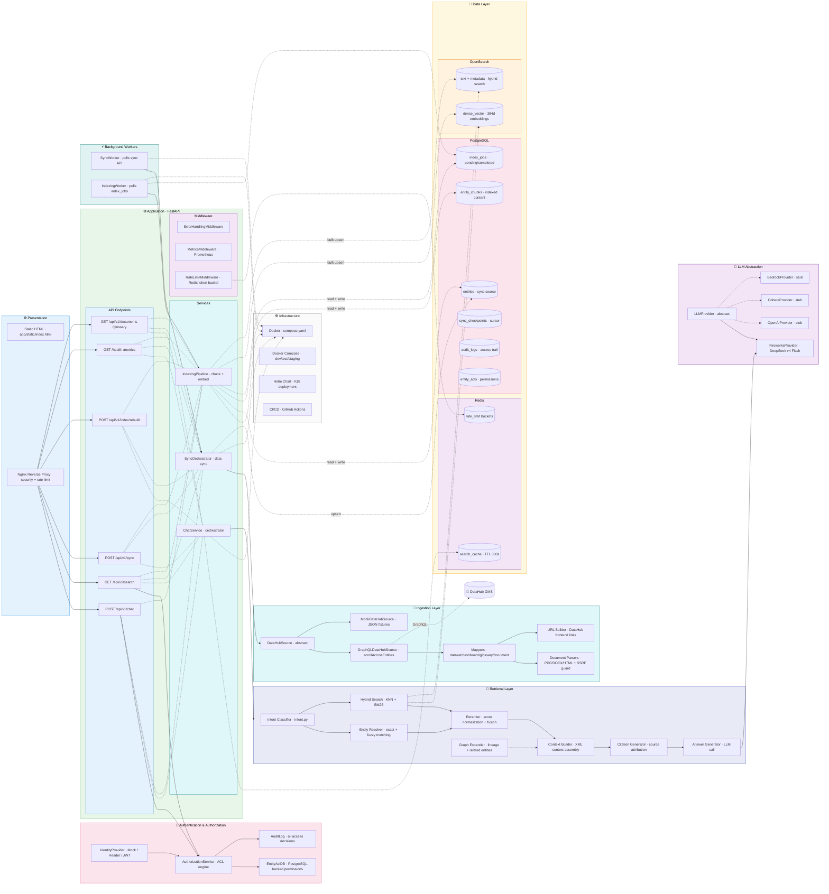

# System Architecture

> Kiến trúc tổng thể của AI Chatbot cho DataHub.
>
> Hệ thống gồm 5 tầng: **Presentation → Application → Retrieval → Data → Infrastructure**.
> Giao tiếp bất đồng bộ qua PostgreSQL job queue (index_jobs) và Redis cache.

## Technology Stack

| Layer | Technology | Purpose |
|-------|-----------|---------|
| **API** | FastAPI + Uvicorn | REST endpoints, async |
| **Auth** | PyJWT + custom IdentityProvider | JWT / Header / Mock modes |
| **Database** | PostgreSQL 16 + asyncpg | Entity store, jobs, audit |
| **Vector** | OpenSearch 2.15 | Dense vectors (384d) + BM25 |
| **Cache** | Redis 7 | Search cache, rate limiting |
| **LLM** | Fireworks AI (DeepSeek v4 Flash) | Answer generation |
| **Sync** | DataHub GraphQL API (`scrollAcrossEntities`) | Entity ingestion |
| **Monitoring** | Prometheus + structlog | Metrics + structured logging |
| **Orch** | Docker Compose + Helm | Local dev → K8s production |

## Component Responsibilities

| Component | Responsible For |
|-----------|----------------|
| `ChatService` | Orchestrate retrieval → generation → response |
| `SyncOrchestrator` | Pull entities from DataHub, upsert to DB |
| `IndexingPipeline` | Chunk entities, generate embeddings, index to OpenSearch |
| `HybridSearch` | KNN (α=0.6) + BM25 (1-α=0.4) fusion search |
| `EntityResolver` | Resolve entity name → exact URN via DB lookup |
| `AuthorizationService` | Check `can_view_entity`, build ACL filters |
| `IdentityProvider` | Authenticate user from JWT/header/mock |
| `DataHubSource` | Abstract interface for DataHub/mock data |
