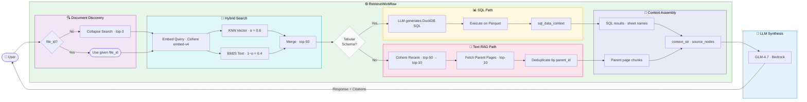

```mermaid
flowchart LR

%% =====================================================
%% CLIENT
%% =====================================================
U([👤 User])


%% =====================================================
%% WORKFLOW
%% =====================================================
subgraph WF["⚙️ RetrieveWorkflow"]

    subgraph DISC["🔍 Document Discovery"]
        D1{file_id?}
        D2[Collapse Search · top-3]
        D3([Use given file_id])
        D1 -->|No| D2
        D1 -->|Yes| D3
    end

    subgraph SEARCH["🔎 Hybrid Search"]
        H1[Embed Query · Cohere embed-v4]
        H2[KNN Vector · α = 0.6]
        H3[BM25 Text · 1−α = 0.4]
        H4[Merge · top-50]
        H1 --> H2 & H3 --> H4
    end

    R1{"Tabular\nSchema?"}

    subgraph SQL["📊 SQL Path"]
        T1[LLM generates DuckDB SQL]
        T2[Execute on Parquet]
        T3[sql_data_context]
        T1 --> T2 --> T3
    end

    subgraph RAG["📄 Text RAG Path"]
        RE1[Cohere Rerank · top-50 → top-10]
        RE2[Fetch Parent Pages · top-10]
        RE3[Deduplicate by parent_id]
        RE1 --> RE2 --> RE3
    end

    subgraph CTX["📝 Context Assembly"]
        C1[SQL results · sheet names]
        C2[Parent page chunks]
        C3[context_str · source_nodes]
        C1 & C2 --> C3
    end

    D2 --> H1
    D3 --> H1
    H4 --> R1
    R1 -->|Yes| T1
    R1 -->|No| RE1
    T3 --> C1
    RE3 --> C2

end

%% =====================================================
%% LLM SYNTHESIS
%% =====================================================
subgraph SYNTH["🤖 LLM Synthesis"]
    L1[GLM-4.7 · Bedrock]
end


%% =====================================================
%% MAIN FLOW
%% =====================================================
U --> D1
C3 --> L1
L1 -->|Response + Citations| U


%% =====================================================
%% STYLING
%% =====================================================
style WF     fill:#e8f5e9,stroke:#43a047,color:#000
style DISC   fill:#f3e5f5,stroke:#8e24aa,color:#000
style SEARCH fill:#e0f7fa,stroke:#00838f,color:#000
style R1     fill:#fafafa,stroke:#9e9e9e,color:#333
style SQL    fill:#fff8e1,stroke:#f9a825,color:#000
style RAG    fill:#fce4ec,stroke:#d81b60,color:#000
style CTX    fill:#e8eaf6,stroke:#3949ab,color:#000
style SYNTH  fill:#e3f2fd,stroke:#1976d2,color:#000
```
