# Data Flow

> Luồng dữ liệu xuyên suốt hệ thống: từ đồng bộ DataHub → indexing → lưu trữ → truy vấn → phản hồi LLM.
>
> Gồm 2 pipeline chính: **Sync Pipeline** (đồng bộ dữ liệu từ DataHub) và **Query Pipeline** (xử lý câu hỏi user).

```mermaid
flowchart LR

%% =====================================================
%% DATA SOURCE
%% =====================================================
DH([🏢 DataHub GMS])
MOCK([🧪 Mock Fixtures])

subgraph SOURCE["📡 Data Source Layer"]
    direction TB
    S1{USE_MOCK_DATAHUB?}
    S2[GraphQLDataHubSource · scrollAcrossEntities]
    S3[MockDataHubSource · JSON fixtures]
    S1 -->|Yes| S3
    S1 -->|No| S2
end

DH -.-> S2
MOCK -.-> S3


%% =====================================================
%% SYNC PIPELINE
%% =====================================================
subgraph SYNC["🔄 Sync Pipeline"]
    direction TB
    SY1[SyncOrchestrator.run_full_sync]
    SY2[list_entity_type: dataset / dashboard / glossary / document]
    SY3[Sync Single Entity · compute_content_hash]
    SY4{content_hash changed?}
    SY5[Upsert Entity to PostgreSQL]
    SY6[Create IndexJob · PENDING]
    SY7[Skip · no changes]

    SY1 --> SY2 --> SY3 --> SY4
    SY4 -->|Yes| SY5 --> SY6
    SY4 -->|No| SY7
end

SOURCE --> SY1


%% =====================================================
%% PERSISTENCE
%% =====================================================
subgraph PG[🐘 PostgreSQL]
    PG1[(entities · entity_type + urn)]
    PG2[(entity_chunks · entity_urn)]
    PG3[(index_jobs · status)]
    PG4[(sync_checkpoints · cursor)]
    PG5[(audit_logs · user access)]
    PG6[(entity_acls · permissions)]
end

SY5 --> PG1
SY6 --> PG3


%% =====================================================
%% INDEXING PIPELINE
%% =====================================================
subgraph INDEX["🧠 Indexing Pipeline"]
    direction TB
    IW[IndexingWorker · polls PENDING jobs]
    I1[IndexingPipeline.process_pending_jobs]
    I2[Build Entity Document · build_chunks_for_entity]
    I2A{Entity Type}
    I2B[Dataset Chunks · summary + schema + lineage]
    I2C[Dashboard Chunks · summary]
    I2D[Glossary Term Chunks · definition]
    I2E[Document Chunks · summary + page chunks]
    I3[Generate Embedding · EmbeddingProvider]
    I4[Bulk Upsert to OpenSearch]
    I5[Save Chunks to PostgreSQL]
    I6[Mark IndexJob COMPLETED]

    IW --> I1
    I1 --> I2
    I2 --> I2A
    I2A -->|dataset| I2B
    I2A -->|dashboard| I2C
    I2A -->|glossary_term| I2D
    I2A -->|document| I2E
    I2B & I2C & I2D & I2E --> I3
    I3 --> I4
    I3 --> I5
    I4 & I5 --> I6
end

PG1 --> IW
PG3 --> IW


%% =====================================================
%% VECTOR / SEARCH STORE
%% =====================================================
subgraph OS[🔶 OpenSearch]
    OS1[(dense_vector · embedding)]
    OS2[(text · entity_urn + chunk_type)]
    OS3[KNN + BM25 Hybrid Index]
end

I4 --> OS1


%% =====================================================
%% CACHE
%% =====================================================
subgraph RC[🔥 Redis]
    RC1[(search_cache · TTL 300s)]
    RC2[(rate_limiter · token bucket)]
end

I5 --> PG2


%% =====================================================
%% QUERY PIPELINE
%% =====================================================
U([👤 User])

subgraph API["🌐 FastAPI · Chat Endpoint"]
    AP1[POST /api/v1/chat]
    AP2[Auth · get_current_user]
    AP3[AuthorizationService · can_view_entity]
    AP4[ChatService.answer]
end

subgraph QUERY["🔍 Query Pipeline"]
    direction TB
    Q1[Classify Intent · structured / general]
    Q2{Intent Type}
    Q3[Structured Retrieval · entity_resolver + entity_repo]
    Q4[Hybrid Search · HybridSearch.search]
    Q5[Entity Resolution · resolve name → urn]
    Q6[KNN Vector Search · OpenSearch]
    Q7[BM25 Text Search · OpenSearch]
    Q8[Reranker · score fusion]
    Q9[Context Builder · assemble context_xml]
    Q10[Citation Generator · extract source spans]
    Q11[AnswerGenerator.generate]

    Q1 --> Q2
    Q2 -->|TERM_DEFINITION / OWNER_LOOKUP / etc.| Q3
    Q2 -->|general question| Q4
    Q3 --> Q5
    Q4 --> Q6 & Q7
    Q6 & Q7 --> Q8
    Q5 --> Q8
    Q8 --> Q9
    Q9 --> Q10
    Q10 --> Q11
end

U -->|HTTP| AP1
AP1 --> AP2 --> AP3 --> AP4
AP4 --> Q1
Q6 & Q7 -.->|query| OS1 & OS2
Q5 -.->|lookup| PG1

subgraph LLM["🤖 LLM · Answer Generator"]
    L1[Fireworks AI · DeepSeek v4 Flash]
    L2[Prompt Template · intent + context + citations]
    L3[Generate Answer + Confidence Score]
    L1 --> L2 --> L3
end

Q11 --> L1

L3 -->|answer + citations + entities| AP4
AP4 -->|ChatResponse| U


%% =====================================================
%% STYLING
%% =====================================================
style SOURCE fill:#e3f2fd,stroke:#1e88e5,color:#000
style SYNC   fill:#e8f5e9,stroke:#43a047,color:#000
style INDEX  fill:#e0f7fa,stroke:#00838f,color:#000
style PG     fill:#fce4ec,stroke:#d81b60,color:#000
style OS     fill:#fff3e0,stroke:#ef6c00,color:#000
style RC     fill:#f3e5f5,stroke:#8e24aa,color:#000
style API    fill:#e8eaf6,stroke:#3949ab,color:#000
style QUERY  fill:#e0f7fa,stroke:#00695c,color:#000
style LLM    fill:#f3e5f5,stroke:#6a1b9a,color:#000
```

## Sync Pipeline

| Step | Component | Description |
|------|-----------|-------------|
| 1 | `GraphQLDataHubSource` | Fetch entities via `scrollAcrossEntities` (hoặc mock fixtures) |
| 2 | `SyncOrchestrator` | Iterate MVP_ENTITY_TYPES, sync từng type |
| 3 | `_sync_single` | Compare `content_hash`, upsert nếu thay đổi |
| 4 | `EntityRepository.upsert` | Lưu entity vào PostgreSQL |
| 5 | `IndexJobRepository.create` | Tạo index job PENDING |

## Query Pipeline

| Step | Component | Description |
|------|-----------|-------------|
| 1 | `IntentClassifier` | Phân loại intent: structured vs general |
| 2 | `EntityResolver` | Resolve entity name → exact URN (nếu structured) |
| 3 | `HybridSearch` | KNN vector (α=0.6) + BM25 text (1-α=0.4), top-50 |
| 4 | `Reranker` | Score fusion, sort, return top-K |
| 5 | `ContextBuilder` | Build XML context from search results |
| 6 | `AnswerGenerator` | Gọi Fireworks DeepSeek với prompt + context |
