# Upload Flow

> Flow hiện tại với mô hình nhận diện file bằng `file_id` (SHA1) + `content_hash` (MD5) và các route SKIP / NEW / UPDATED / REPROCESS.
>
> So sánh với flow cũ tại [upload_flow_legacy.md](./upload_flow_legacy.md).

```mermaid
flowchart LR

%% =====================================================
%% CLIENT / INGESTION
%% =====================================================
U([👤 User])

subgraph INGEST["🌐 Ingestion API"]
    A1[Receive Import Request]
    A4[Persist Source File to S3]
    A5[Start Temporal Workflow]
    A1 --> A4 --> A5
end

U -->|POST /import| A1
A5 -->|workflow_id| U


%% =====================================================
%% OBJECT STORAGE
%% =====================================================
subgraph S3["☁️ Object Storage (S3)"]
    S1[source file]
    S2[page markdown]
    S3O[normalized markdown/json]
    S4[parquet dataset]
    S5[schema metadata]
end

A4 --> S1


%% =====================================================
%% ORCHESTRATION
%% =====================================================
ASKIP([Return Existing file_id\n+ Append session_id])

subgraph WF["⚙️ Workflow Orchestration"]
    WF1{force=True?}
    W2{Check file_id\n+ content_hash}
    W3{Route by MIME Type}

    WF1 -->|Yes| WREPROCESS([REPROCESS])
    WF1 -->|No| W2
    W2 -->|same content in scope| ASKIP
    W2 -->|same file_id, new content| WUPDATED([UPDATED])
    W2 -->|not found| WNEW([NEW])

    WREPROCESS --> W3
    WUPDATED --> W3
    WNEW --> W3
end

A5 -. async .-> WF1


%% =====================================================
%% DOCUMENT NORMALIZATION
%% =====================================================
subgraph NORMALIZE["📦 Normalization Pipeline"]

    subgraph DOC["Document Processor"]
        D1{Searchable Content?}
        D2[Native Text Extraction]
        D3[Page Batch Split]
        D4[Parallel OCR / VLM]
        D5[Assemble Markdown]

        D1 -->|Yes| D2 --> D5
        D1 -->|No| D3 --> D4 --> D5
    end

    subgraph TAB["Tabular Processor"]
        T1[Read Worksheets]
        T2[Convert to Parquet]
        T3[Infer Schema / Enums]
        T4[Generate Metadata]
        T1 --> T2 --> T3 --> T4
    end

    subgraph IMG["Image Processor"]
        I1[Encode Image]
        I2[OCR / Vision Parsing]
        I1 --> I2
    end

end

W3 -->|PDF / DOCX / PPTX| DOC
W3 -->|Excel / CSV| TAB
W3 -->|Image| IMG


%% =====================================================
%% ARTIFACT PERSISTENCE
%% =====================================================
D5 --> S2
D5 --> S3O

T2 --> S4
T4 --> S5

I2 --> S3O


%% =====================================================
%% INDEXING PIPELINE
%% =====================================================
subgraph INDEX["🧠 GraphRAG Indexing Pipeline"]
    G1[Construct Graph Topology]
    G2[Semantic Chunking]
    G3[Materialize Graph Nodes]
    G4[Generate Embeddings]
    G5[Bulk Vector Upsert]

    G1 --> G2 --> G3 --> G4 --> G5
end

S3O -.-> INDEX
S4 -.-> INDEX
S5 -.-> INDEX


%% =====================================================
%% PERSISTENCE LAYER
%% =====================================================
subgraph GRAPH["🔵 Neptune"]
    N1[Document Graph]
    N2[Ontology / Taxonomy]
    N3[Entity Relations]
end

subgraph VECTOR["🟠 OpenSearch"]
    O1[Dense Vectors]
    O2[Chunk Metadata]
end

WSWAP[Swap Old Chunks]

G1 --> GRAPH
G5 --> VECTOR
G5 -->|UPDATED / REPROCESS only| WSWAP
WSWAP -->|Delete old chunks| VECTOR


%% =====================================================
%% STYLING
%% =====================================================
style ASKIP fill:#f5f5f5,stroke:#9e9e9e,color:#333
style WNEW fill:#e8f5e9,stroke:#43a047,color:#000
style WUPDATED fill:#fff8e1,stroke:#f9a825,color:#000
style WREPROCESS fill:#fce4ec,stroke:#d81b60,color:#000

style INGEST fill:#e3f2fd,stroke:#1e88e5,color:#000
style S3 fill:#fff8e1,stroke:#f9a825,color:#000
style WF fill:#e8f5e9,stroke:#43a047,color:#000

style DOC fill:#e3f2fd,stroke:#1976d2,color:#000
style TAB fill:#f3e5f5,stroke:#8e24aa,color:#000
style IMG fill:#fce4ec,stroke:#d81b60,color:#000

style INDEX fill:#e0f7fa,stroke:#00838f,color:#000
style GRAPH fill:#e8eaf6,stroke:#3949ab,color:#000
style VECTOR fill:#fff3e0,stroke:#ef6c00,color:#000
```

